ssm+Vue计算机毕业设计学生资源管理系统（程序+LW文档）

**项目运行**

**环境配置：**

**Jdk1.8 + Tomcat7.0 + Mysql + HBuilderX** **（Webstorm也行）+ Eclispe（IntelliJ
IDEA,Eclispe,MyEclispe,Sts都支持）。**

**项目技术：**

**SSM + mybatis + Maven + Vue** **等等组成，B/S模式 + Maven管理等等。**

**环境需要**

**1.** **运行环境：最好是java jdk 1.8，我们在这个平台上运行的。其他版本理论上也可以。**

**2.IDE** **环境：IDEA，Eclipse,Myeclipse都可以。推荐IDEA;**

**3.tomcat** **环境：Tomcat 7.x,8.x,9.x版本均可**

**4.** **硬件环境：windows 7/8/10 1G内存以上；或者 Mac OS；**

**5.** **是否Maven项目: 否；查看源码目录中是否包含pom.xml；若包含，则为maven项目，否则为非maven项目**

**6.** **数据库：MySql 5.7/8.0等版本均可；**

**毕设帮助，指导，本源码分享，调试部署** **(** **见文末** **)**

### 功能结构

为了更好的去理清本系统整体思路，对该系统以结构图的形式表达出来，设计实现该学生资源管理系统的功能结构图如下所示：

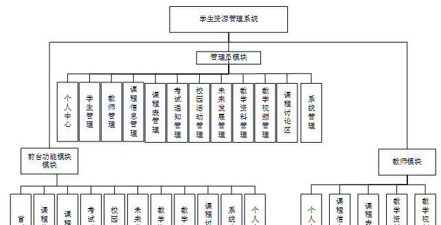

图4-1 系统总体结构图

### 4.2 数据库设计

####  4.2.1 数据库E/R图

ER图是由实体及其关系构成的图，通过E/R图可以清楚地描述系统涉及到的实体之间的相互关系。在系统中对一些主要的几个关键实体如下图：

(1) 学生信息E/R图如下所示：

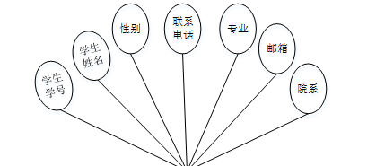

图4-2学生信息E/R图

(2)教学资料E/R图如下所示：

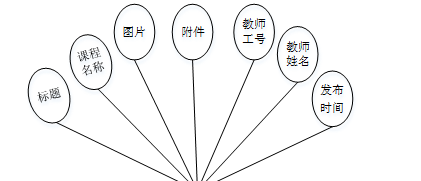

图4-3教学资料E/R图

(3)考试通知E/R图如下所示：

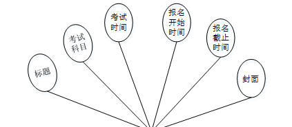

图4-4考试通知E/R图

### 系统功能模块

学生注册，学生通过输入学号、密码、姓名、联系电话、邮箱、专业、院系等内容进行注册，如图5-1所示。

图5-1学生注册界面图

学生通过登录进入系统可查看首页、课程信息、课程表、考试通知、校园活动、未来发展、教学资料、教学视频、课程讨论区、系统公告、个人中心等内容，如图5-2所示。

图5-2系统首页界图面

个人中心，学生可在个人中心页面通过输入学号、学生姓名、密码、性别、联系电话、邮箱、专业、院系等内容进行更新信息或查看我的发布、我的收藏等内容，如图5-3所示。

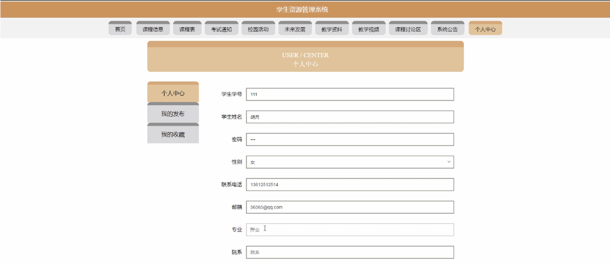

图5-3个人中心界面图

校园活动，学生可在校园活动页面查看活动主题、活动编号、活动图片、活动类型、活动时间、活动地点、主要负责人、联系方式等内容，还可进行收藏或评论等操作，如图5-4所示。

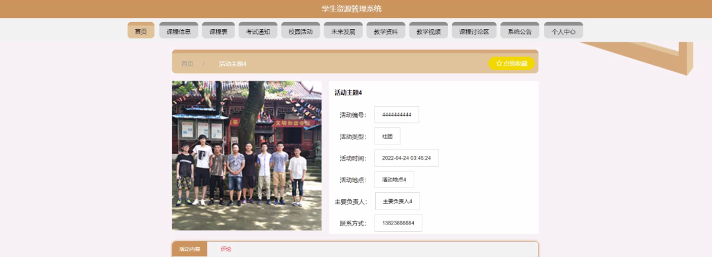

图5-4校园活动界面图

课程表，学生可在课程表页面查看课程名称、封面、学年学期、课程编号、课程类型、节次、周次、教师工号、教师姓名、授课周数、授课地点等内容，还可进行收藏或评论等操作，如图5-5所示。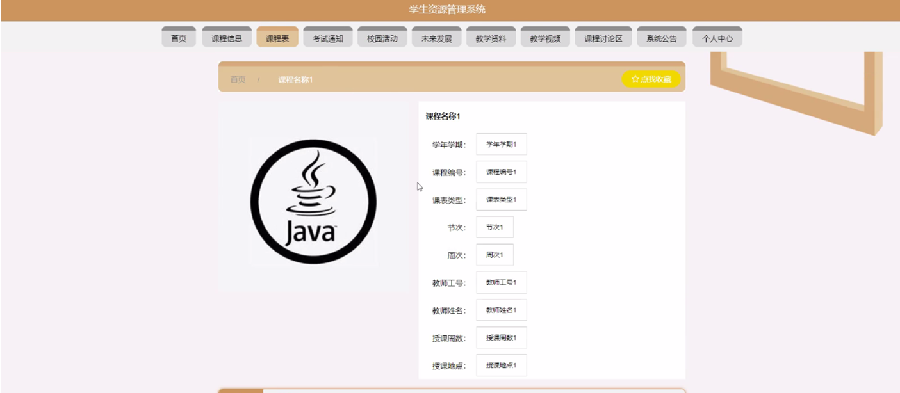

图5-5课程表界面图

考试通知，学生可在考试通知页面查看标题、考试科目、考试时间、报名开始时间、报名截止时间、封面等内容，还可进行收藏或评论等操作，如图5-6所示。

图5-6考试通知界面图

教学资料，学生可在教学资料页面查看标题、封面、课程名称、教师工号、教师姓名、发布时间、附件等内容，还可进行收藏或评论等操作，如图5-7所示。

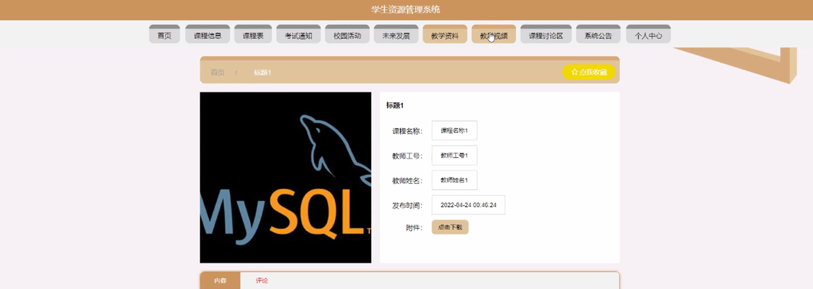

图5-7教学资料界面图

课程讨论区，学生可在课程讨论区页面通过输入标题、类型、内容进行提交或重置等操作，如图5-8所示。

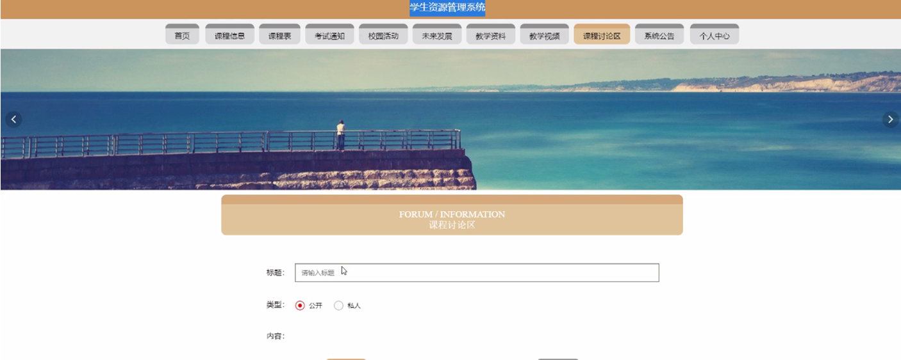

图5-8课程讨论区界图面

5.2管理员功能模块

管理员登录，管理员通过输入用户名、密码、角色进行登录，如图5-9所示。

图5-9管理员登录界面图

管理员通过登录进入系统可查看个人中心、学生管理、教师管理、课程信息管理、课程表管理、考试通知管理、校园活动管理、未来发展管理、教学资料管理、教学视频管理、课程讨论区、系统管理等内容，如图5-10所示。

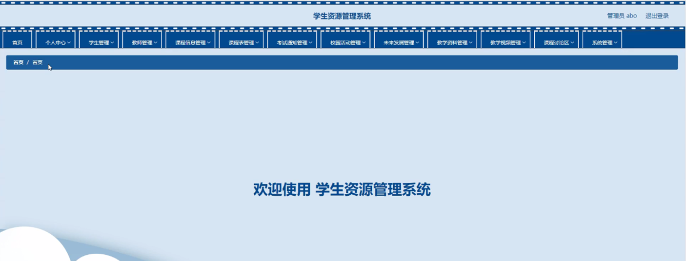

图5-10管理员功能界面图

学生管理，管理员可在学生管理页面查看学生学号、学生姓名、性别、联系电话、邮箱、专业、院系等内容，还可进行新增、修改或删除等操作，如图5-11所示。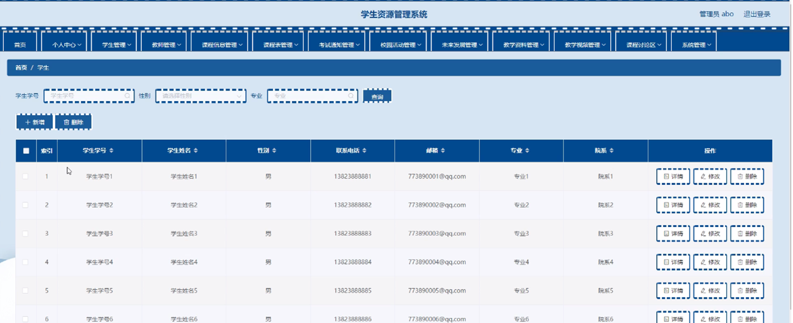

图5-11学生管理界面图

课程表管理，管理员可在课程表管理页面查看学年学期、课程编号、课程名称、课表类型、节次、周次、教师工号、教师姓名、授课周数、授课地点、封面等内容，还可进行新增、修改、查看评论或删除等操作，如图5-12所示。

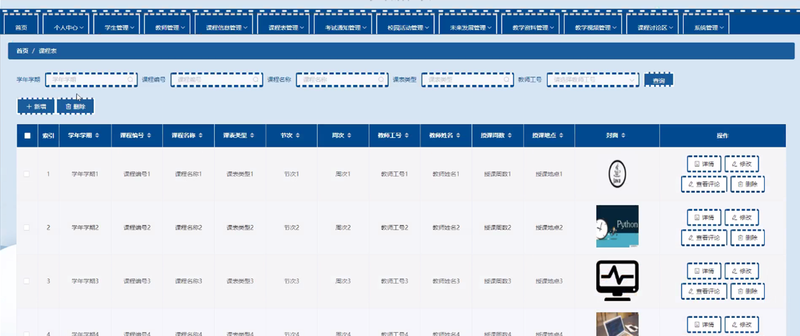

图5-12课程表管理界面图

#### **JAVA** **毕设帮助，指导，源码分享，调试部署**

