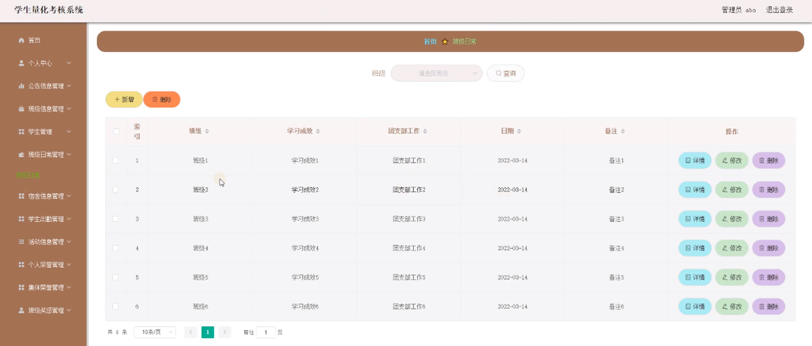

ssm+Vue计算机毕业设计学生量化考核系统（程序+LW文档）

**项目运行**

**环境配置：**

**Jdk1.8 + Tomcat7.0 + Mysql + HBuilderX** **（Webstorm也行）+ Eclispe（IntelliJ
IDEA,Eclispe,MyEclispe,Sts都支持）。**

**项目技术：**

**SSM + mybatis + Maven + Vue** **等等组成，B/S模式 + Maven管理等等。**

**环境需要**

**1.** **运行环境：最好是java jdk 1.8，我们在这个平台上运行的。其他版本理论上也可以。**

**2.IDE** **环境：IDEA，Eclipse,Myeclipse都可以。推荐IDEA;**

**3.tomcat** **环境：Tomcat 7.x,8.x,9.x版本均可**

**4.** **硬件环境：windows 7/8/10 1G内存以上；或者 Mac OS；**

**5.** **是否Maven项目: 否；查看源码目录中是否包含pom.xml；若包含，则为maven项目，否则为非maven项目**

**6.** **数据库：MySql 5.7/8.0等版本均可；**

**毕设帮助，指导，本源码分享，调试部署** **(** **见文末** **)**

### 系统体系结构

学生量化考核系统的结构图4-1所示：

图4-1 系统结构

模块包括首页，个人中心，公告信息管理，班级信息管理，学生管理，班级日常管理，宿舍信息管理，学生出勤管理，活动信息管理，个人荣誉管理，集体荣誉管理，班级奖惩管理等进行相应的操作。

登录系统结构图，如图4-2所示：

图4-2 登录结构图

这些功能可以充分满足学生量化考核系统的需求。此系统功能较为全面如下图系统功能结构如图4-3所示。

图4-3系统功能结构图

### 4.2 数据库设计

本系统使用MYSQL 作为系统的数据库，设计用户注册表、文件上传的表等等。

#### 4.2.1 数据库概念结构设计

概念结构设计是根据用户需求形成的。用最常的E-R方法描述数据模型进行数据库的概念设计，首先设计局部的E-
R模式，最后各局部ER模式综合成一个全局模式。然后再把概念模式转换成逻辑模式。将概念设计从设计过程中独立开来，设计复杂程度降低，不受特定DBMS的限制。

1.所有实体和属性的定义如下所示。

班级信息属性图如图4-4所示。

图4-4班级信息实体属性图

学生出勤实体属性图如图4-5所示。

图4-5学生出勤实体属性图

### 登录注册模块

系统用户登录，在登录页面根据要求填写用户名和密码，选择角色等信息，点击登录进行登录操作，如图5-1所示。

图5-1系统用户登录界面图

学生注册，在学生注册页面通过填写学号，密码，确认密码，姓名，手机等内容进行注册操作，如图5-2所示。

图5-2 学生注册界面图

### 5.2管理员功能模块

管理员进行登录，进入系统前在登录页面根据要求填写用户名和密码，选择角色等信息，点击登录进行登录操作，如图5-3所示。

图5-3管理员登录界面图

管理员登录系统后，可以对首页，个人中心，公告信息管理，班级信息管理，学生管理，班级日常管理，宿舍信息管理，学生出勤管理，活动信息管理，个人荣誉管理，集体荣誉管理，班级奖惩管理等功能进行相应的操作管理，如图5-4所示。

图5-4管理员功能界面图

公告信息管理，在公告信息管理页面可以对索引,公告标题,公告类型,公告图片,发布日期等内容进行详情，修改和删除等详细操作，如图5-5所示。

图5-5公告信息管理界面图

班级信息管理，在班级信息管理页面可以对索引,班级,学年,班级人数,班主任等信息进行详情，修改和删除等详细操作，如图5-6所示。

图5-6班级信息管理界面图

学生管理，在学生管理页面可以对索引,学号,姓名,性别,头像,手机,班级等内容进行详情，修改和删除等详细操作，如图5-7所示。

图5-7学生管理界面图

班级日常管理，在班级日常管理页面可以对索引,班级,学习成效,团支部工作,日期,备注等内容进行详情，修改和删除等详细操作，如图5-8所示。

图5-8班级日常管理界面图

宿舍信息管理，在宿舍信息管理页面可以对索引,学号,姓名,班级,寝室号等内容进行详情，修改和删除等详细操作；如图5-9所示。

图5-9宿舍信息管理界面图

学生出勤管理，在学生出勤管理页面可以对索引,出勤编号,出勤时间,学号,姓名,班级等内容进行详情，修改和删除等详细操作，如图5-10所示。

图5-10学生出勤管理界面图

活动信息管理，在活动信息管理页面可以对索引,活动名称,活动类型,活动图片,活动地点,活动时间,活动人数等内容进行详情，修改和删除等详细操作；如图5-11所示。

图5-11活动信息管理界面图

### 5.3学生功能模块

学生登录进入学生量化考核系统可以对首页，个人中心，公告信息管理，班级信息管理，班级日常管理，宿舍信息管理，学生出勤管理，活动信息管理，个人荣誉管理，集体荣誉管理，班级奖惩管理等功能进行相应操作，如图5-12所示。

图5-12学生功能界面图

**JAVA** **毕设帮助，指导，源码分享，调试部署**

