ssm+Vue计算机毕业设计学生风采网（程序+LW文档）

**项目运行**

**环境配置：**

**Jdk1.8 + Tomcat7.0 + Mysql + HBuilderX** **（Webstorm也行）+ Eclispe（IntelliJ
IDEA,Eclispe,MyEclispe,Sts都支持）。**

**项目技术：**

**SSM + mybatis + Maven + Vue** **等等组成，B/S模式 + Maven管理等等。**

**环境需要**

**1.** **运行环境：最好是java jdk 1.8，我们在这个平台上运行的。其他版本理论上也可以。**

**2.IDE** **环境：IDEA，Eclipse,Myeclipse都可以。推荐IDEA;**

**3.tomcat** **环境：Tomcat 7.x,8.x,9.x版本均可**

**4.** **硬件环境：windows 7/8/10 1G内存以上；或者 Mac OS；**

**5.** **是否Maven项目: 否；查看源码目录中是否包含pom.xml；若包含，则为maven项目，否则为非maven项目**

**6.** **数据库：MySql 5.7/8.0等版本均可；**

**毕设帮助，指导，本源码分享，调试部署** **(** **见文末** **)**

###  系统体系结构

学生风采网的结构图4-1所示：

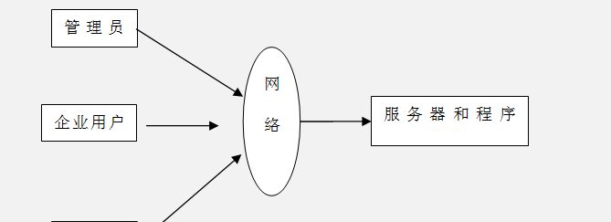

图4-1 系统结构

登录系统结构图，如图4-2所示：

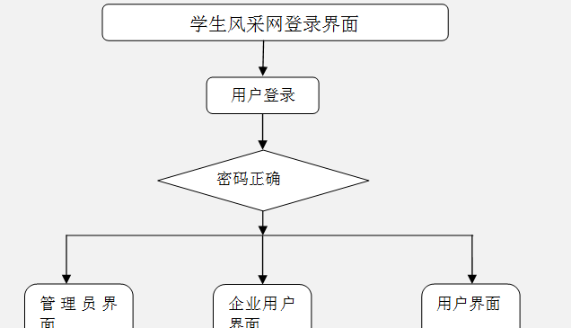

图4-2 登录结构图

系统结构图，如图4-3所示。

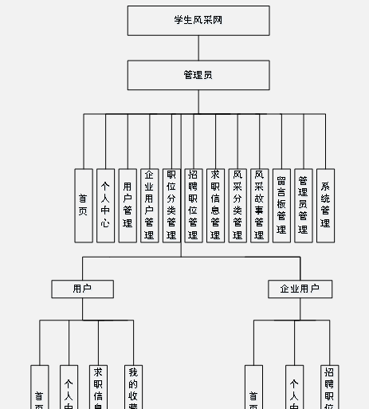

图4-3系统结构图

### 数据库设计原则

学习编程，我们都知道数据库设计是基于需要设计的系统功能，我们需要建立一个数据库关系模型，用于存储数据信息，这样当我们在程序中时，就没有必要为程序页面添加数据，从而提高系统的效率。数据库存储了很多信息，可以说是信息管理系统的核心和基础，数据库还为系统提供了添加、删除、修改和检查等操作模块，使系统能够快速找到自己想要的信息，而不是在程序代码中找到。数据库中信息表的每个部分根据一定的关系精确地组合，排列和组合成数据表。

通过学生风采网的功能进行规划分成几个实体信息，实体信息将通过ER图进行说明，本系统的主要实体图如下：

管理员信息属性图如图4-5所示。

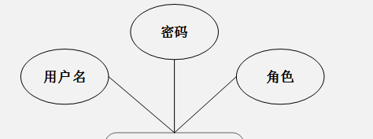

图4-5 管理员信息实体属性图

用户信息实体属性图如图4-6所示。

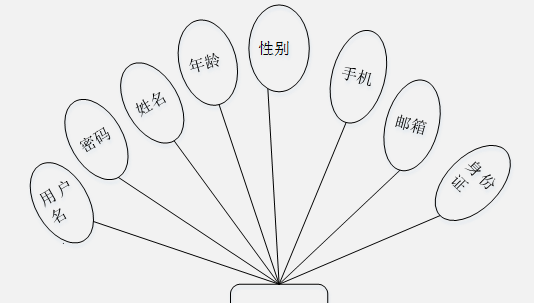

图4-6用户信息实体属性图

求职信息实体属性图如图4-7所示。

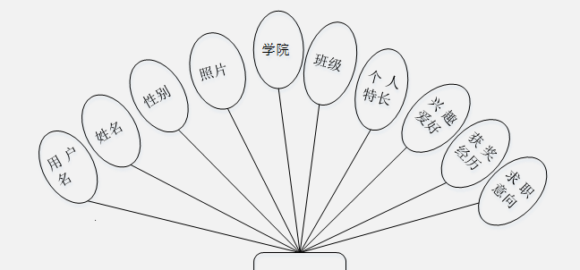

图4-7求职信息实体属性图

企业用户信息实体属性图如图4-8所示。

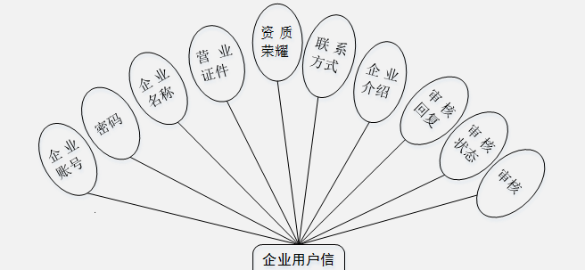

图4-8企业用户信息实体属性图

风采故事信息实体属性图如图4-9所示。

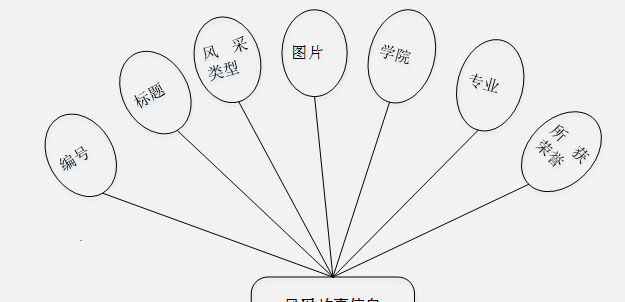

图4-9风采故事信息实体属性图

### 前台首页功能模块

学生风采网，在学生风采网可以查看首页、招聘职位、求职信息、风采故事、校园资讯、留言反馈、个人中心、后台管理等内容，如图5-1所示。

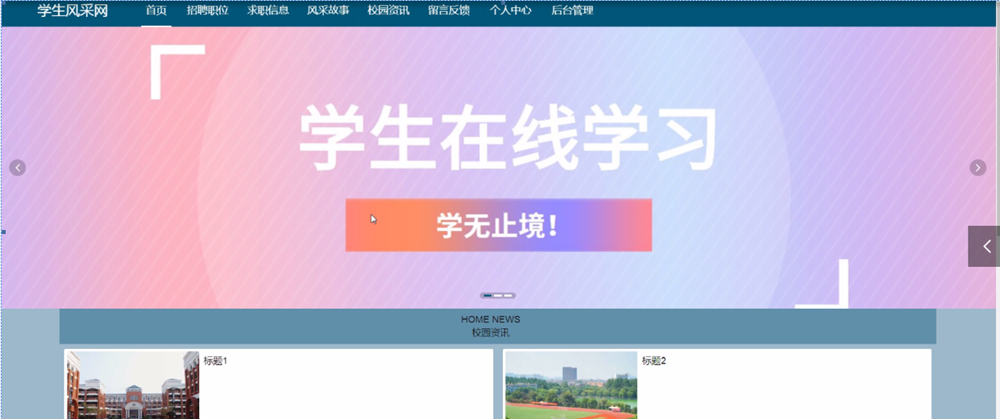

图5-1系统首页界面图

登录、用户注册，通过用户注册获取用户名、密码、姓名、年龄、性别、手机、邮箱、身份证等信息进行注册，如图5-2所示。

图5-2登录、用户注册界面图

招聘职位，在招聘职位页面可以填写职位编号、职位类别、企业账号、企业名称、学历要求、职位要求、薪资待遇等信息进行立即提交，如图5-3所示。

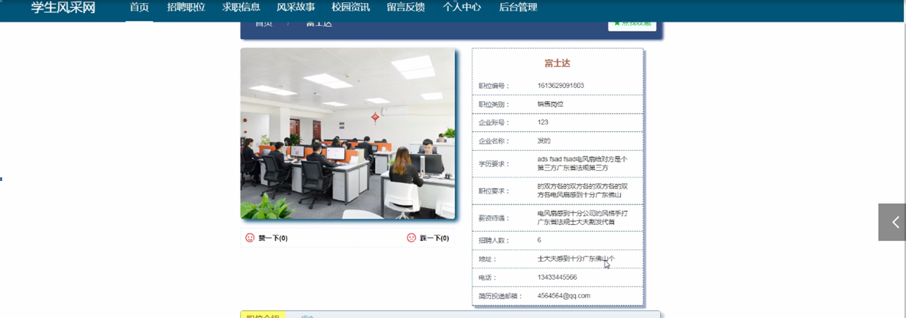

图5-3招聘职位界面图

风采故事，在风采故事页面可以填写编号、标题、风采类型、图片、学院、专业、所获荣誉等信息进行立即提交如图5-4所示。

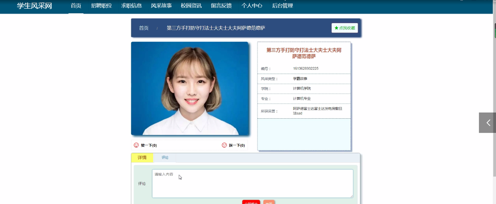

图5-4风采故事界面图

### 5.2管理员功能模块

管理员登录，通过填写用户名、密码、角色等信息，输入完成后选择登录即可进入学生风采网，如图5-5所示。

图5-5管理员登录界面图

管理员登录进入首页、个人中心、用户管理，企业用户管理、职位分类管理，招聘职位管理，求职信息管理、风采分类管理、风采故事管理、留言板管理、管理员管理、系统管理等内容，如图5-6所示。

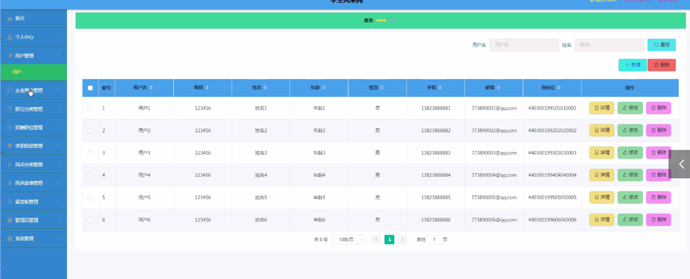

图5-6管理员功能界面图

企业用户管理，在企业用户管理页面可以查看企业账号、密码、企业名称、企业图片、营业证件、资质荣耀、联系方式、企业介绍、审核回复、审核状态、审核等信息，并可根据需要对企业用户管理进行详情，修改，删除操作，如图5-7所示。

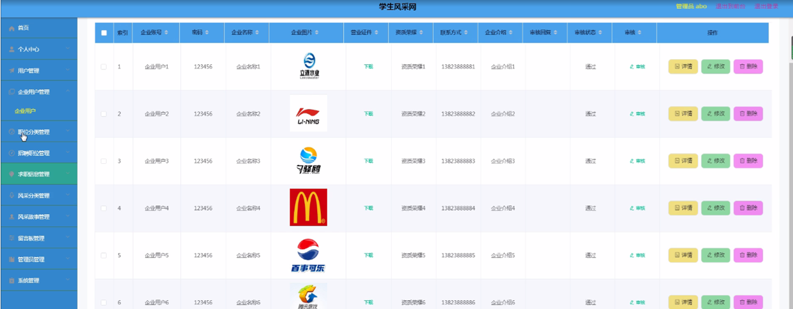

图5-7企业用户管理界面图

管理员在职位分类管理页面可以查看职位类别等信息，并可根据需要对职位分类管理进行详情、修改、删除操作，如图5-8所示。

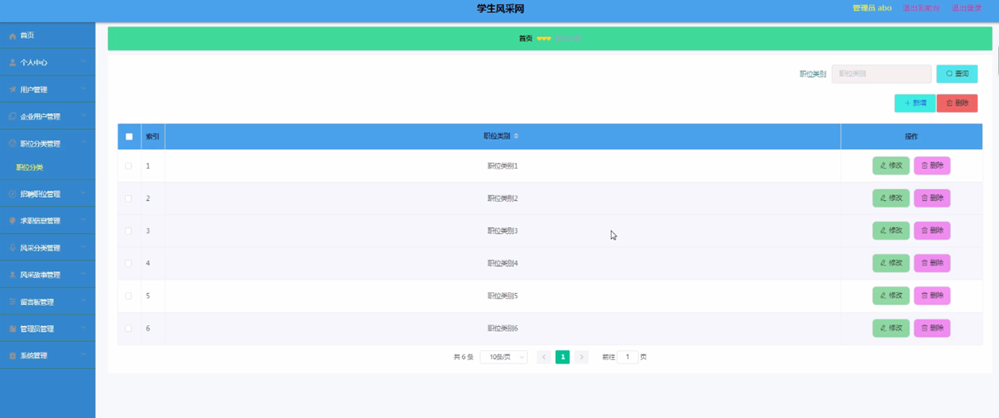

图5-8职位分类管理界面图

求职信息管理，在求职信息管理页面可以查看用户名、姓名、性别、照片、电话、学院、班级、个人特长、兴趣爱好、获奖经历、求职意向等信息，并可根据需要对求职信息管理进行详情、修改、删除操作，如图5-9所示。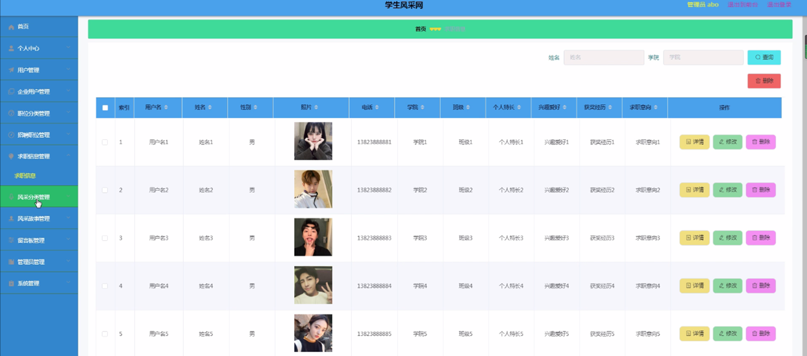

图5-9求职信息管理界面图

风采分类管理，在风采分类管理页面可以查看风采类型等内容，并可根据需要对风采分类管理进行详情、修改、删除操作，如图5-10所示。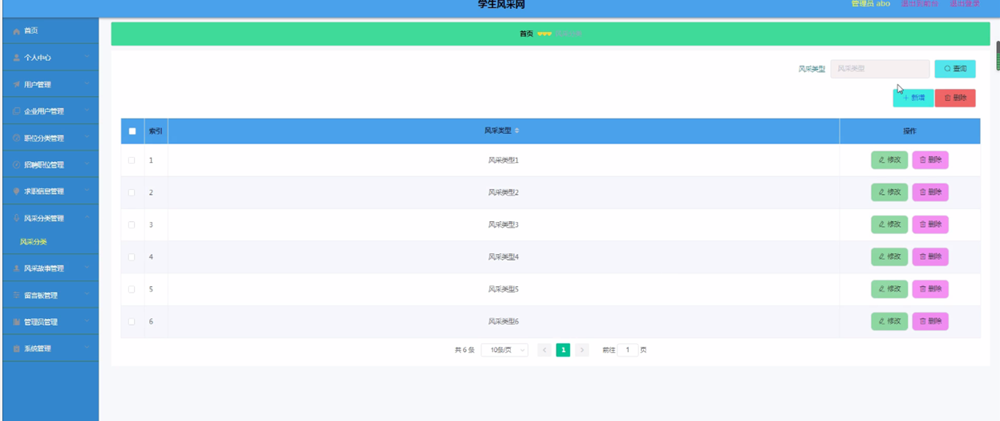

图5-10风采分类管理界面图

风采故事管理，在风采故事管理页面可以查看编号、标题、风采类型、图片、学院、专业、所获荣誉等信息，并可根据需要对风采故事管理进行详情，修改，删除操作，如图5-11所示。

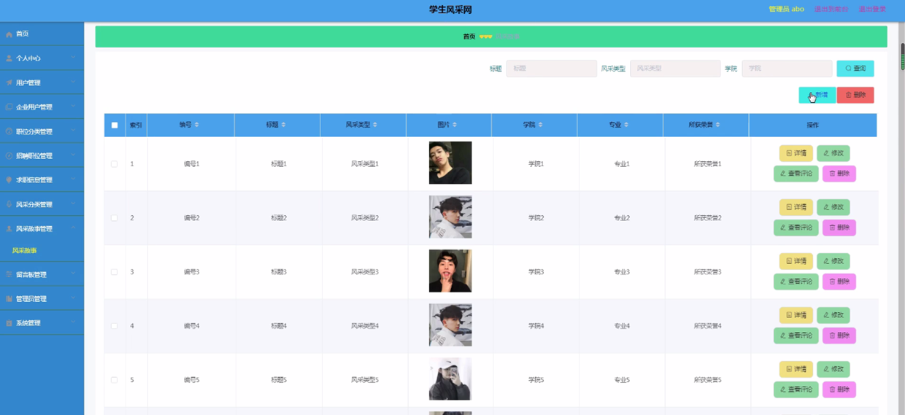

图5-11风采故事管理界面图

留言板管理，在留言板管理页面可以查看用户名、留言内容、回复内容等内容，并可根据需要对留言板管理进行详情，修改，删除操作，如图5-12所示。

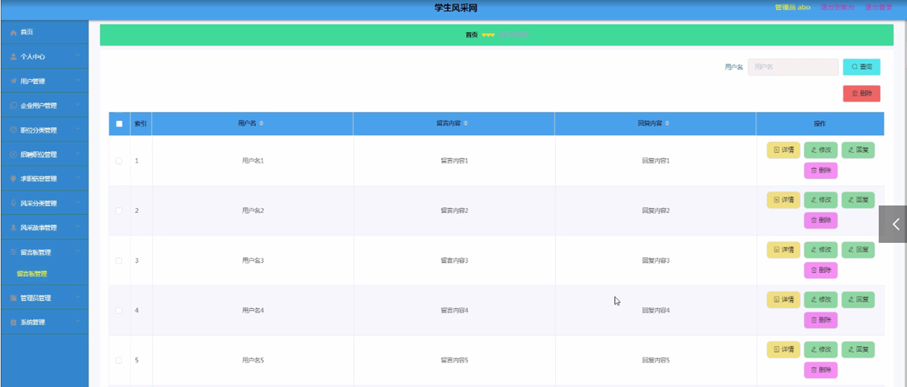

图5-12留言板管理界面图

#### **JAVA** **毕设帮助，指导，源码分享，调试部署**

