ssm+Vue计算机毕业设计学科竞赛管理（程序+LW文档）

**项目运行**

**环境配置：**

**Jdk1.8 + Tomcat7.0 + Mysql + HBuilderX** **（Webstorm也行）+ Eclispe（IntelliJ
IDEA,Eclispe,MyEclispe,Sts都支持）。**

**项目技术：**

**SSM + mybatis + Maven + Vue** **等等组成，B/S模式 + Maven管理等等。**

**环境需要**

**1.** **运行环境：最好是java jdk 1.8，我们在这个平台上运行的。其他版本理论上也可以。**

**2.IDE** **环境：IDEA，Eclipse,Myeclipse都可以。推荐IDEA;**

**3.tomcat** **环境：Tomcat 7.x,8.x,9.x版本均可**

**4.** **硬件环境：windows 7/8/10 1G内存以上；或者 Mac OS；**

**5.** **是否Maven项目: 否；查看源码目录中是否包含pom.xml；若包含，则为maven项目，否则为非maven项目**

**6.** **数据库：MySql 5.7/8.0等版本均可；**

**毕设帮助，指导，本源码分享，调试部署** **(** **见文末** **)**

###  系统结构

系统架构图属于系统设计阶段，系统架构图只是这个阶段一个产物，系统的总体架构决定了整个系统的模式，是系统的基础。学科竞赛管理系统的整体结构设计如图4-2所示。

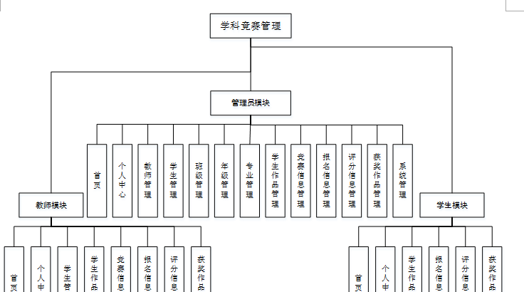

图4-2 系统结构图

### 4.3. 数据库设计

#### 4.3.1 数据库实体

管理员信息结构图，如图4-3所示：

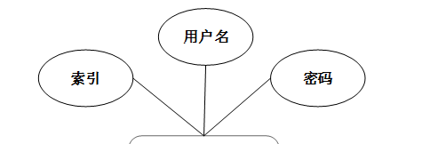

图4-3 管理员信息实体结构图

学生作品管理实体属性图，如图4-4所示：

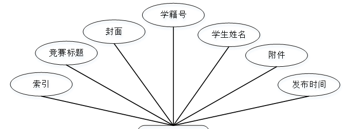

图4-4学生作品管理实体属性图

竞赛信息管理实体属性图如图4-5所示。

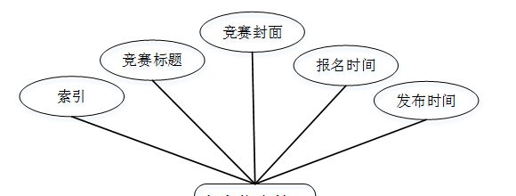

图4-5竞赛信息管理实体属性图

获奖作品管理实体属性图如图4-6所示。

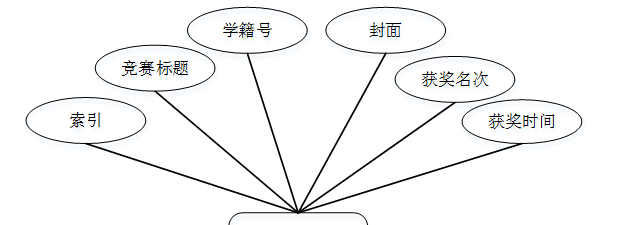

图4-6获奖作品管理实体属性图

### 系统功能模块

学科竞赛管理，在系统首页可以查看首页、学生作品、竞赛信息、获奖作品、系统公告、个人中心、后台管理等内容进行详细操作，如图5-1所示。

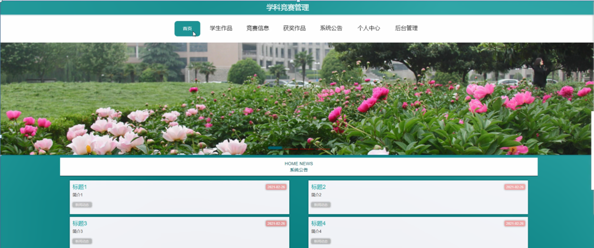

图5-1系统首页界面图

学生作品，在学生作品页面可以查看竞赛标题、封面、学籍号、学生姓名、发布时间、附件、作品简介等详细信息，如图5-2所示。

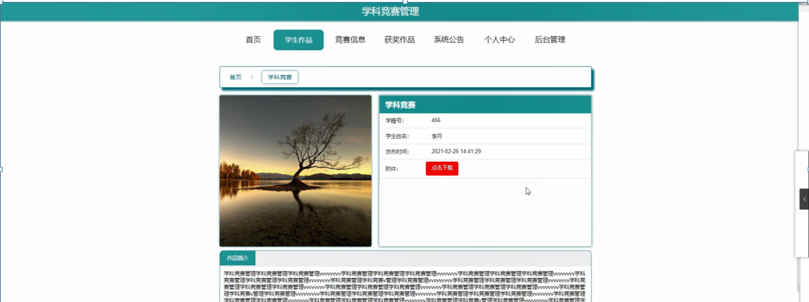

图5-2学生作品界面图

竞赛信息，在竞赛信息页面可以查看竞赛标题、竞赛封面、报名时间、发布时间、竞赛内容等信息进行报名，如图5-3所示。

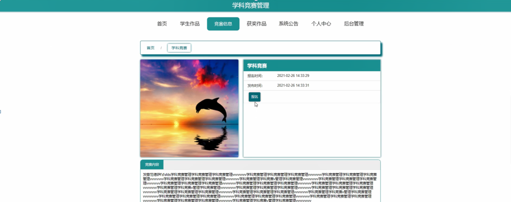

图5-3竞赛信息界面图

获奖作品，在获奖作品页面可以查看竞赛标题、学生姓名、学籍号、封面、获奖名次、获奖时间、作品简介等详细信息，如图5-4所示。

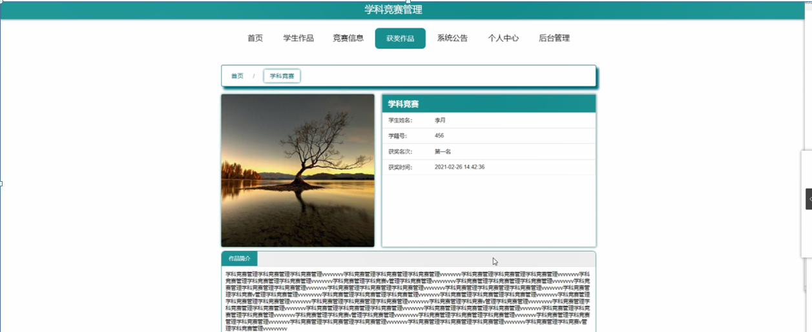

图5-4获奖作品界面图

### 5.2 管理员功能模块

管理员登录，管理员通过输入用户名、密码、选择角色等信息，然后点击登录就能登录到系统进行系统的使用了，如图5-5所示。

图5-5管理员登录界面图

管理员登录进入系统之后，就可以对所有的信息进行查看，可以查看到首页、个人中心、教师管理、学生管理、班级管理、年级管理、专业管理、学生作品管理、竞赛信息管理、报名信息管理、评分信息管理、获奖作品管理、系统管理等，并且还可以对其进行相应的操作管理，如图5-6所示。

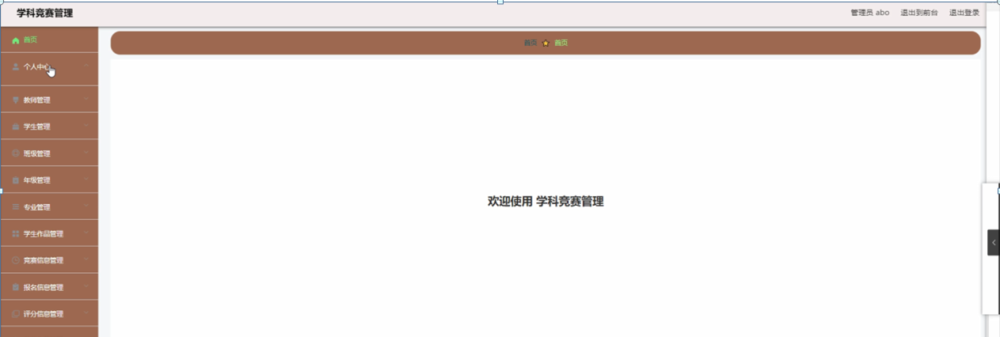

图5-6管理员功能界面图

教师管理，在教师管理页面中可以对索引、教师工号、教师姓名、密码、性别、职称、联系电话、教师邮箱等信息进行详情，修改或删除等操作，如图5-7所示。

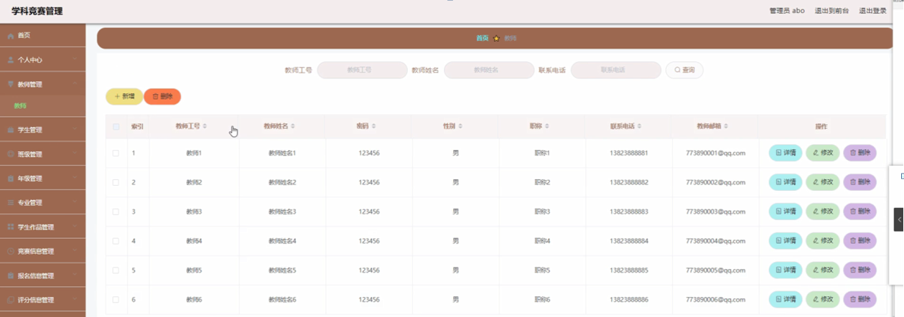

图5-7教师管理界面图

学生管理，在学生管理页面中可以对索引、学籍号、学生姓名、密码、年级、班级、性别、专业、联系电话、邮箱、身份证等信息进行详情，修改或删除等操作，如图5-8所示。

图5-8学生管理界面图

班级管理，在班级管理页面中可以对索引、班级等信息进行详情，修改或删除等操作，如图5-9所示。

图5-9班级管理界面图

年级管理，在年级管理页面中可以对索引、年级等信息进行详情，修改或删除等操作，如图5-10所示。

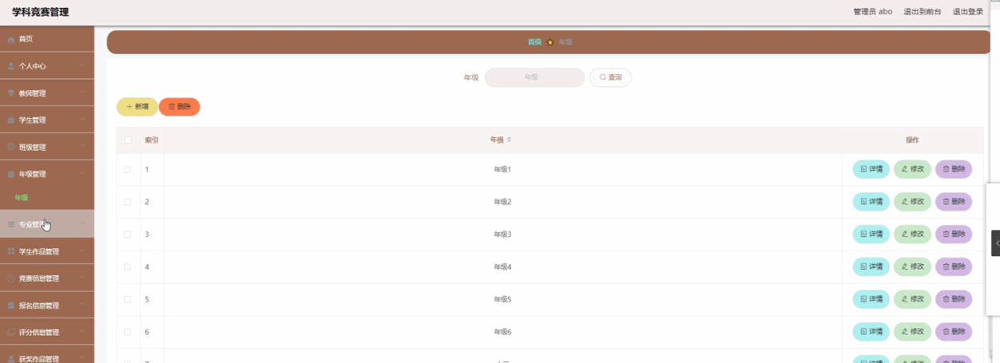

图5-10年级管理界面图

专业管理，在专业管理页面中可以对索引、专业等信息进行详情，修改或删除等操作，如图5-11所示。

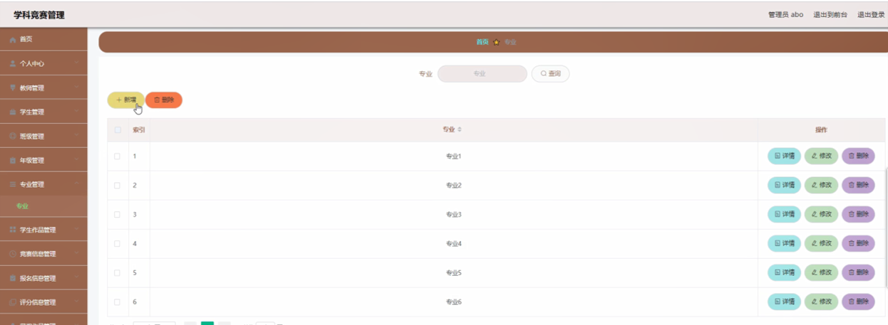

图5-11专业管理界面图

学生作品管理，在学生作品管理页面中可以对索引、竞赛标题、封面、学籍号、学生姓名、附件、发布时间等信息进行详情，修改或删除等操作，如图5-12所示。

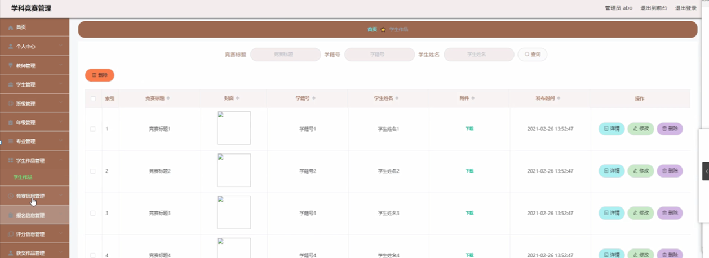

图5-12学生作品管理界面图

**JAVA** **毕设帮助，指导，源码分享，调试部署**

