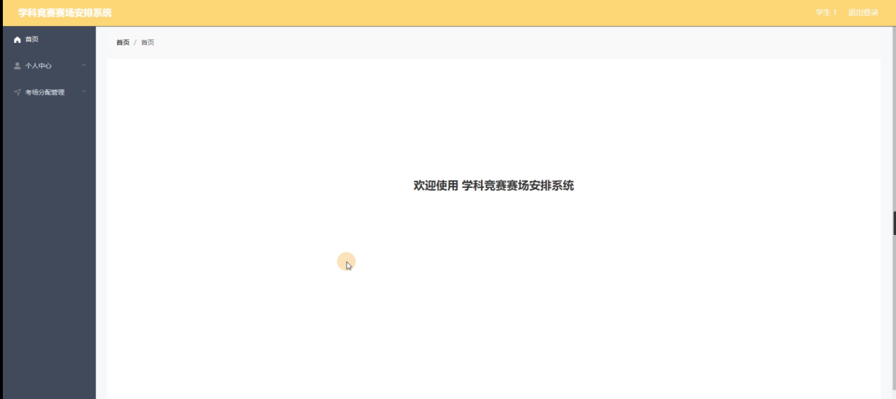

ssm+Vue计算机毕业设计学科竞赛赛场安排系统（程序+LW文档）

**项目运行**

**环境配置：**

**Jdk1.8 + Tomcat7.0 + Mysql + HBuilderX** **（Webstorm也行）+ Eclispe（IntelliJ
IDEA,Eclispe,MyEclispe,Sts都支持）。**

**项目技术：**

**SSM + mybatis + Maven + Vue** **等等组成，B/S模式 + Maven管理等等。**

**环境需要**

**1.** **运行环境：最好是java jdk 1.8，我们在这个平台上运行的。其他版本理论上也可以。**

**2.IDE** **环境：IDEA，Eclipse,Myeclipse都可以。推荐IDEA;**

**3.tomcat** **环境：Tomcat 7.x,8.x,9.x版本均可**

**4.** **硬件环境：windows 7/8/10 1G内存以上；或者 Mac OS；**

**5.** **是否Maven项目: 否；查看源码目录中是否包含pom.xml；若包含，则为maven项目，否则为非maven项目**

**6.** **数据库：MySql 5.7/8.0等版本均可；**

**毕设帮助，指导，本源码分享，调试部署** **(** **见文末** **)**

### 系统结构设计

整个系统是由多个功能模块组合而成的，要将所有的功能模块都一一列举出来，然后进行逐个的功能设计，使得每一个模块都有相对应的功能设计，然后进行系统整体的设计。

本学科竞赛赛场安排系统结构图如图3-2所示。

图3-2 学科竞赛赛场安排系统结构图

3.3 数据库设计

数据库可以说是所有软件的根本，如果数据库存在缺陷，那么会导致系统开发的不顺利、维护困难、用户使用不顺畅等一系列问题，严重时将会直接损害企业的利益，同时在开发完成后，数据库缺陷也更加难以解决。所以必须要对数据库设计重点把握，做到认真细致。因此，数据库设计是这个学科竞赛赛场安排系统的重点要素。

3.3.1概念结构设计

(1)管理员实体属性图如下图3-3所示

图3-3管理员实体属性图

(2) 考试场地管理实体属性如下图3-4所示

图3-4考试场地管理实体属性图

(3) 考场分配管理实体属性如下图3-5所示

图3-5考场分配管理实体属性图

(4) 学生信息实体属性如下图3-6所示

图3-6学生信息实体属性图

管理员功能模块

管理员登录，通过填写注册时输入的用户名、密码、角色进行登录，如图4-1所示。

图4-1管理员登录界面图

管理员登录进入学科竞赛赛场安排系统可以查看首页、个人中心、学生管理、监考老师管理、考试场地管理、考场分配管理、考试科目管理等信息，如图4-2所示。

图4-2管理员功能界面图

学生管理，在学生管理页面中可以学生账号、学生姓名、密码、性别、院系、专业、联系电话、照片等信息，还可以根据需要进行分配考场、修改或删除等操作，如图4-3所示。

图4-3学生管理界面图

监考老师管理，在监考老师管理页面中可以查看老师账号、密码、老师姓名、性别、年龄、照片、手机号、邮箱等信息，并可根据需要进行修改或删除等操作，如图4-4所示。

图4-4监考老师管理界面图

考试场地管理，在考试场地管理页面中可以查看场地编号、教师号、座位数量、所在位置、备注内容等信息，并可根据需要进行修改或删除等操作，如图4-5所示。

图4-5考试场地管理界面图

考场分配管理，在考场分配管理页面中可以查看学生账号、学生姓名、场地编号、教室号、所在位置、座位号、考试科目、准考证号、考试时间、老师账号、老师姓名等内容，并可根据需要进行修改或删除等操作，如图4-6所示。

图4-6考场分配管理界面图

考试科目管理，在考试科目管理页面中可以查看考试科目等内容，并可根据需要进行修改或删除等操作，如图4-7所示。

图4-7考试科目管理界面图

4.2学生功能模块

学生登录进入学科竞赛赛场安排系统可以查看首页、个人中心、考场分配管理等内容，如图4-8所示。

图4-8学生功能界面图

个人中心，在个人信息页面中通过填写学生账号、学生姓名、密码、性别、院系、专业、联系电话、照片等信息进行修改，如图4-9所示。

图4-9个人中心界面图

考场分配管理，在考场分配管理页面中可以查看学生账号、学生姓名、场地编号、教室号、所在位置、座位号、考试科目、准考证号、考试时间、老师账号、老师姓名等信息，如图4-10所示。

图4-10考场分配管理界面图

4.3监考老师功能模块

监考老师登录进入学科竞赛赛场安排系统可以查看首页、个人中心、考场分配管理等内容，如图4-11所示。

图4-11监考老师功能界面图

个人中心，在个人信息页面中通过填写老师账号、密码、老师姓名、性别、年龄、照片、手机号、邮箱等信息进行修改，如图4-12所示。

图4-12个人中心界面图

#### **JAVA** **毕设帮助，指导，源码分享，调试部署**

