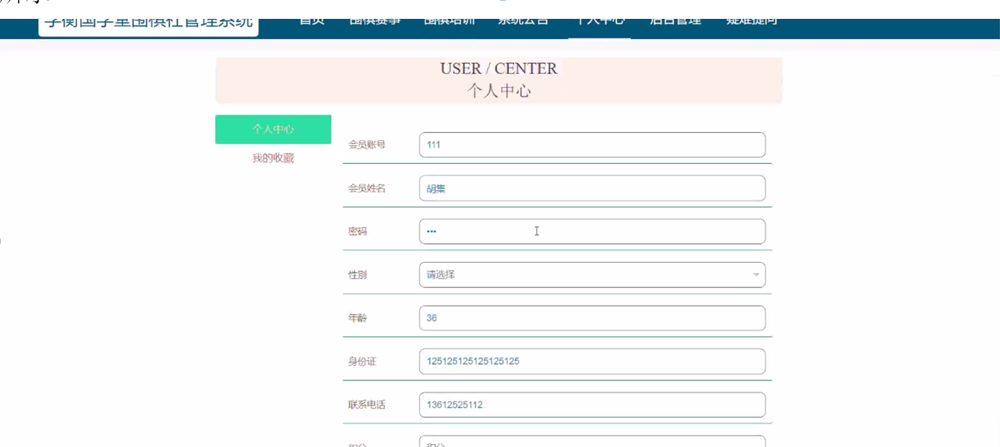

ssm+Vue计算机毕业设计学衡国学堂围棋社管理系统（程序+LW文档）

**项目运行**

**环境配置：**

**Jdk1.8 + Tomcat7.0 + Mysql + HBuilderX** **（Webstorm也行）+ Eclispe（IntelliJ
IDEA,Eclispe,MyEclispe,Sts都支持）。**

**项目技术：**

**SSM + mybatis + Maven + Vue** **等等组成，B/S模式 + Maven管理等等。**

**环境需要**

**1.** **运行环境：最好是java jdk 1.8，我们在这个平台上运行的。其他版本理论上也可以。**

**2.IDE** **环境：IDEA，Eclipse,Myeclipse都可以。推荐IDEA;**

**3.tomcat** **环境：Tomcat 7.x,8.x,9.x版本均可**

**4.** **硬件环境：windows 7/8/10 1G内存以上；或者 Mac OS；**

**5.** **是否Maven项目: 否；查看源码目录中是否包含pom.xml；若包含，则为maven项目，否则为非maven项目**

**6.** **数据库：MySql 5.7/8.0等版本均可；**

**毕设帮助，指导，本源码分享，调试部署** **(** **见文末** **)**

### 系统设计主要功能

通过市场调研及咨询研究，了解了学衡国学堂围棋社管理系统及管理者的使用需求，于是制定了管理员、会员等模块。功能结构图如下所示：

图4-1系统功能结构图

### 4.2 数据库设计

#### 4.2.1 数据库设计规范

数据可设计要遵循职责分离原则，即在设计时应该要考虑系统独立性，即每个系统之间互不干预不能混乱数据表和系统关系。

数据库命名也要遵循一定规范，否则容易混淆，数据库字段名要尽量做到与表名类似，多使用小写英文字母和下划线来命名并尽量使用简单单词。

#### 4.2.2  E/R图

会员注册E/R图，如下所示：

图4-2 会员注册E/R图

围棋培训管理E/R图，如下所示：

图4-3围棋培训管理E/R图

### 系统功能模块

学衡国学堂围棋社管理系统，在系统首页可查看首页、围棋赛事、围棋培训、系统公告、个人中心、后台管理、疑难提问等内容，如图5-1所示。

图5-1系统首页界面图

会员注册，会员通过输入会员账号、会员姓名、密码、年龄、身份证、联系电话等内容进行注册，如图5-2所示。

图5-2会员注册界面图

会员通过输入账号、密码进行登录进入系统，如图5-3所示。

图5-3会员登录界面图

围棋赛事，会员可在围棋赛事页面查看赛事编号、赛事名称、比赛地点、赛事周期、点击次数、封面、赛事详情、评论等内容，还可进行报名或收藏等操作，如图5-4所示。

图5-4围棋赛事界面图

个人中心，会员可在个人中心页面通过输入会员账号、会员姓名、密码、性别、年龄、身份证、联系电话、积分等内容进行个人信息更新或查看我的收藏等内容，如图5-5所示

图5-5个人中心界面图

5.2会员功能模块

会员进入系统后台管理模块可查看个人中心、比赛报名管理、比赛成绩管理、积分兑换管理等内容，如图5-6所示。

图5-6会员功能管理界面图

比赛报名管理，会员可在比赛报名管理页面查看赛事名称、赛事类型、赛事图片、比赛地点、赛事周期、会员账号、会员姓名、报名时间、审核回复、审核状态等内容，还可进行删除等操作，如图5-7所示。

图5-7比赛报名管理界面图

比赛成绩管理，会员可在比赛成绩管理页面通过输入赛事名称、赛事类型进行查询等操作，如图5-8所示。

图5-8比赛成绩管理界图面

积分兑换管理，会员可在积分兑换管理页面查看会员账号、会员姓名、兑换积分、兑换时间等内容，如图5-9所示。

图5-9积分兑换管理界图面

5.3管理员功能模块

管理员通过输入用户名、密码、角色进行登录进入系统，如图5-10所示。

图5-10 管理员登录界面图

管理员通过登录进入学衡国学堂围棋社管理系统可查看个人中心、会员管理、围棋赛事管理、围棋培训管理、比赛报名管理、比赛成绩管理、积分兑换管理、系统管理等内容，如图5-11所示。

图5-11管理员功能管理界面图

会员管理，管理员可在会员管理页面查看会员账号、会员姓名、性别、年龄、身份证、联系电话、积分等内容，还可进行新增、修改或删除等操作，如图5-12所示。

图5-12会员管理界面图

#### **JAVA** **毕设帮助，指导，源码分享，调试部署**

