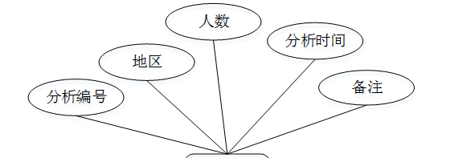

ssm+Vue计算机毕业设计学院校友信息管理系统的（程序+LW文档）

**项目运行**

**环境配置：**

**Jdk1.8 + Tomcat7.0 + Mysql + HBuilderX** **（Webstorm也行）+ Eclispe（IntelliJ
IDEA,Eclispe,MyEclispe,Sts都支持）。**

**项目技术：**

**SSM + mybatis + Maven + Vue** **等等组成，B/S模式 + Maven管理等等。**

**环境需要**

**1.** **运行环境：最好是java jdk 1.8，我们在这个平台上运行的。其他版本理论上也可以。**

**2.IDE** **环境：IDEA，Eclipse,Myeclipse都可以。推荐IDEA;**

**3.tomcat** **环境：Tomcat 7.x,8.x,9.x版本均可**

**4.** **硬件环境：windows 7/8/10 1G内存以上；或者 Mac OS；**

**5.** **是否Maven项目: 否；查看源码目录中是否包含pom.xml；若包含，则为maven项目，否则为非maven项目**

**6.** **数据库：MySql 5.7/8.0等版本均可；**

**毕设帮助，指导，本源码分享，调试部署** **(** **见文末** **)**

### 系统功能模块

根据系统功能分析，可以画出系统的功能模块图，系统总体功能如下图所示：

图 4-1 系统总体功能模块图

### 4.2数据库设计

#### 4.2.1 数据库需求分析

管理员：具有最高的管理权限，支持后台管理，对用户信息进行增删改查，对处方信息进行及时更新，还可以管理留言信息，删除一些不健康的留言。

#### 4.2.2 数据库概念结构设计

概念模型是对现实中的问题出现的事物的进行描述，ER图是由实体及其关系构成的图，通过E-R图可以清楚地描述系统涉及到的实体之间的相互关系。

流动分析实体图如图4-2所示：

图4-2流动分析实体图

地区分析实体图如图4-3所示：

图4-3地区分析实体图

用户实体图如图4-4所示：

图4-4用户实体图

### 管理员功能模块

管理员进行登录，进入系统前在登录页面根据要求填写用户名、密码，选择角色等信息，点击登录进行登录操作，如图5-1所示。

图5-1管理员登录界面图

管理员登录系统后，可以对首页、个人中心、用户管理、地区管理、薪酬管理、校友信息管理、地区分析管理、薪酬分析管理、流动分析管理、系统管理等功能进行相应的操作管理，如图5-2所示。

图5-2管理员功能界面图

地区管理，在地区管理页面可以对索引、地区等内容进行详情，修改和删除等操作，如图5-3所示。

图5-3地区管理界面图

薪酬管理，在薪酬管理页面可以对索引、薪酬等内容进行详情，修改和删除等操作，如图5-4所示。

图5-4薪酬管理界面图

校友信息管理，在校友信息管理页面可以对索引、用户账号、用户姓名、年龄、性别、电话号码、是否流动、地区、薪酬、头像、所在单位、职位等内容进行详情、修改和删除等操作，如图5-5所示。

图5-5校友信息管理界面图

地区分析管理，在地区分析管理页面可以对索引、分析编号、地区、人数、分析时间等内容进行详情、修改和删除等操作，如图5-6所示。

图5-6地区分析管理界面图

薪酬分析管理，在薪酬分析管理页面可以对索引、分析编号、薪酬、人数、分析时间等内容进行详情、修改和删除等操作，如图5-7所示。

图5-7薪酬分析管理界面图

流动分析管理，在流动分析管理页面可以对索引、分析编号、是否流动、人数、分析时间等内容进行详情，修改和删除等操作，如图5-8所示。

图5-8流动分析管理界面图

系统管理，在学院公告页面可以对索引、标题、图片等内容进行详情，修改和删除等操作，如图5-9所示。

图5-9系统管理界面图

### .5.2用户功能模块

用户登录进入学院校友信息管理系统可以对首页、个人中心、校友信息管理、系统管理等功能进行相应操作，如图5-10所示。

图5-10用户功能界面图

个人中心，在个人中心页面通过填写用户账号、性别、头像、年龄、毕业年份、用户姓名、电话号码等内容进行个人信息修改，如图5-11所示。

图5-11个人中心界面图

校友信息管理，在校友信息管理页面可以对索引、用户账号、用户姓名、年龄、性别、电话号码、是否流动、地区、薪酬、头像、所在单位、职位等内容进行详情等操作，如图5-12所示。

图5-12校友信息管理界面图

#### **JAVA** **毕设帮助，指导，源码分享，调试部署**

