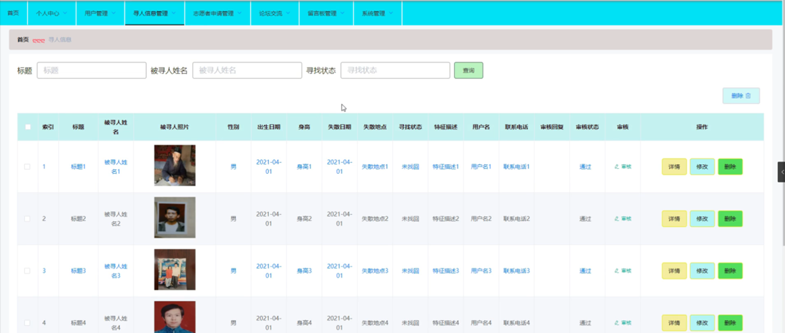
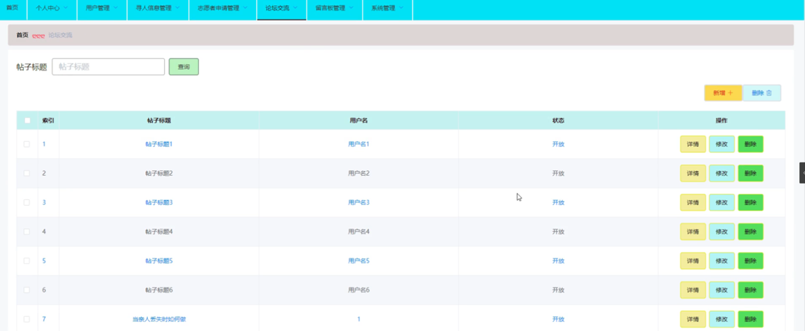

ssm+Vue计算机毕业设计寻人系统设计（程序+LW文档）

**项目运行**

**环境配置：**

**Jdk1.8 + Tomcat7.0 + Mysql + HBuilderX** **（Webstorm也行）+ Eclispe（IntelliJ
IDEA,Eclispe,MyEclispe,Sts都支持）。**

**项目技术：**

**SSM + mybatis + Maven + Vue** **等等组成，B/S模式 + Maven管理等等。**

**环境需要**

**1.** **运行环境：最好是java jdk 1.8，我们在这个平台上运行的。其他版本理论上也可以。**

**2.IDE** **环境：IDEA，Eclipse,Myeclipse都可以。推荐IDEA;**

**3.tomcat** **环境：Tomcat 7.x,8.x,9.x版本均可**

**4.** **硬件环境：windows 7/8/10 1G内存以上；或者 Mac OS；**

**5.** **是否Maven项目: 否；查看源码目录中是否包含pom.xml；若包含，则为maven项目，否则为非maven项目**

**6.** **数据库：MySql 5.7/8.0等版本均可；**

**毕设帮助，指导，本源码分享，调试部署** **(** **见文末** **)**

###  系统结构设计

系统架构图属于系统设计阶段，系统架构图只是这个阶段一个产物，系统的总体架构决定了整个系统的模式，是系统的基础。寻人系统设计的整体结构设计如图4-2所示。

图4-2 系统结构图

### 4.3数据库设计

数据库是计算机信息系统的基础。目前，电脑系统的关键与核心部分就是数据库。数据库开发的优劣对整个系统的质量和速度有着直接影响。

#### 4.3.1 数据库设计原则

数据库的概念结构设计采用实体—联系（E-R）模型设计方法。E-R模型法的组成元素有：实体、属性、联系，E-R模型用E-
R图表示，是提示用户工作环境中所涉及的事物，属性则是对实体特性的描述。在系统设计当中数据库起着决定性的因素。下面设计出这几个关键实体的实体—关系图。

#### 4.3.2 数据库实体

数据模型中的实体（Entity），也称为实例，对应现实世界中可区别于其他对象的“事件”或“事物”。例如，公司中的每个员工，家里中的每个家具。

本系统的E-R图如下图所示：

1、用户注册实体图如图4-3所示：

图4-3用户注册实体图

2、寻人信息实体图如图4-4所示：

图4-4寻人信息实体图

### 系统功能模块

寻人系统设计，在系统首页可以查看首页、寻人信息、论坛交流、寻人指南、留言反馈、个人中心、后台管理等内容，如图5-1所示。

图5-1系统首页界面图

用户注册，在用户注册页面通过填写用户名、密码、姓名、联系电话、身份证等信息完成用户注册，如图5-2所示。

图5-2用户注册界面图

寻人信息，在寻人信息页面可以查看标题、被寻人姓名、被寻人照片、姓名、出生日期、身高、失散日期、失散地点、寻找状态、特征描述、用户名、联系电话等信息，如图5-3所示。

图5-3寻人信息界面图

论坛交流，在论坛交流页面通过填写标题、类型、内容等信息进行发布帖子，如图5-4所示。

图5-4论坛交流界面图

个人中心，在个人中心页面通过填写用户名、密码、姓名、性别、联系电话、身份证等信息，根据需要对我的发布、我的收藏进行相对应操作，如图5-5所示。

图5-5个人中心界面图

### 5.2管理员功能模块

管理员登录，通过填写注册时输入的用户名、密码、角色进行登录，如图5-6所示。

图5-6管理员登录界面图

管理员登录进入寻人系统设计可以查看首页、个人中心、用户管理、寻人信息管理、志愿者申请管理、论坛管理、留言板管理、系统管理等信息，如图5-7所示。

图5-7管理员功能界面图

用户管理，在用户管理页面中可以查看索引、用户名、姓名、头像、性别、联系电话、身份证等信息，并可根据需要进行修改或删除等操作，如图5-8所示。

图5-8用户管理界面图

寻人信息管理，在寻人信息管理页面中可以查看索引、标题、被寻人姓名、被寻人照片、姓名、出生日期、身高、失散日期、失散地点、寻找状态、特征描述、用户名、联系电话、审核回复、审核状态、审核等信息，并可根据需要进行修改或删除等操作，如图5-9所示。

图5-9寻人信息管理界面图

志愿者申请管理，在志愿者申请管理页面中可以查看索引、用户名、姓名、联系电话、身份证、年龄、职业、家庭住址、申请说明、申请时间、备注、审核回复、审核状态、审核等信息，并可根据需要进行修改或删除等操作，如图5-10所示。

图5-10志愿者申请管理界面图

论坛管理，在论坛管理页面中可以查看索引、帖子标题、用户名、状态等信息，并可根据需要进行修改或删除等操作，如图5-11所示。

图5-11论坛管理界面图

留言板管理，在留言板管理页面中可以查看索引、用户名、留言内容、回复内容等信息，并可根据需要进行回复、修改或删除等操作，如图5-12所示。

图5-12留言板管理界面图

#### **JAVA** **毕设帮助，指导，源码分享，调试部署**

