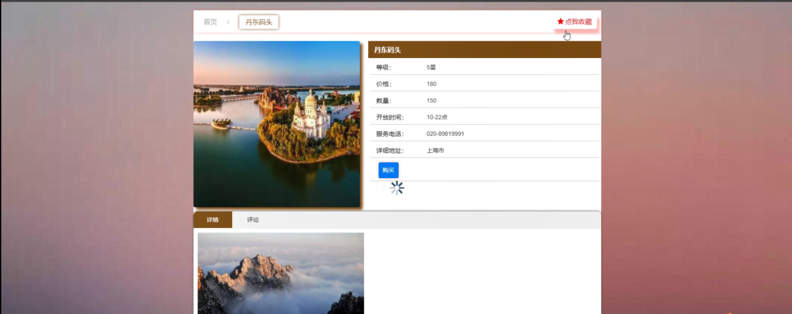
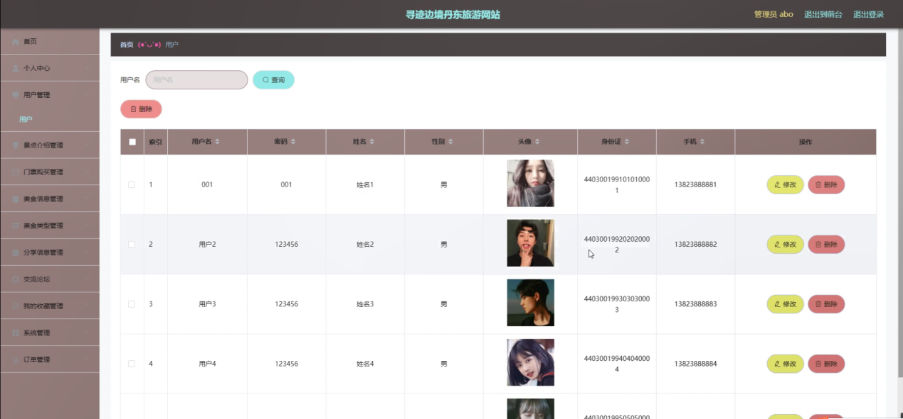

ssm+Vue计算机毕业设计寻迹边境丹东旅游网站（程序+LW文档）

**项目运行**

**环境配置：**

**Jdk1.8 + Tomcat7.0 + Mysql + HBuilderX** **（Webstorm也行）+ Eclispe（IntelliJ
IDEA,Eclispe,MyEclispe,Sts都支持）。**

**项目技术：**

**SSM + mybatis + Maven + Vue** **等等组成，B/S模式 + Maven管理等等。**

**环境需要**

**1.** **运行环境：最好是java jdk 1.8，我们在这个平台上运行的。其他版本理论上也可以。**

**2.IDE** **环境：IDEA，Eclipse,Myeclipse都可以。推荐IDEA;**

**3.tomcat** **环境：Tomcat 7.x,8.x,9.x版本均可**

**4.** **硬件环境：windows 7/8/10 1G内存以上；或者 Mac OS；**

**5.** **是否Maven项目: 否；查看源码目录中是否包含pom.xml；若包含，则为maven项目，否则为非maven项目**

**6.** **数据库：MySql 5.7/8.0等版本均可；**

**毕设帮助，指导，本源码分享，调试部署** **(** **见文末** **)**

### 系统结构设计

整个系统是由多个功能模块组合而成的，要将所有的功能模块都一一列举出来，然后进行逐个的功能设计，使得每一个模块都有相对应的功能设计，然后进行系统整体的设计。

本寻迹边境丹东旅游网站结构图如图4-2所示。

图4-2 系统功能结构图

#### 数据库E-R图设计

本寻迹边境丹东旅游网站采用的是MYSQL数据库，数据存储快，因为寻迹边境丹东旅游网站，主要的就是对信息的管理，信息内容比较多，这就需要好好的设计一个好的数据库，分类要清楚，不能添加信息的时候，造成信息太过混乱，设计好的数据库首先就需要先把各个实体之间的关系表达明确，系统的E-
R图如下图所示：

1、用户注册实体图如图4-5所示：

图4-5 用户注册管理实体图

2、景点介绍信息实体图如图4-6所示：

图4-6景点介绍信息实体图

3、门票购买管理实体图如图4-7所示：

图4-7门票购买管理实体图

系统功能模块

寻迹边境丹东旅游网站，在系统首页可以查看首页、景点介绍、美食信息、分享信息、交流论坛、个人中心、后台管理、购物车等内容，如图5-1所示。

图5-1系统功能界面图

景点介绍，在景点介绍页面可以查看景点名称、等级、图片、价格、数量、开发时间、服务电话、详细地址等信息，如图5-2所示。

图5-2景点介绍界面图

用户注册，在用户注册页面通过填写用户名、密码、姓名、身份证、手机等信息完成用户注册，如图5-3所示。在交流论坛页面通过填写标题、类型、内容等信息进行发布帖子，如图5-4所示。

图5-3用户注册界面图

图5-4交流论坛界面图

美食信息，在美食信息页面可以查看景美食名称、美食类型、图片、咨询电话、地址、价格、单次购买、库存等信息，进行添加到购物车，如图5-5所示。

图5-5美食信息界面图

个人中心，在个人中心页面通过填写用户名、密码、姓名、性别、身份证、手机、余额等信息进行更新信息，如图5-6所示。

图5-6个人中心界面图

购物车，在购物车页面可以查看购买商品、价格、数量、总价等信息，如图5-7所示。

图5-7购物车界面图

5.2管理员功能模块

管理员登录，通过填写注册时输入的用户名、密码、角色进行登录，如图5-8所示。

图5-8管理员登录界面图

管理员登录进入寻迹边境丹东旅游网站可以查看首页、个人中心、用户管理、景点介绍管理、门票购买管理、美食信息管理、美食类型管理、分享信息管理、交流论坛、我的收藏管理、系统管理、订单管理等信息，如图5-9所示。

图5-9管理员功能界面图

用户管理，在用户管理页面中可以可以查看用户名、密码、姓名、性别、头像、身份证、手机等信息，还可以根据需要进行修改或删除等操作，如图5-10所示。

图5-10用户管理界面图

景点介绍管理，在景点介绍管理页面中可以查看景点名称、等级、图片、价格、数量、开发时间、服务电话、详细地址等信息，并可根据需要进行查看评论、修改或删除等操作，如图5-11所示。

图5-11景点介绍管理界面图

门票购买管理，在门票购买管理页面中可以查看订单编号、景点名称、等级、价格、数量、总价格、购买日期、用户名、姓名、是否支付等信息，并可根据需要进行修改或删除等细操作，如图5-12所示。

图5-12门票购买管理界面图

#### **JAVA** **毕设帮助，指导，源码分享，调试部署**

