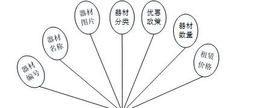

ssm+Vue计算机毕业设计幸福小区健身器材租赁系统（程序+LW文档）

**项目运行**

**环境配置：**

**Jdk1.8 + Tomcat7.0 + Mysql + HBuilderX** **（Webstorm也行）+ Eclispe（IntelliJ
IDEA,Eclispe,MyEclispe,Sts都支持）。**

**项目技术：**

**SSM + mybatis + Maven + Vue** **等等组成，B/S模式 + Maven管理等等。**

**环境需要**

**1.** **运行环境：最好是java jdk 1.8，我们在这个平台上运行的。其他版本理论上也可以。**

**2.IDE** **环境：IDEA，Eclipse,Myeclipse都可以。推荐IDEA;**

**3.tomcat** **环境：Tomcat 7.x,8.x,9.x版本均可**

**4.** **硬件环境：windows 7/8/10 1G内存以上；或者 Mac OS；**

**5.** **是否Maven项目: 否；查看源码目录中是否包含pom.xml；若包含，则为maven项目，否则为非maven项目**

**6.** **数据库：MySql 5.7/8.0等版本均可；**

**毕设帮助，指导，本源码分享，调试部署** **(** **见文末** **)**

### 功能结构

为了更好的去理清本系统整体思路，对该系统以结构图的形式表达出来，设计实现该幸福小区健身器材租赁系统的功能结构图如下所示：

图4-1 系统总体结构图

### 4.2 数据库设计

####  4.2.1 数据库E/R图

ER图是由实体及其关系构成的图，通过E/R图可以清楚地描述系统涉及到的实体之间的相互关系。在系统中对一些主要的几个关键实体如下图：

(1) 用户管理E/R图如下所示：

图4-2用户管理E/R图

(2) 器材信息E/R图如下所示：

图4-3器材信息E/R图

(3) 归还记录E/R图如下所示：

图4-4归还记录E/R图

### 管理员功能模块

管理员登录，管理员通过输入用户名，密码和角色，点击登录进入系统操作进行操作，如图5-1所示。

图5-1管理员登录界图面

管理员通过登陆进入系统后，可以查看个人中心、用户管理、器材分类管理、器材信息管理、租赁记录管理、归还记录管理、系统管理等功能，还能对每个功能逐一进行相应操作，如图5-2所示。

图5-2管理员功能界图面

用户管理，管理员可在用户管理页面查看用户名、姓名、性别、头像、手机、居住地址、审核回复、审核状态等内容，还可进行新增、审核、修改或删除等操作，如图5-3所示。

图5-3用户管理界面图

器材分类管理，管理员可在器材分类管理页面进行新增、修改或删除等操作，如图5-4所示。

图5-4器材分类管理界面图

器材信息管理，管理员可在器材信息管理页面查看器材编号、器材名称、器材图片、器材分类、优惠政策、器材数量、租赁价格等内容，还可进行新增、修改或删除等操作，如图5-5所示。

图5-5器材信息管理界面图

租赁记录管理，管理员可在租赁记录管理页面查看租赁单号、器材名称、器材图片、器材分类、器材数量、租赁价格、租赁天数、订单金额、租赁备注、器材状态、租赁日期、用户名、手机、居住地址、是否支付、审核回复、审核状态等内容，还可进行修统计或删除等操作，如图5-6所示。

图5-6租赁记录管理界面图

归还记录管理，管理员可在归还记录管理页面查看租赁单号、器材名称、器材图片、器材分类、器材数量、归还备注、租赁日期、归还日期、用户名、手机、居住地址、审核回复、审核状态等内容，还可进行审核、修改或删除等操作，如图5-7所示。

图5-7归还记录管理界面图

5.2系统功能模块

幸福小区健身器材租赁系统，在系统首页可查看首页、器材信息、公告信息、个人中心、后台管理等内容，如图5-8所示。

图5-8系统首页界面图

用户注册，用户通过输入用户名、密码、姓名、手机、居住地址等内容进行注册，如图5-9所示。

图5-9用户注册界面图

器材信息，用户可在器材信息页面查看器材名称、器材编号、器材图片、器材分类、优惠政策、器材数量、租赁价格、器材作用等内容，还可进行器材租赁或收藏等操作，如图5-10所示。

图5-10器材信息界面图

后台管理，用户可在后台管理页面查看个人中心、租赁记录管理、归还记录管理等内容，如图5-11所示。

图5-11用户后台功能界面图

租赁记录管理，用户可在租赁记录管理页面查看租赁单号、器材名称、器材图片、器材分类、器材数量、租赁价格、租赁天数、订单金额、租赁备注、器材状态、租赁日期、用户名、手机、居住地址、是否支付、审核回复、审核状态等内容，如图5-12所示。

图5-12租赁记录管理界图面

#### **JAVA** **毕设帮助，指导，源码分享，调试部署**

