ssm+Vue计算机毕业设计幼儿健康管理系统（程序+LW文档）

**项目运行**

**环境配置：**

**Jdk1.8 + Tomcat7.0 + Mysql + HBuilderX** **（Webstorm也行）+ Eclispe（IntelliJ
IDEA,Eclispe,MyEclispe,Sts都支持）。**

**项目技术：**

**SSM + mybatis + Maven + Vue** **等等组成，B/S模式 + Maven管理等等。**

**环境需要**

**1.** **运行环境：最好是java jdk 1.8，我们在这个平台上运行的。其他版本理论上也可以。**

**2.IDE** **环境：IDEA，Eclipse,Myeclipse都可以。推荐IDEA;**

**3.tomcat** **环境：Tomcat 7.x,8.x,9.x版本均可**

**4.** **硬件环境：windows 7/8/10 1G内存以上；或者 Mac OS；**

**5.** **是否Maven项目: 否；查看源码目录中是否包含pom.xml；若包含，则为maven项目，否则为非maven项目**

**6.** **数据库：MySql 5.7/8.0等版本均可；**

**毕设帮助，指导，本源码分享，调试部署** **(** **见文末** **)**

### 系统结构

系统架构图属于系统设计阶段，系统架构图只是这个阶段一个产物，系统的总体架构决定了整个系统的模式，是系统的基础。幼儿健康管理系统的整体结构设计如图4-2所示。

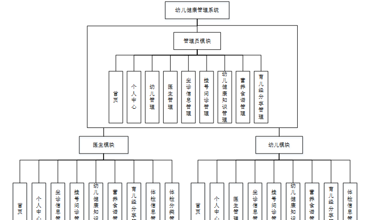

图4-2 系统结构图

### 4.3. 数据库设计

#### 4.3.1 数据库实体

管理员信息结构图，如图4-3所示：

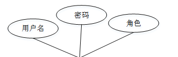

图4-3 管理员信息实体结构图

坐诊信息实体属性图，如图4-4所示：

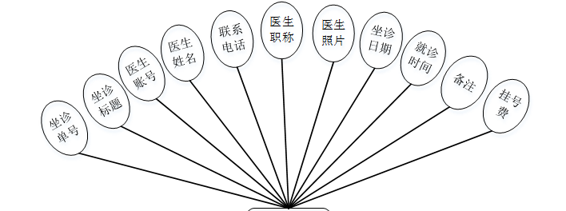

图4-4坐诊信息实体属性图

幼儿健康知识实体属性图如图4-5所示。

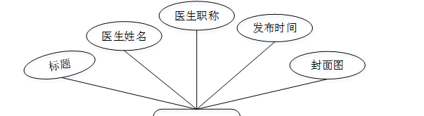

图4-5幼儿健康知识实体属性图

### 系统功能模块

幼儿健康管理系统，在系统的首页可以查看首页、坐诊信息、幼儿健康知识、营养食谱、育儿经分享、健康论坛、新闻资讯、个人中心、后台管理等信息进行详细操作，如图5-1所示。

图5-1系统首页界面图

坐诊信息，在坐诊信息页面中可以查看坐诊单号、坐诊标题、医生账号、医生姓名、联系电话、医生职称、医生照片、坐诊日期、就诊时间、备注、挂号费等信息，并进行挂号问诊操作，如图5-2所示。

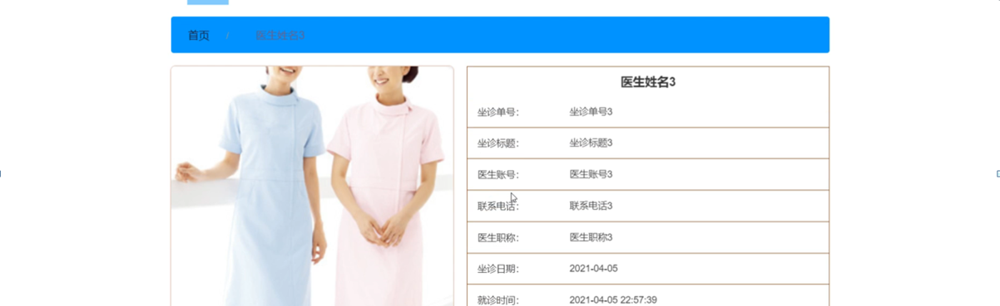

图5-2坐诊信息界面图

幼儿健康知识，在幼儿健康知识页面中可以查看标题、医生姓名、医生职称、发布时间、点击次数等信息，如图5-3所示。

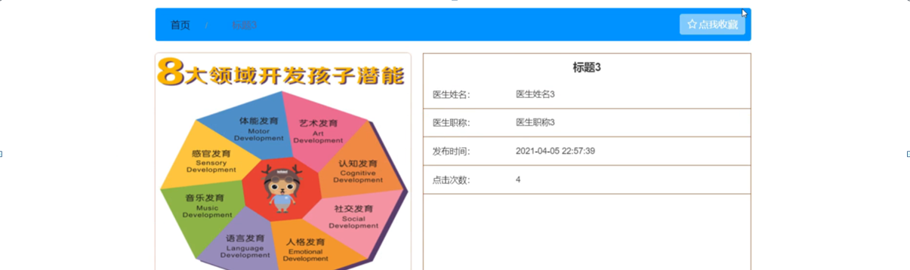

图5-3幼儿健康知识界面图

育儿经分享，在育儿经分享页面中可以查看育儿标题、育儿封面、发布时间、医生姓名、医生职称等信息，如图5-4所示。

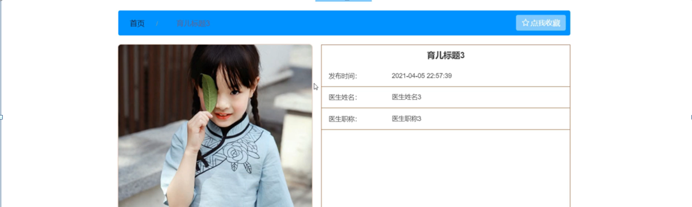

图5-4育儿经分享界面图

个人中心，在个人中心页面通过填写账号、密码、姓名、性别、手机、邮箱等信息进行更新信息，根据需要对我的发布、我的收藏进行相对应操作，如图5-5所示。

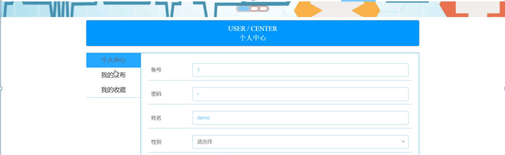

图5-5个人中心界面图

### 5.2 管理员功能模块

管理员登录，管理员通过输入用户名、密码、选择角色等信息，然后点击登录就能登录到系统进行系统的使用了，如图5-6所示。

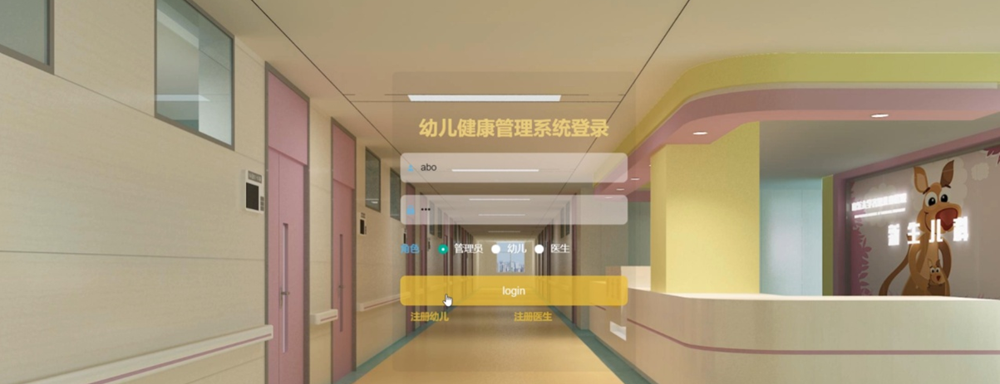

图5-6管理员登录界面图

管理员登录进入系统之后，就可以对所有的信息进行查看，可以查看到首页、个人中心、幼儿管理、医生管理、坐诊信息管理、挂号问诊管理、幼儿健康知识管理、营养食谱管理、育儿经分享管理等，并且还可以对其进行相应的操作管理，如图5-7所示。

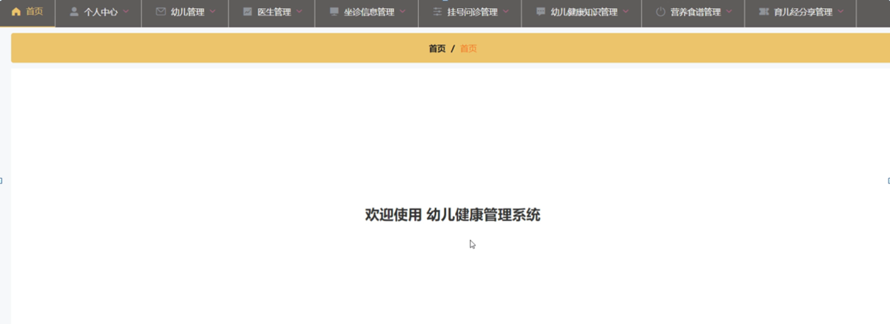

图5-7管理员功能界面图

幼儿管理，在幼儿管理页面中可以对账号、姓名、性别、手机、邮箱、照片等信息进行详情、修改或删除等操作，如图5-8所示。

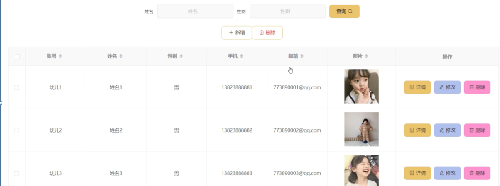

图5-8幼儿管理界面图

医生管理，在医生管理页面中可以对医生账号、医生姓名、医生职称、医生性别、联系电话、医生邮箱、医生照片等信息进行详情、修改或删除等操作，如图5-9所示。

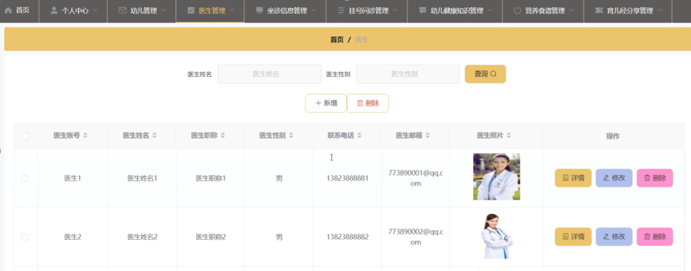

图5-9医生管理界面图

挂号问诊管理，在挂号问诊管理页面中可以对坐诊单号、坐诊标题、医生姓名、联系电话、医生照片、就诊时间、挂号费、账号、姓名、是否支付、审核回复、审核状态、审核等信息进行详情、修改或删除等操作，如图5-10所示。

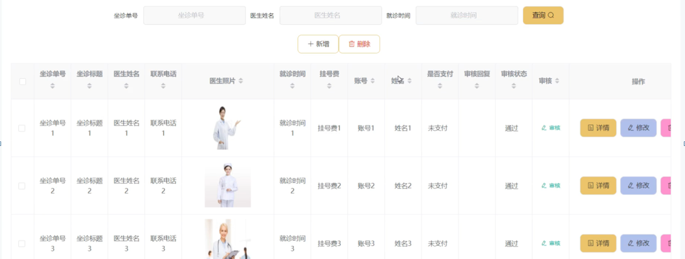

图5-10挂号问诊管理界面图

幼儿健康知识管理，在幼儿健康知识管理页面中可以对标题、医生姓名、医生职称、发布时间、封面图等信息进行详情、查看评论、修改或删除等操作，如图5-11所示。

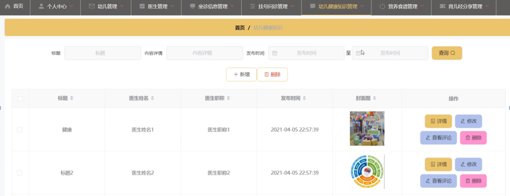

图5-11幼儿健康知识管理界面图

### 5.3幼儿功能模块

幼儿登录进入系统后台可以查看首页、个人中心、医生管理、坐诊信息管理、挂号问诊管理、幼儿健康知识管理、营养食谱管理、育儿经分享管理、体检信息管理等信息进行详细操作，如图5-12所示。

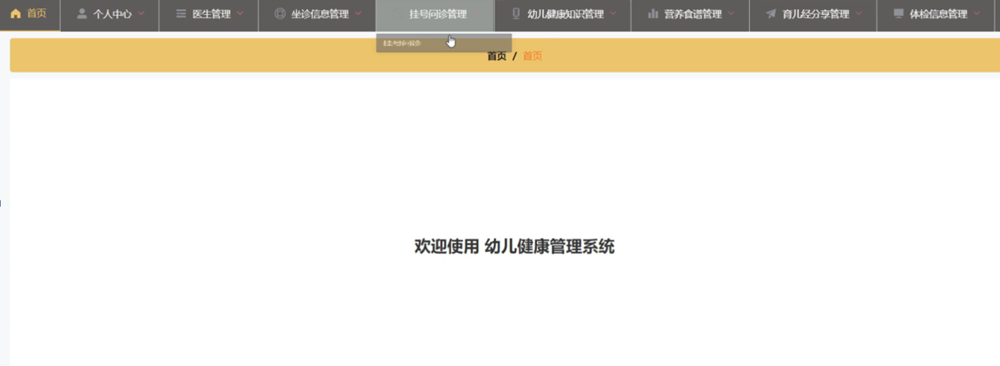

图5-12幼儿功能界面图

**JAVA** **毕设帮助，指导，源码分享，调试部署**

