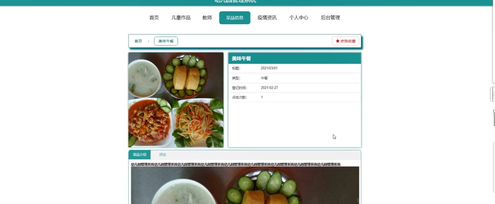

ssm+Vue计算机毕业设计幼儿园管理系统（程序+LW文档）

**项目运行**

**环境配置：**

**Jdk1.8 + Tomcat7.0 + Mysql + HBuilderX** **（Webstorm也行）+ Eclispe（IntelliJ
IDEA,Eclispe,MyEclispe,Sts都支持）。**

**项目技术：**

**SSM + mybatis + Maven + Vue** **等等组成，B/S模式 + Maven管理等等。**

**环境需要**

**1.** **运行环境：最好是java jdk 1.8，我们在这个平台上运行的。其他版本理论上也可以。**

**2.IDE** **环境：IDEA，Eclipse,Myeclipse都可以。推荐IDEA;**

**3.tomcat** **环境：Tomcat 7.x,8.x,9.x版本均可**

**4.** **硬件环境：windows 7/8/10 1G内存以上；或者 Mac OS；**

**5.** **是否Maven项目: 否；查看源码目录中是否包含pom.xml；若包含，则为maven项目，否则为非maven项目**

**6.** **数据库：MySql 5.7/8.0等版本均可；**

**毕设帮助，指导，本源码分享，调试部署** **(** **见文末** **)**

### 系统结构设计

系统架构图属于系统设计阶段，系统架构图只是这个阶段一个产物，系统的总体架构决定了整个系统的模式，是系统的基础。幼儿园管理系统的整体结构设计如图4-2所示。

图4-2 系统结构图

### 4.3数据库设计

数据库是计算机信息系统的基础。目前，电脑系统的关键与核心部分就是数据库。数据库开发的优劣对整个系统的质量和速度有着直接影响。

#### 4.3.1 数据库设计原则

数据库的概念结构设计采用实体—联系（E-R）模型设计方法。E-R模型法的组成元素有：实体、属性、联系，E-R模型用E-
R图表示，是提示用户工作环境中所涉及的事物，属性则是对实体特性的描述。在系统设计当中数据库起着决定性的因素。下面设计出这几个关键实体的实体—关系图。

#### 4.3.2 数据库实体

数据模型中的实体（Entity），也称为实例，对应现实世界中可区别于其他对象的“事件”或“事物”。例如，公司中的每个员工，家里中的每个家具。

本系统的E-R图如下图所示：

1、儿童作品管理实体图如图4-3所示：

图4-3儿童作品管理实体图

2、儿童信息实体图如图4-4所示：

图4-4儿童信息实体图

### 系统功能模块

幼儿园管理系统，在系统首页可以查看首页、儿童作品、教师、菜品信息、疫情资讯、个人中心、后台管理等内容，如图5-1所示。

图5-1系统首页界面图

儿童作品，在儿童作品页面可以查看标题、儿童姓名、班级、图片、发表时间、内容等信息，进行收藏，如图5-2所示。

图5-2儿童作品界面图

教师，在教师页面可以查看教师姓名、教师工号、性别、图片、职称、联系电话、教师邮箱、班级等信息，如图5-3所示。

图5-3教师界面图

菜品信息，在菜品信息页面可以查看菜品名称、标题、类型、图片、登记时间、点击次数、菜品介绍等信息，进行评论或收藏，如图5-4所示。

图5-4菜品信息界面图

个人中心，在个人中心页面通过填写儿童姓名、密码、班级、性别、年龄、身高、体重等信息进行更新，如图5-5所示。

图5-5个人中心界面图

### 5.2管理员功能模块

管理员登录，通过填写注册时输入的用户名、密码、角色进行登录，如图5-6所示。

图5-6管理员登录界面图

管理员登录进入幼儿园管理系统可以查看首页、个人中心、儿童作品管理、儿童管理、教师管理、菜品信息管理、体温登记管理、系统管理等信息，如图5-7所示。

图5-7管理员功能界面图

儿童作品管理，在儿童作品管理页面中可以查看索引、标题、封面、儿童姓名、班级、发表时间等信息，并可根据需要对进行修改或删除等操作，如图5-8所示。

图5-8儿童作品管理界面图

儿童管理，在儿童管理页面中可以查看索引、儿童姓名、密码、班级、性别、年龄、身高、体重等信息，并可根据需要进行修改或删除操作，如图5-9所示。

图5-9儿童管理界面图

教师管理，在教师管理页面中可以查看索引、教师工号、密码、教师姓名、性别、职称、联系电话、教师邮箱、班级、头像等内容，并可根据需要进行修改或删除操作，如图5-10所示。

图5-10教师管理界面图

菜品信息管理，在菜品信息管理页面中可以查看索引、标题、菜品名称、类型、图片、登记时间等内容，并可根据需要进行查看评论，并可根据需要进行修改或删除操作，如图5-11所示。

图5-11菜品信息管理界面图

体温登记管理，在体温登记管理页面中可以查看索引、儿童姓名、班级、体温、状态、登记时间等内容，并可根据需要进行修改或删除操作，如图5-12所示。

图5-12体温登记管理界面图

**JAVA** **毕设帮助，指导，源码分享，调试部署**

