ssm+Vue计算机毕业设计幼儿影视节目智能推荐系统（程序+LW文档）

**项目运行**

**环境配置：**

**Jdk1.8 + Tomcat7.0 + Mysql + HBuilderX** **（Webstorm也行）+ Eclispe（IntelliJ
IDEA,Eclispe,MyEclispe,Sts都支持）。**

**项目技术：**

**SSM + mybatis + Maven + Vue** **等等组成，B/S模式 + Maven管理等等。**

**环境需要**

**1.** **运行环境：最好是java jdk 1.8，我们在这个平台上运行的。其他版本理论上也可以。**

**2.IDE** **环境：IDEA，Eclipse,Myeclipse都可以。推荐IDEA;**

**3.tomcat** **环境：Tomcat 7.x,8.x,9.x版本均可**

**4.** **硬件环境：windows 7/8/10 1G内存以上；或者 Mac OS；**

**5.** **是否Maven项目: 否；查看源码目录中是否包含pom.xml；若包含，则为maven项目，否则为非maven项目**

**6.** **数据库：MySql 5.7/8.0等版本均可；**

**毕设帮助，指导，本源码分享，调试部署** **(** **见文末** **)**

### 系统结构

系统架构图属于系统设计阶段，系统架构图只是这个阶段一个产物，系统的总体架构决定了整个系统的模式，是系统的基础。幼儿影视节目智能推荐系统的整体结构设计如图4-2所示。

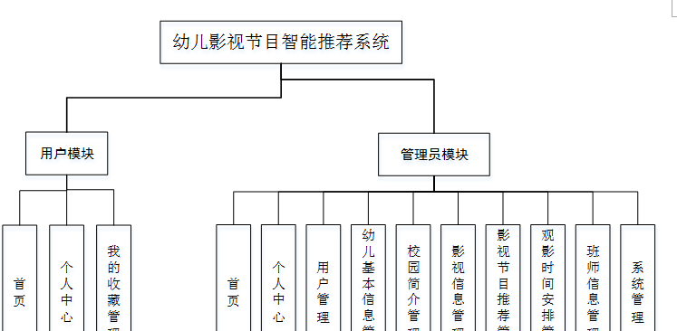

图4-2 系统结构图

### 4.3. 数据库设计

#### 4.3.1 数据库实体

用户管理结构图，如图4-3所示：

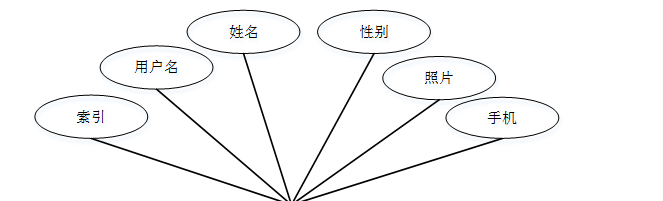

图4-3用户管理结构图

校园简介管理实体属性图，如图4-4所示：

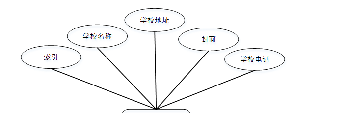

图4-4校园简介管理实体属性图

影视信息管理实体属性图，如图4-5所示：

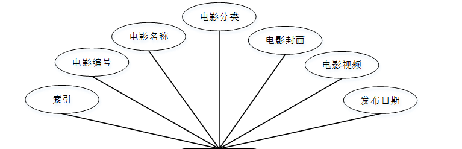

图4-5影视信息管理实体属性图

### 系统功能模块

幼儿影视节目智能推荐系统，在系统的首页可以查看首页、校园简介、影视信息、影视节目推荐、观景时间安排、班师信息、新闻资讯、个人中心、后台管理等信息进行详细操作，如图5-1所示。

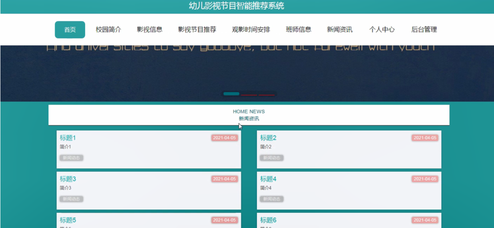

图5-1系统首页界面图

影视信息，在影视信息页面中可以查看电影编号、电影分类、图片、主要演员、电影介绍、发布日期、点击次数、电影详情等详细信息进行评论或收藏；如图5-2所示。

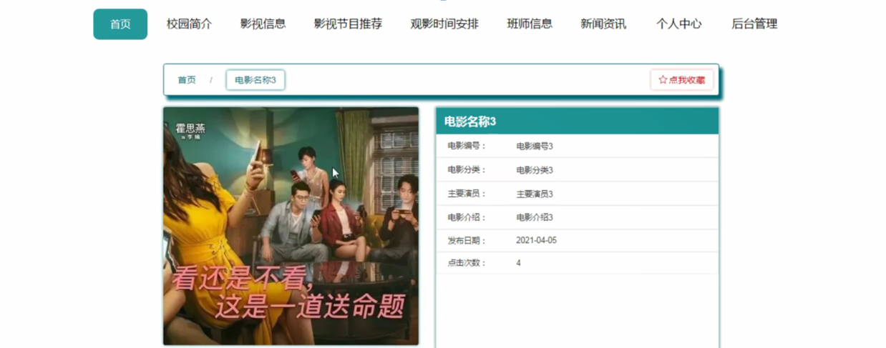

图5-2影视信息界面图

影视节目推荐，在影视节目推荐页面中可以查看视频名称、视频分类、图片、视频介绍、授课教师、课时、上课时间、上课地点等详细信息进行评论或收藏；如图5-3所示。

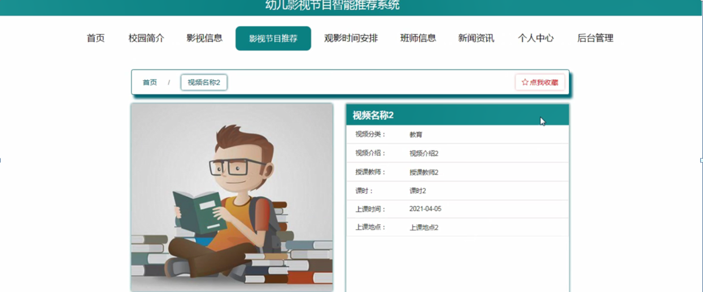

图5-3影视节目推荐界面图

观影时间安排，在观影时间安排页面中可以查看观影班级、观影地点、观影时间、图片、电影编号、电影名称、在线老师等详细信息；如图5-4所示。

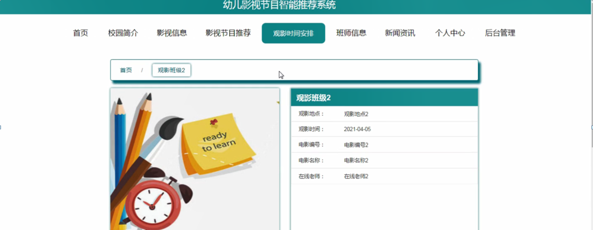

图5-4观影时间安排界面图

班师信息，在班师信息页面中可以查看班级名称、班级人数、班级楼层、年级、班主任姓名、图片等详细信息；如图5-5所示。

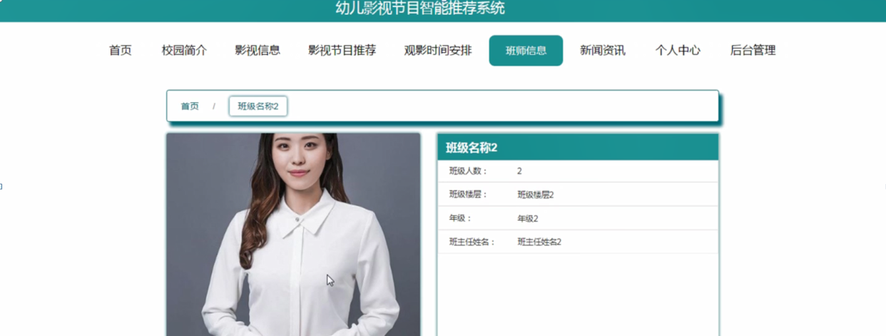

图5-5班师信息界面图

用户注册，在用户注册页面通过填写用户名、密码、姓名、手机等信息进行注册操作；如图5-6所示。在个人中心页面通过填写用户名、密码、姓名、性别、图片、手机等信息进行更新操作；还可以对我的收藏进行详细操作；如图5-7所示。

图5-6用户注册界面图

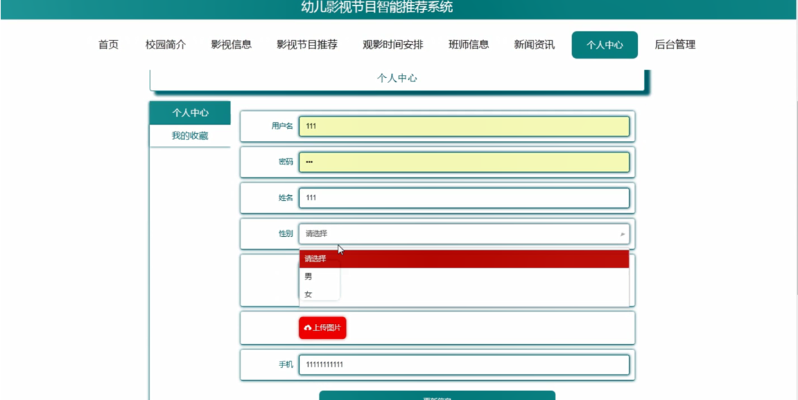

图5-7个人中心界面图

### 5.2管理员功能模块

管理员登录，管理员通过输入账号，密码，选择角色等信息即可进行系统登录，如图5-8所示。

图5-8管理员登录界面图

管理员登录进入幼儿影视节目智能推荐系统可以查看首页、个人中心、用户管理、幼儿基本信息管理、校园简介管理、影视信息管理、影视节目推荐管理、观影时间安排管理、班师信息管理、系统管理等内容进行详细操作，如图5-9所示。

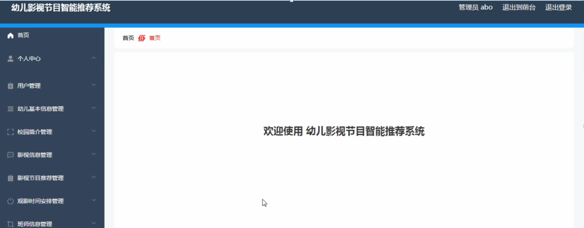

图5-9管理员功能界面图

用户管理，在用户管理页面可以对索引、用户名、姓名、性别、照片、手机等信息进行详情，修改或删除等操作，如图5-10所示。

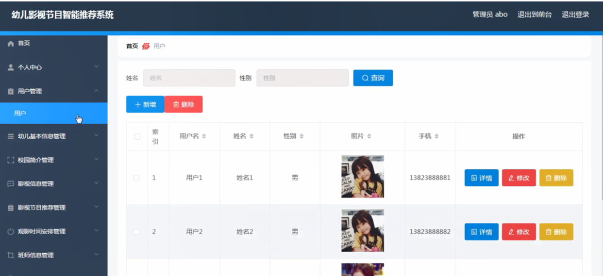

图5-10用户管理界面图

幼儿基本信息管理，在幼儿基本信息管理页面可以对索引、幼儿编号、幼儿姓名、班级、幼儿年龄、幼儿性别、幼儿照片、用户名、姓名等信息进行详情，修改或删除等操作，如图5-11所示。

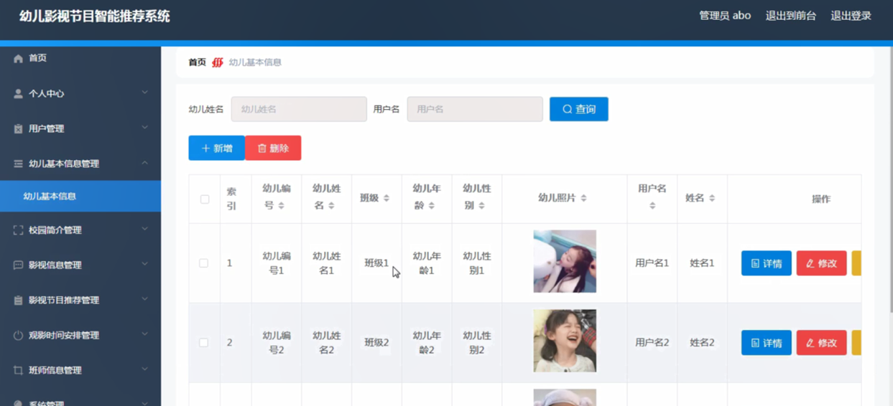

图5-11幼儿基本信息管理界面图

校园简介管理，在校园简介管理页面可以对索引、学校名称、学校地址、封面、学校电话等信息进行详情，修改或删除等操作，如图5-12所示。

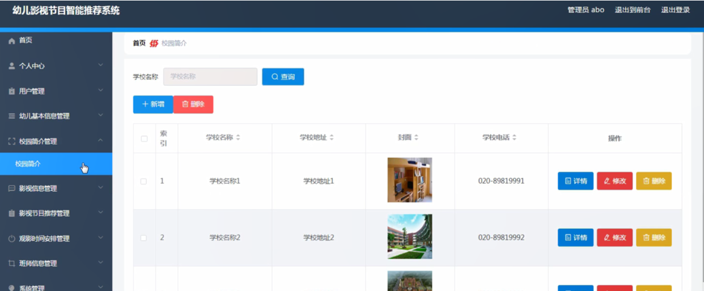

图5-12校园简介管理界面图

#### **JAVA** **毕设帮助，指导，源码分享，调试部署**

