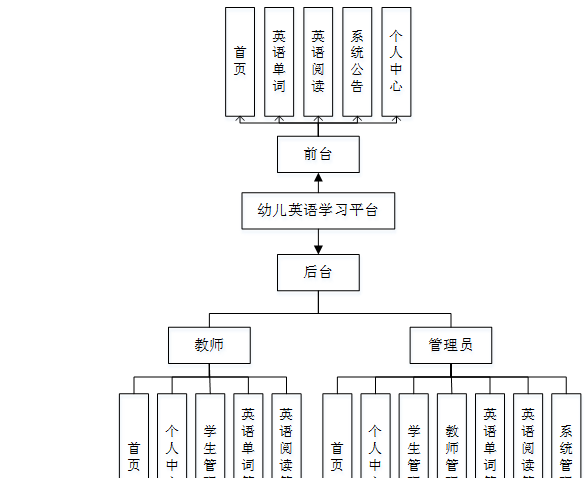

ssm+Vue计算机毕业设计幼儿英语学习平台的（程序+LW文档）

**项目运行**

**环境配置：**

**Jdk1.8 + Tomcat7.0 + Mysql + HBuilderX** **（Webstorm也行）+ Eclispe（IntelliJ
IDEA,Eclispe,MyEclispe,Sts都支持）。**

**项目技术：**

**SSM + mybatis + Maven + Vue** **等等组成，B/S模式 + Maven管理等等。**

**环境需要**

**1.** **运行环境：最好是java jdk 1.8，我们在这个平台上运行的。其他版本理论上也可以。**

**2.IDE** **环境：IDEA，Eclipse,Myeclipse都可以。推荐IDEA;**

**3.tomcat** **环境：Tomcat 7.x,8.x,9.x版本均可**

**4.** **硬件环境：windows 7/8/10 1G内存以上；或者 Mac OS；**

**5.** **是否Maven项目: 否；查看源码目录中是否包含pom.xml；若包含，则为maven项目，否则为非maven项目**

**6.** **数据库：MySql 5.7/8.0等版本均可；**

**毕设帮助，指导，本源码分享，调试部署** **(** **见文末** **)**

### 软件功能模块设计

系统整功能如下图所示：

图 4-1 系统总体功能模块图

### 系统功能模块

幼儿英语学习平台，在平台首页可以查看首页、英语单词、英语阅读、系统公告、个人中心等内容进行详细操作，如图5-1所示。

图5-1平台首页界面图

学生注册，在学生注册页面通过填写学生学号、学生姓名、密码、确认密码、联系电话等信息完成学生注册，如图5-2所示。

图5-2学生注册界面图

英语单词，在英语单词页面可以查看单词、等级、字母、音标、翻译、听力、图片等详细内容，并进行收藏操作，如图5-3所示。

图5-3英语单词界面图

英语阅读，在英语阅读页面可以查看文章名称、作者、文章阅读、文章内容、文章图片等详细内容，并进行收藏操作，如图5-4所示。

图5-4英语阅读界面图

系统公告，在系统公告页面可以查看标题、图片、内容等详细内容，如图5-5所示。

图5-5系统公告界面图

个人中心，在个人中心页面通过填写学生学号、学生姓名、密码、性别、联系电话等信息进行更新信息，根据需要对我的收藏进行详细操作，如图5-6所示。

图5-6个人中心界面图

### 5.2管理员功能模块

管理员进行登录，进入平台前在登录页面根据要求填写用户名、密码，选择角色等信息，点击登录进行登录操作，如图5-7所示。

图5-7管理员登录界面图

管理员登录幼儿英语学习平台后，可以对首页、个人中心、学生管理、教师管理、英语单词管理、英语阅读管理、系统管理等功能进行相应的操作管理，如图5-8所示。

图5-8管理员功能界面图

学生管理，在学生管理页面可以对索引、学生学号、学生姓名、性别、联系电话等内容进行详情，修改和删除等操作，如图5-9所示。

图5-9学生管理界面图

教师管理，在教师管理页面可以对索引、教师工号、教师姓名、性别、职称、联系电话等内容进行详情，修改和删除等操作，如图5-10所示。

图5-10教师管理界面图

英语单词管理，在英语单词管理页面可以对索引、单词、等级、图片、字母、音标、听力等内容进行详情，修改和删除等操作，如图5-11所示。

图5-11英语单词管理界面图

英语阅读管理，在英语阅读管理页面可以对索引、文章名称、文章图片、作者、文章阅读等内容进行详情，修改和删除等操作，如图5-12所示。

图5-12英语阅读管理界面图

#### **JAVA** **毕设帮助，指导，源码分享，调试部署**

