ssm+Vue计算机毕业设计应急互助信息管理系统（程序+LW文档）

**项目运行**

**环境配置：**

**Jdk1.8 + Tomcat7.0 + Mysql + HBuilderX** **（Webstorm也行）+ Eclispe（IntelliJ
IDEA,Eclispe,MyEclispe,Sts都支持）。**

**项目技术：**

**SSM + mybatis + Maven + Vue** **等等组成，B/S模式 + Maven管理等等。**

**环境需要**

**1.** **运行环境：最好是java jdk 1.8，我们在这个平台上运行的。其他版本理论上也可以。**

**2.IDE** **环境：IDEA，Eclipse,Myeclipse都可以。推荐IDEA;**

**3.tomcat** **环境：Tomcat 7.x,8.x,9.x版本均可**

**4.** **硬件环境：windows 7/8/10 1G内存以上；或者 Mac OS；**

**5.** **是否Maven项目: 否；查看源码目录中是否包含pom.xml；若包含，则为maven项目，否则为非maven项目**

**6.** **数据库：MySql 5.7/8.0等版本均可；**

**毕设帮助，指导，本源码分享，调试部署** **(** **见文末** **)**

### 软件功能模块设计

系统整体功能如下图所示：

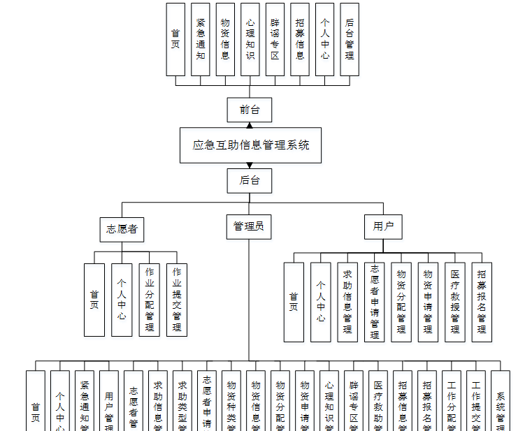图4-1系统总体功能模块图

### 4.2数据库设计

#### 4.2.1概念模型设计

概念模型是对现实中的问题出现的事物的进行描述，ER图是由实体及其关系构成的图，通过E-R图可以清楚地描述系统涉及到的实体之间的相互关系。

紧急通知管理实体图如图4-2所示：

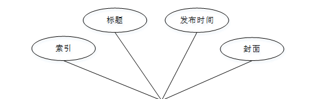

图4-2紧急通知管理实体图

求助信息管理实体图如图4-3所示：

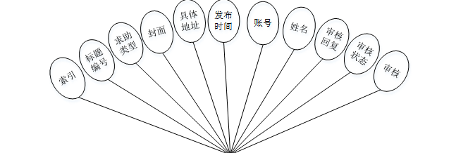

图4-3求助信息管理实体图

志愿者申请管理实体图如图4-4所示：

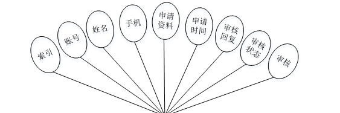

图4-4志愿者申请管理实体图

### 系统功能模块

应急互助信息管理系统，在系统首页可以查看首页，紧急通知，物资信息，心理知识，辟谣专区，招募信息，个人中心，后台管理等内容，如图5-1所示。

图5-1系统首页界面图

用户注册，在用户注册页面通过填写账号，密码，确认密码，姓名，年龄，手机等信息进行用户注册操作，如图5-2所示。

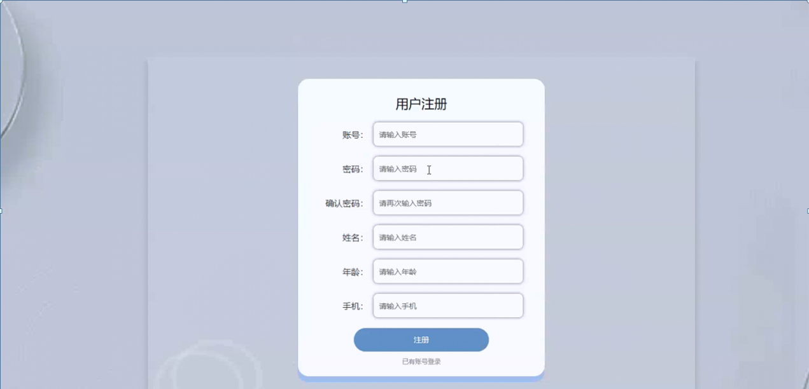

图5-2用户注册界面图

物资信息，在物资信息页面可以查看物资编号，物资名称，物资种类，数量，登记时间，点击次数等信息进行物资申请或收藏操作，如图5-3所示。

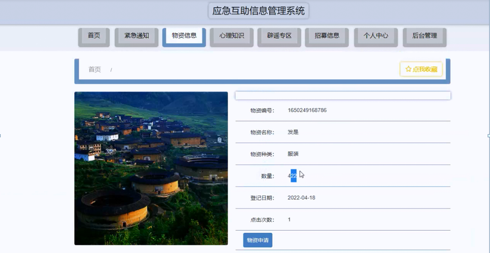

图5-3物资信息界面图

招募信息，在招募信息页面可以查看招募要求，招募人数，工作时间，工作时长，工作地点，招募时间，发布时间，点击次数等信息进行招募报名或收藏操作，如图5-4所示。

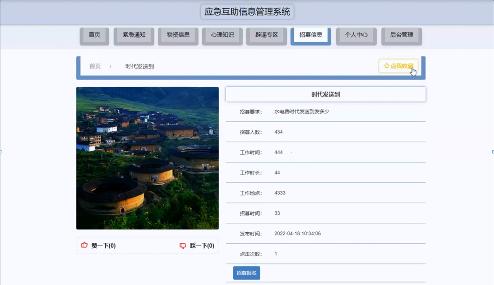

图5-4招募信息界面图

个人中心，在个人中心页面通过填写账号，密码，姓名，年龄，性别，手机，上传图片等信息进行更新操作，还可以根据需要对我的收藏进行详细操作，如图5-5所示。

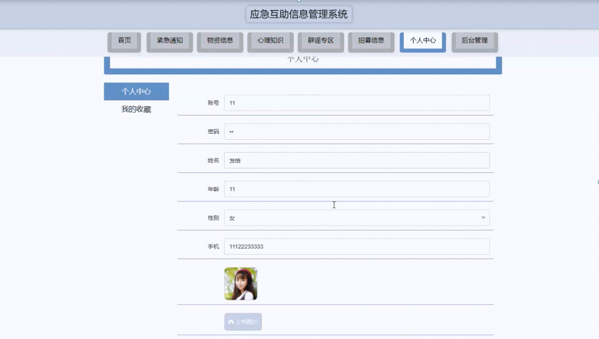

图5-5个人中心界面图

### 5.2管理员功能模块

管理员进行进入系统，在登录页面根据要求填写用户名和密码，选择角色等信息，点击登录进行登录操作，如图5-6所示。

图5-6管理员登录界面图

管理员登录系统后，可以对首页，个人中心，紧急通知管理，用户管理，志愿者管理，求助信息管理，求助类型管理，志愿者申请管理，物资种类管理，物资信息管理，物资分配管理，物资申请管理，心理知识管理，辟谣专区管理，医疗救助管理，招募信息管理，招募报名管理，工作分配管理，工作提交管理，系统管理等功能进行相应的操作管理，如图5-7所示。

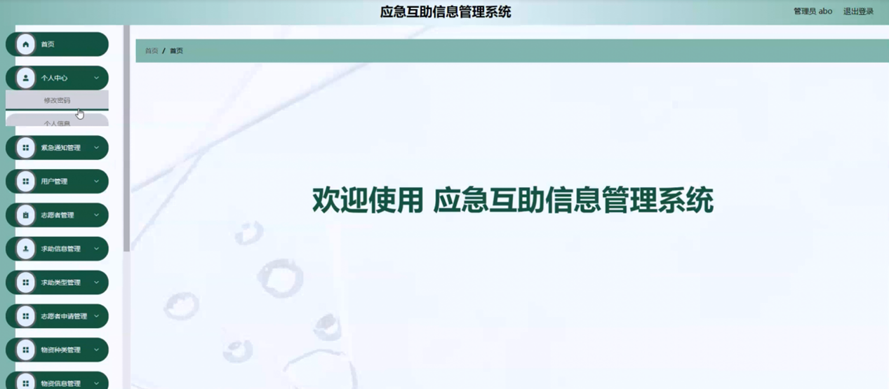

图5-7管理员功能界面图

紧急通知管理，在紧急通知管理页面可以对索引，标题，发布时间，封面等内容进行详情，修改和删除等操作，如图5-8所示。

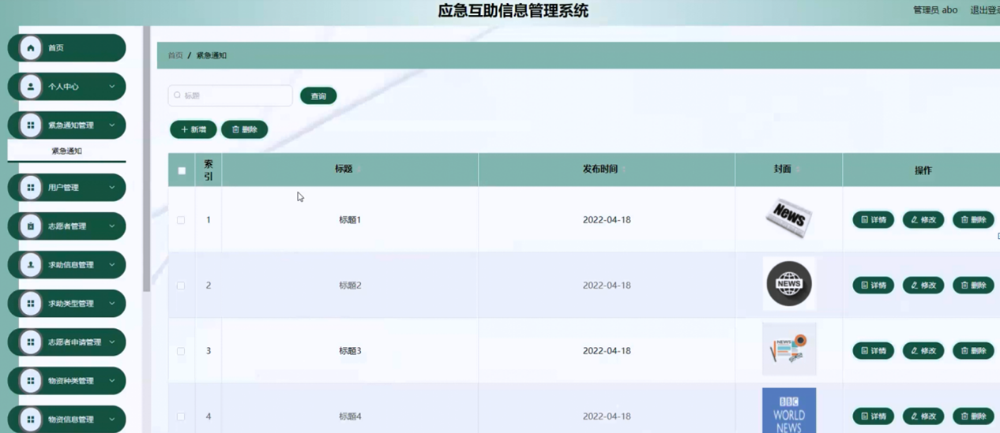

图5-8紧急通知管理界面图

用户管理，在用户管理页面可以对索引，账号，姓名，年龄，性别，手机，照片等内容进行详情，修改和删除等操作，如图5-9所示。

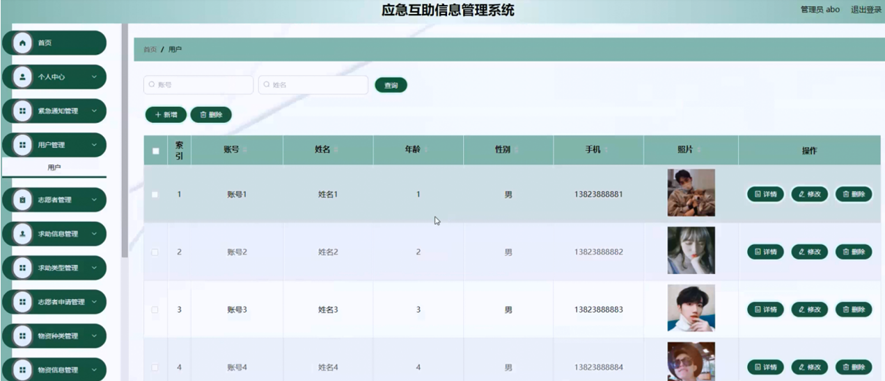

图5-9用户管理界面图

志愿者管理，在志愿者管理页面可以对索引，志愿者账号，志愿者姓名，年龄，性别，手机，照片等内容进行详情，修改和删除等操作，如图5-10所示。

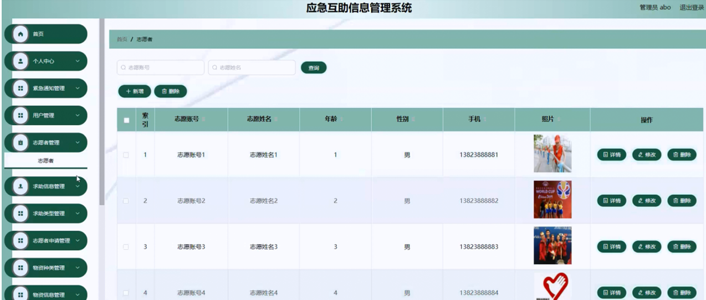

图5-10志愿者管理界面图

求助信息管理，在求助信息管理页面可以对索引，标题名称，求助类型，封面，具体地址，发布时间，账号，姓名，审核回复，审核状态，审核等内容进行详情和删除操作，如图5-11所示。

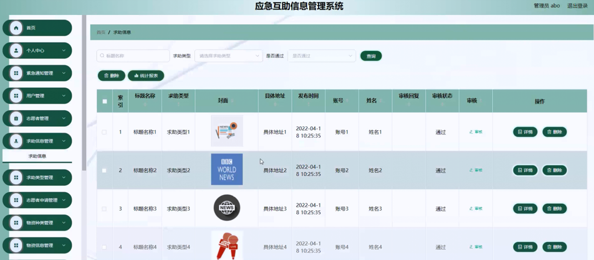

图5-11求助信息管理界面图

志愿者申请管理，在志愿者申请管理页面可以对索引，账号，姓名，手机，申请资料，申请时间，审核回复，审核状态，审核等内容进行详情或删除等操作，如图5-12所示。

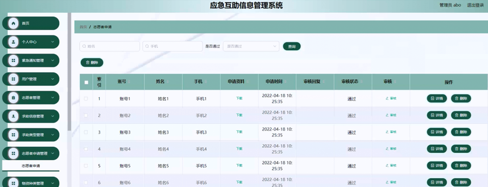

图5-12志愿者申请管理界面图

**JAVA** **毕设帮助，指导，源码分享，调试部署**

