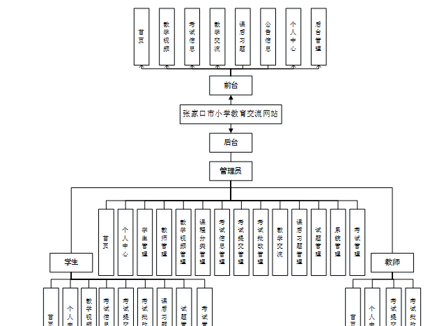
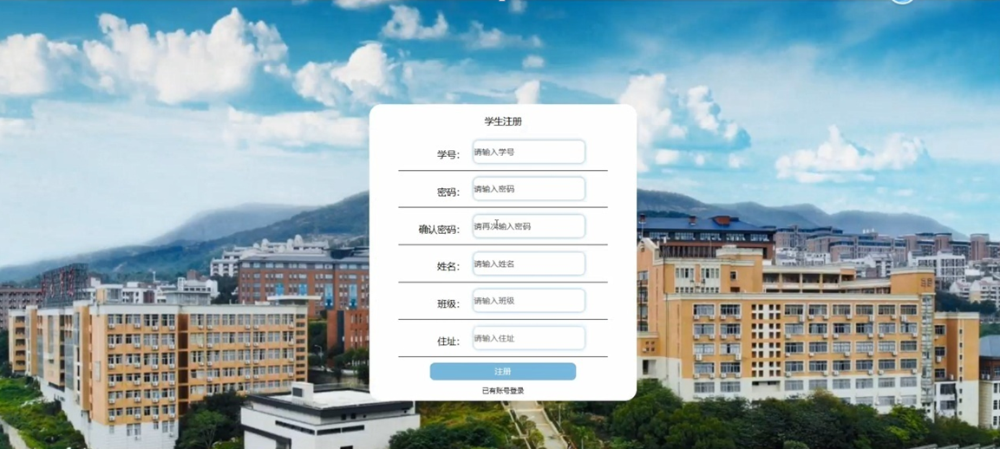
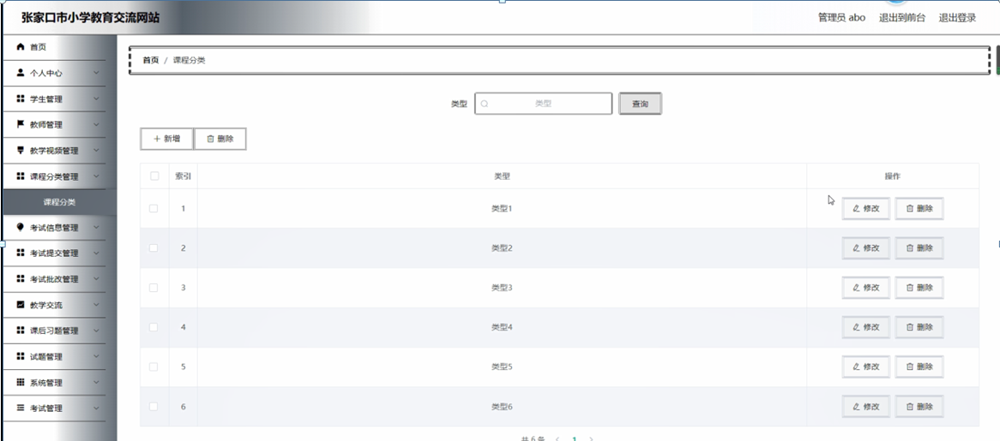

ssm+Vue计算机毕业设计张家口市小学教育交流网站（程序+LW文档）

**项目运行**

**环境配置：**

**Jdk1.8 + Tomcat7.0 + Mysql + HBuilderX** **（Webstorm也行）+ Eclispe（IntelliJ
IDEA,Eclispe,MyEclispe,Sts都支持）。**

**项目技术：**

**SSM + mybatis + Maven + Vue** **等等组成，B/S模式 + Maven管理等等。**

**环境需要**

**1.** **运行环境：最好是java jdk 1.8，我们在这个平台上运行的。其他版本理论上也可以。**

**2.IDE** **环境：IDEA，Eclipse,Myeclipse都可以。推荐IDEA;**

**3.tomcat** **环境：Tomcat 7.x,8.x,9.x版本均可**

**4.** **硬件环境：windows 7/8/10 1G内存以上；或者 Mac OS；**

**5.** **是否Maven项目: 否；查看源码目录中是否包含pom.xml；若包含，则为maven项目，否则为非maven项目**

**6.** **数据库：MySql 5.7/8.0等版本均可；**

**毕设帮助，指导，本源码分享，调试部署** **(** **见文末** **)**

### 系统总体架构设计

该款张家口市小学教育交流网站；用户可以通过注册账号从而登入系统主界面来实现相对应的功能，分别是查看首页，教学视频，考试信息，教学交流，课后习题，公告信息，个人中心，后台管理等功能。

系统使用Eclipse设计开发，使用MySql进行对数据的存储。后台读取数据并转换成json类型的数据进行传输，在客户端接收数据解析实现各功能并显示给用户。

该系统软件的功能结构图：

图4-1 网站功能结构图

### 4.3 系统数据库的设计

#### 4.3.1数据库E/R图

ER图是由实体及其关系构成的图，通过E/R图可以清楚地描述系统涉及的实体之间的相互关系。在系统中对一些主要的几个关键实体如下图：

（1）教学交流E/R图如下所示：

图4-2教学交流E/R图

（2）课后习题表E/R图如下所示：

图4-3课习题表E/R图

（3）公告信息E/R图如下所示：

图4-4公告信息E/R图

### 系统功能模块

张家口市小学教育交流网站，在网站首页可以查看首页，教学视频，考试信息，教学交流，课后习题，公告信息，个人中心，后台管理等内容，并进行详细操作；如图5-1所示。

图5-1网站首页界面图

学生注册，在学生注册页面通过填写学号,密码,确认密码,姓名,班级,住址等信息进行注册操作；如图5-2所示。

图5-2学生注册界面图

教学视频，在教学视频页面可以查看课程名称,课程分类,发布时间,工号,姓名,点击次数,视频详情等内容；如图5-3所示。

图5-3教学视频界面图

考试信息，在考试信息页面可以查看考试名称,考试课程,考试班级,考试时间,结束时间,工号,姓名,考试文件等内容，并根据需要进行考试提交操作；如图5-4所示。

图5-4考试信息界面图

个人中心，在个人中心页面通过填写工号,密码,姓名,性别,班级,手机,上传图片等内容进行更新信息操作，还可以对我的发布，考试记录，错题本，我的收藏等进行详细操作；如图5-5所示。

图5-5个人中心界面图

### 5.2后台功能模块

后台登录，进入系统前在登录页面根据要求填写用户名和密码，选择角色等信息，点击登录进行登录操作，如图5-6所示。

图5-6后台登录界面图

#### 5.2.1管理员功能

管理员登录系统后，可以对首页，个人中心，学生管理，教师管理，教学视频管理，课程分类管理，考试信息管理，考试提交管理，考试批改管理，教学交流，课后习题管理，试题管理，系统管理，考试管理等功能进行相应的操作管理，如图5-7所示。

图5-7管理员功能界面图

学生管理，在学生管理页面可以对索引,学号,姓名,性别,班级,住址,头像等内容进行详情，修改和删除等操作，如图5-8所示。

图5-8学生管理界面图

教师管理，在教师管理页面可以对索引,工号,姓名,性别,班级,手机,照片等信息进行详情，修改和删除等操作，如图5-9所示。

图5-9教师管理界面图

教学视频管理，在教学视频管理页面可以对索引,课程名称,课程分类,教学视频,发布时间,课程图片,工号,姓名,审核回复,审核状态,审核等内容进行详情，查看评论和删除等操作，如图5-10所示。

图5-10教学视频管理界面图

课程分类管理，在课程分类管理页面可以对索引,类型等内容进行修改和删除等操作，如图5-11所示。

图5-11课程分类管理界面图

考试提交管理，在考试提交管理页面可以对索引,考试名称,考试课程,考试班级,提交时间,提交文件,工号,学号,姓名,审核回复,审核状态等内容进行详情和删除操作，如图5-12所示。

图5-12考试提交管理界面图

#### **JAVA** **毕设帮助，指导，源码分享，调试部署**

