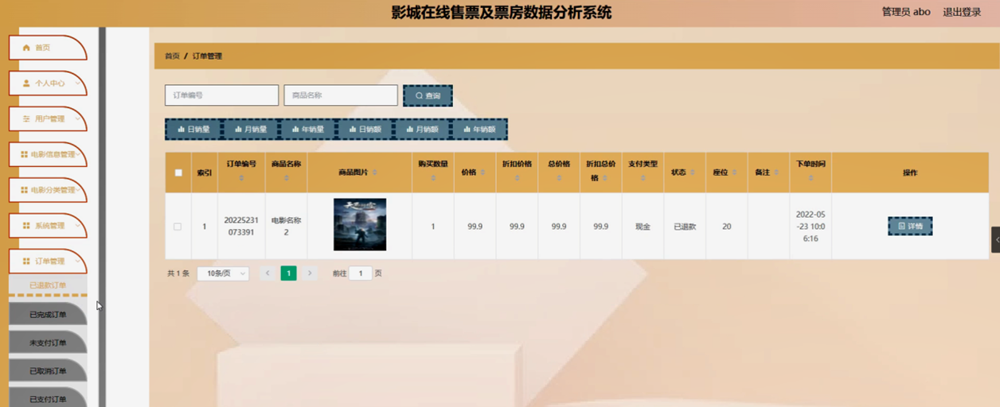

ssm+Vue计算机毕业设计影城在线售票及票房数据分析系统（程序+LW文档）

**项目运行**

**环境配置：**

**Jdk1.8 + Tomcat7.0 + Mysql + HBuilderX** **（Webstorm也行）+ Eclispe（IntelliJ
IDEA,Eclispe,MyEclispe,Sts都支持）。**

**项目技术：**

**SSM + mybatis + Maven + Vue** **等等组成，B/S模式 + Maven管理等等。**

**环境需要**

**1.** **运行环境：最好是java jdk 1.8，我们在这个平台上运行的。其他版本理论上也可以。**

**2.IDE** **环境：IDEA，Eclipse,Myeclipse都可以。推荐IDEA;**

**3.tomcat** **环境：Tomcat 7.x,8.x,9.x版本均可**

**4.** **硬件环境：windows 7/8/10 1G内存以上；或者 Mac OS；**

**5.** **是否Maven项目: 否；查看源码目录中是否包含pom.xml；若包含，则为maven项目，否则为非maven项目**

**6.** **数据库：MySql 5.7/8.0等版本均可；**

**毕设帮助，指导，本源码分享，调试部署** **(** **见文末** **)**

### 软件功能模块设计

系统整体功能如下图所示：

图 4-1 系统总体功能模块图

### 4.2 数据库设计与实现

在每一个系统中数据库有着非常重要的作用，数据库的设计得好将会增加系统的效率以及系统各逻辑功能的实现。所以数据库的设计我们要从系统的实际需要出发，才能使其更为完美的符合系统功能的实现。

#### 4.2.1 概念模型设计

概念模型是对现实中的问题出现的事物的进行描述，ER图是由实体及其关系构成的图，通过E-R图可以清楚地描述系统涉及到的实体之间的相互关系。

用户注册实体图如图4-2所示：

图4-2用户注册实体图

电影信息实体图如图4-3所示：

图4-3电影信息实体图

### 系统功能模块

影城在线售票及票房数据分析系统，在系统首页可以查看首页、电影信息、电影资讯、个人中心等内容，并进行详细操作；如图5-1所示。

图5-1系统首页界面图

用户注册，在用户注册页面通过填写账号、密码、确认密码、姓名、邮箱、手机号码等信息进行注册操作，如图5-2所示。

图5-2用户注册界面图

电影信息，在电影信息页面可以查看电影名称、图片、价格、电影分类、演员、发行商、电影简介、上映日期、座位总数、电影内容等内容，并进行立即预订，评论，选座或收藏操作，如图5-3所示。

图5-3电影信息界面图

个人中心，在个人中心页面通过填写账号、密码、姓名、性别、邮箱、手机号码、上传图片、余额等内容进行更新信息，还可以根据需要对我的订单，我的收藏进行详细操作，如图5-4所示。

图5-4个人中心界面图

### 5.2管理员功能模块

管理员进行登录，进入系统前在登录页面根据要求填写用户名和密码等信息，点击登录进行登录操作，如图5-5所示。

图5-5管理员登录界面图

管理员登录系统后，可以对首页、个人中心、用户管理、电影信息管理、电影分类管理、系统管理、订单管理等功能进行相应的操作管理，如图5-6所示。

图5-6管理员功能界面图

用户管理，在用户管理页面可以对索引、账号、姓名、性别、邮箱、手机号码、相片等内容进行详情，修改和删除操作，如图5-7所示。

图5-7用户管理界面图

电影信息管理，在电影信息管理页面可以对索引、电影名称、电影分类、电影封面、导演、发行商、上映日期、价格、座位总数等内容进行详情，修改，查看评论或删除操作，如图5-8所示。

图5-8电影信息管理界面图

电影分类管理，在电影分类管理页面可以对索引、电影分类等内容进行详情，修改和删除操作，如图5-9所示。

图5-9电影分类管理界面图

系统管理，在电影资讯页面可以对索引、标题、图片等内容进行详情，修改和删除操作，还可以对轮播图管理进行详细操作；如图5-10所示。

图5-10系统管理界面图

订单管理，在已退款订单、已完成订单、未支付订单、已取消订单、已支付订单页面可以对索引、订单编号、商品名称、商品图片、购买数量、价格、折扣价格、总价格、折扣总价格、支付类型、状态、座位、备注、下单时间等内容进行详细操作，如图5-11所示。

图5-11订单管理界面图

#### **JAVA** **毕设帮助，指导，源码分享，调试部署**

