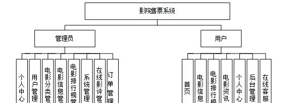
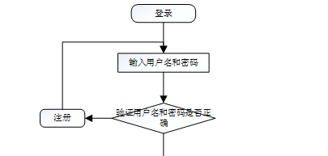
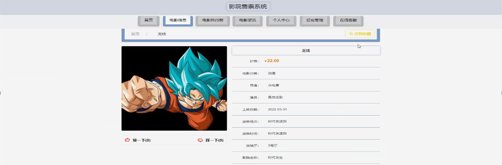
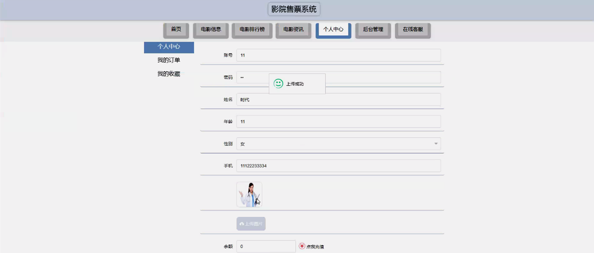
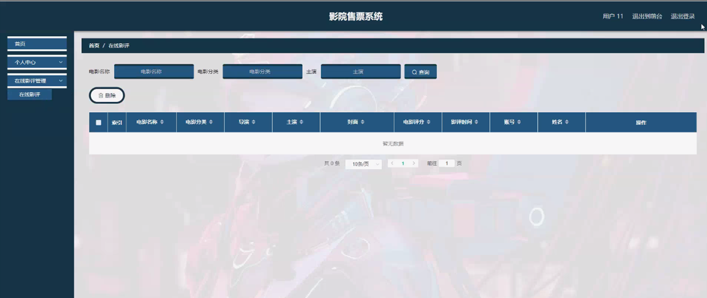
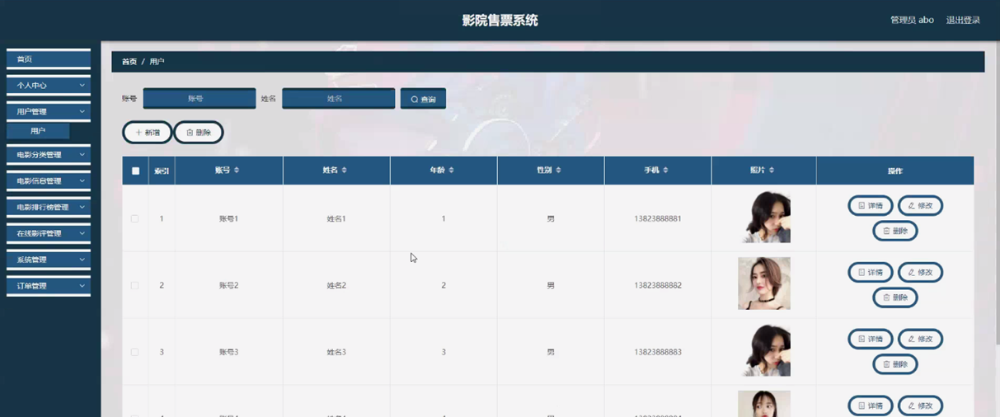

ssm+Vue计算机毕业设计影院售票系统（程序+LW文档）

**项目运行**

**环境配置：**

**Jdk1.8 + Tomcat7.0 + Mysql + HBuilderX** **（Webstorm也行）+ Eclispe（IntelliJ
IDEA,Eclispe,MyEclispe,Sts都支持）。**

**项目技术：**

**SSM + mybatis + Maven + Vue** **等等组成，B/S模式 + Maven管理等等。**

**环境需要**

**1.** **运行环境：最好是java jdk 1.8，我们在这个平台上运行的。其他版本理论上也可以。**

**2.IDE** **环境：IDEA，Eclipse,Myeclipse都可以。推荐IDEA;**

**3.tomcat** **环境：Tomcat 7.x,8.x,9.x版本均可**

**4.** **硬件环境：windows 7/8/10 1G内存以上；或者 Mac OS；**

**5.** **是否Maven项目: 否；查看源码目录中是否包含pom.xml；若包含，则为maven项目，否则为非maven项目**

**6.** **数据库：MySql 5.7/8.0等版本均可；**

**毕设帮助，指导，本源码分享，调试部署** **(** **见文末** **)**

### 4.1系统总体设计

系统总体设计即对有关系统全局问题的设计，也就是设计系统总的处理方案，又称系统概要设计。它包括系统规划与系统功能设计等内容。

影院售票系统主要有两类用户，分别是用户模块和管理员模块，详细规划如图4-1所示。

图4-1 系统规划图

其中各子模块的主要功能如下：

1、用户登录：用户进入网页先输入用户名与密码，选择权限登录，系统要记录登录的用户名和登录类型。

2、新用户注册：新用户填写账号、密码、姓名、年龄、手机，完成注册。

3、查看影院售票系统信息：用户登录成功后，能够按分类或者查找影院售票系统信息进行管理。

4、主页内容管理：管理员登录以后，可以对个人中心、用户管理、电影分类管理、电影信息管理、电影排行榜管理、在线影评管理、系统管理、订单管理进行详细操作。

### 4.2数据库设计

数据库是一个软件项目的根基，它决定了整个项目代码的走势，同时也决定了整个项目在后期的维护以及升级的难易程度。

#### 4.2.1 数据库概念设计

根据影院售票系统的功能需求，对数据库进行分析，得到相应的数据，设计用户需要的各种实体，以及相互之间的关联，为逻辑结构设计铺好路。根据所实体内的各种具体信息得于实现。

1\. 用户管理实体

用户管理实体包括账号、姓名、性别、年龄、手机、照片等属性。用户管理实体图如图4-2所示：

图4-2 用户管理实体图

2\. 在线影评管理实体

在线影评管理实体包括电影名称、电影分类、导演、主演、封面、电影评分、影评时间、账号、姓名等属性；在线影评管理实体图如图4-3所示：

图4-3在线影评管理实体图

### 5.1功能页面实现

按照不同功能模块，在此对系统所涉及的关键页面的实现细节进行阐述，包括页面功能描述，页面涉及功能分析，介绍以及界面展示。

系统登录：
运行系统，首先进入登录界面，按照登录界面的要求填写相应的“账号”和“密码”以及用户类型，点击“登录”然后系统判断填写是否正确，若正确进入相应的界面，否则给出要求先注册信息。具体流程如图5-1所示。

图5-1 登录流程图

登录，通过输入账号，密码，选择角色并点击登录进行系统登录操作，如图5-2所示。

图5-2登录界面图

### 5.2系统功能模块

影院售票系统，在系统首页可以查看首页、电影信息、电影排行榜、电影资讯、个人中心、后台管理、在线客服等内容进行详细操作，如图5-3所示。

图5-3系统首页界面图

电影信息，用户可在电影信息页面查看电影名称、价格、电影分类、导演、演员、上映日期、放映场次、放映时间、放映厅、封面、影院名称、影院地址、点击次数、座位总数、视频等内容，还可进行赞、踩、预订、评论或收藏等操作，如图5-4所示。

图5-4电影信息界面图

用户注册，在用户注册页面通过填写账号、密码、姓名、年龄、手机等信息完成用户注册操作，如图5-5所示。

图5-5用户注册界面图

个人中心，用户可在个人中心页面通过输入账号、密码、姓名、年龄、上传图片、性别、手机、余额等内容进行更新信息或查看我的订单、我的收藏等内容，如图5-6所示。

图5-6个人中心界面图

我的订单，用户可在我的订单页面查看订单编号、订单状态、名称、价格、数量、总价、座位等内容，如图5-7所示。

图5-7我的订单界面图

后台管理，用户进入系统后台可查看个人中心、在线影评管理等内容，如图5-8所示。

图5-8用户后台功能界图面

在线影评管理，用户可在在线影评管理页面查看电影名称、电影分类、导演、主演、封面、电影评分、影评时间、账号、姓名等内容，还可进行删除等操作，如图5-9所示。

图5-9在线影评管理界面图

5.3管理员功能模块

管理员登录，管理员通过输入用户名、密码、角色进行登录，如图5-10所示。

图5-10管理员登录界面图

管理员通过登录进入系统可查看个人中心、用户管理、电影分类管理、电影信息管理、电影排行榜管理、在线影评管理、系统管理、订单管理等内容，如图5-11所示。

图5-11管理员功能界面图

用户管理，管理员可在用户管理页面查看账号、姓名、性别、年龄、手机、照片等内容，还可进行新增、修改或删除等操作，如图5-12所示。

图5-12用户管理界面图

**JAVA** **毕设帮助，指导，源码分享，调试部署**

