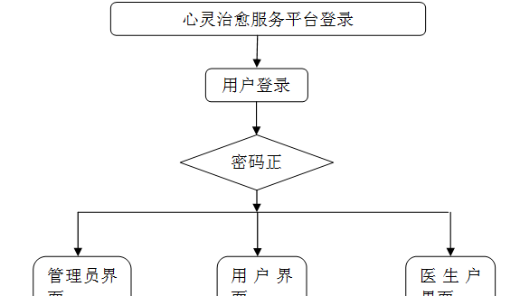
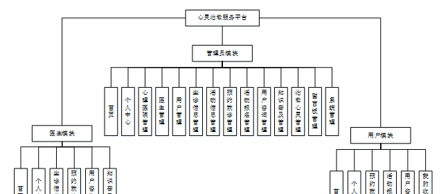

ssm+Vue计算机毕业设计心灵治愈服务平台（程序+LW文档）

**项目运行**

**环境配置：**

**Jdk1.8 + Tomcat7.0 + Mysql + HBuilderX** **（Webstorm也行）+ Eclispe（IntelliJ
IDEA,Eclispe,MyEclispe,Sts都支持）。**

**项目技术：**

**SSM + mybatis + Maven + Vue** **等等组成，B/S模式 + Maven管理等等。**

**环境需要**

**1.** **运行环境：最好是java jdk 1.8，我们在这个平台上运行的。其他版本理论上也可以。**

**2.IDE** **环境：IDEA，Eclipse,Myeclipse都可以。推荐IDEA;**

**3.tomcat** **环境：Tomcat 7.x,8.x,9.x版本均可**

**4.** **硬件环境：windows 7/8/10 1G内存以上；或者 Mac OS；**

**5.** **是否Maven项目: 否；查看源码目录中是否包含pom.xml；若包含，则为maven项目，否则为非maven项目**

**6.** **数据库：MySql 5.7/8.0等版本均可；**

**毕设帮助，指导，本源码分享，调试部署** **(** **见文末** **)**

### 系统体系结构

心灵治愈服务平台开发系统的结构图4-1所示：

图4-1 系统结构

模块包括主界面，首页、个人中心、心理医院管理、医生管理、用户管理、坐诊信息管理、活动信息管理、预约就诊管理、活动报名管理、用户咨询管理、知识普及管理、治愈心灵管理、留言板管理、系统管理等进行相应的操作。

登录系统结构图，如图4-2所示：

图4-2 登录结构图

这些功能可以充分满足心灵治愈服务平台的需求。此系统功能较为全面如下图系统功能结构如图4-3所示。

图4-3系统功能结构图

### 数据库设计原则

每个数据库的应用它们都是和区分开的，当运行到一定的程序当中，它就会与自己相关的协议与客户端进行通讯。那么这个系统就会对使这些数据进行连接。当我们选择哪个桥段的时候，接下来就会简单的叙述这个数据库是如何来创建的。当点击完成按钮的时候就会自动在对话框内弹出数据源的名称，在进行点击下一步即可，直接在输入相对应的身份验证和登录密码。

心灵治愈服务平台的数据流程：

图4-4 系统数据流程图

坐诊信息实体E-R图，如图4-5所示。

图4-5坐诊信息E-R图

知识普及管理E-R图，如图4-6所示。

图4-6知识普及管理E-R图

### 系统功能模块

心灵治愈服务平台，在系统首页可以查看首页、心理医院、坐诊信息、活动信息、知识普及、治愈心灵、相关动态、留言反馈、个人中心、后台管理等内容，如图5-1所示。

图5-1系统首页界面图

心理医院，在心理医院页面可以查看医院名称、医院类型、医院地址、咨询电话、医院邮箱等详细内容，如图5-2所示。

图5-2心理医院界面图

坐诊信息，在坐诊信息页面可以查看医生姓名、医生工号、性别、职称、科室、挂号费、医院名称、医院地址、坐诊时间、点击次数等详细信息，根据需要进行预约就诊、在线咨询操作，如图5-3所示。

图5-3坐诊信息界面图

活动信息，在活动信息页面可以查看活动名称、活动分类、活动城市、活动地点、活动时间、联系人、联系电话、公众号、联系邮箱等详细信息，根据需要进行在线报名操作，如图5-4所示。

图5-4活动信息界面图

知识普及，在知识普及页面可以查看标题名称、知识类型、发布日期、医生工号、医生姓名、视频内容等详细内容，如图5-5所示。

图5-5知识普及界面图

治愈心灵，在治愈心灵页面可以查看推荐标题、推荐类型、推荐链接、发布日期等详细内容，如图5-6所示。

图5-6治愈心灵界面图

个人中心，在个人中心页面通过填写用户名、密码、姓名、性别、手机、邮箱、身份证等信息进行更新信息，根据需要对我的收藏进行相对应操作，如图5-7所示。

图5-7个人中心界面图

### 5.2管理员功能模块

管理员登录，通过填写注册时输入的用户名、密码、验证码，选择角色进行登录，如图5-8所示。

图5-8管理员登录界面图

管理员登录进入心灵治愈服务平台可以查看首页、个人中心、心理医院管理、医生管理、用户管理、坐诊信息管理、活动信息管理、预约就诊管理、活动报名管理、用户咨询管理、知识普及管理、治愈心灵管理、留言板管理、系统管理等信息,如图5-9所示。

图5-9管理员功能界面图

心理医院管理，在心理医院管理页面中可以查看索引、医院名称、医院图片、医院类型、医院地址、咨询电话、医院邮箱等信息，并可根据需要进行查看评论修改或删除等操作，如图5-10所示。

图5-10心理医院管理界面图

医生管理，在医生管理页面中可以查看索引、医生工号、医生姓名、性别、照片、科室、医院名称、医院类型、职称、医院地址、联系电话等信息，并可根据需要进行添加坐诊、修改或删除等操作，如图5-11所示。

图5-11医生管理界面图

用户管理，在用户管理页面中可以查看索引、用户名、姓名、性别、头像、手机、邮箱、身份证等信息，并可根据需要进行修改或删除等操作，如图5-12所示。

图5-12用户管理界面图

#### **JAVA** **毕设帮助，指导，源码分享，调试部署**

