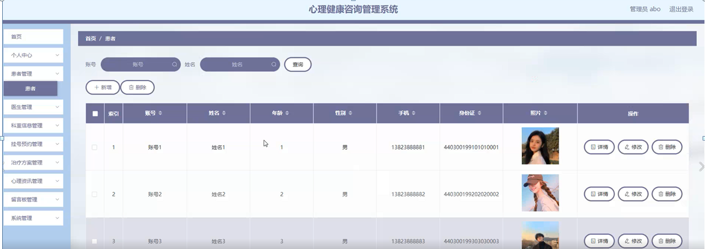

ssm+Vue计算机毕业设计心理健康咨询管理系统（程序+LW文档）

**项目运行**

**环境配置：**

**Jdk1.8 + Tomcat7.0 + Mysql + HBuilderX** **（Webstorm也行）+ Eclispe（IntelliJ
IDEA,Eclispe,MyEclispe,Sts都支持）。**

**项目技术：**

**SSM + mybatis + Maven + Vue** **等等组成，B/S模式 + Maven管理等等。**

**环境需要**

**1.** **运行环境：最好是java jdk 1.8，我们在这个平台上运行的。其他版本理论上也可以。**

**2.IDE** **环境：IDEA，Eclipse,Myeclipse都可以。推荐IDEA;**

**3.tomcat** **环境：Tomcat 7.x,8.x,9.x版本均可**

**4.** **硬件环境：windows 7/8/10 1G内存以上；或者 Mac OS；**

**5.** **是否Maven项目: 否；查看源码目录中是否包含pom.xml；若包含，则为maven项目，否则为非maven项目**

**6.** **数据库：MySql 5.7/8.0等版本均可；**

**毕设帮助，指导，本源码分享，调试部署** **(** **见文末** **)**

### 系统结构图

整个系统的模块划分包含患者功能模块、医生功能模块和管理员功能模块又划分了若干了子模块,为了方便更直观的理解,下图以图形形式给出关于整个网站的结构图。

网站总体功能结构图3-1如图所示：

图3-1网站总体功能结构图

### 数据库概念设计

在对数据库设计之前首先要分析一下心理健康咨询管理系统的功能，和各模块之间的关系，再对数据表进行设计。每一个模块的实体都会对应多个实体对象，下面是几个系统中的数据实体。

患者信息实体E-R图如图4-1所示：

图4-1患者信息E-R图

医生信息实体E-R图如图4-2所示：

图4-2医生信息实体E-R图

科室信息实体E-R图如图4-3所示：

图4-3科室信息实体E-R图

挂号预约信息实体E-R图如图4-4所示：

图4-4挂号预约信息实体E-R图

### 网站首页的设计

该界面是心理健康咨询管理系统的首页，界面设置要求界面简洁明了、操作简单、兼容性好。在考虑设计界面时，首先要考虑界面标准化设计，其次是完善界面设计，但不要因对界面的美化使界面的操作变得复杂，用户可在此页面进行登录等操作，页面顶部导航条是各模块的入口。

网站首页页面主要包括首页、医生、科室信息、心理资讯、留言板、个人中心、后台管理等内容，并根据需要进行详细操作；如图5-1所示：

图5-1网站首页界面图

患者注册，在患者注册页面通过填写账号、密码、确认密码、姓名、年龄、手机、身份证等信息完成患者注册操作，如图5-2所示。

图5-2患者注册界面图

患者登录，在患者登录页面通过填写账号、密码等信息完成患者登录操作，如图5-3所示。

图5-3患者登录界面图

医生，在医生页面可以查看医生账号、医生姓名、年龄、职称、性别、医龄、联系电话、照片、个人简介、点击次数等内容，并进行收藏等操作；如图5-4所示。

图5-4医生界面图

科室信息，在科室信息页面查看科室号、科室名称、封面、上班时间、票额、挂号费、医生账号、医生姓名、医龄、联系电话、点击次数，根据需要进行挂号预约或点我收藏，如图5-5所示。

图5-5科室信息界面图

心理资讯，在心理资讯页面查看标题、发布时间、封面、点击次数，进行收藏或评论，如图5-5所示。

图5-5心理资讯界面图

个人中心，在个人中心页面填写账号、姓名、年龄、性别、手机、身份证、照片等信息进行更新信息，还可以根据需要对我的收藏进行相对应操作，如图5-6 5-7所示。

图5-6个人中心界面图

图5-7我的收藏界面图

### 5.2管理员功能模块

管理员进行登录，进入系统前在登录页面根据要求填写用户名和密码，选择角色等信息，点击登录操作，如图5-7所示。

图5-7管理员登录界面图

管理员登录系统后，可以对首页、个人中心、患者管理、医生管理、科室信息管理、挂号预约管理、治疗方案管理、心理资讯管理、留言板管理、系统管理等进行相应的操作管理，如图5-8所示。

图5-8管理员功能界面图

患者管理，在患者管理页面可以对账号、姓名、年龄、性别、手机、身份证、照片等内容进行详情、修改和删除等操作，如图5-9所示。

图5-9患者管理界面图

医生管理，在医生管理页面可以对医生账号、医生姓名、年龄、职称、性别、医龄、联系电话、照片等内容进行详情、修改、删除等操作，如图5-10所示。

图5-10医生管理界面图

科室信息管理，在科室信息管理页面可以对科室号、科室名称、封面、上班时间、票额、挂号费、医生账号、医生姓名、医龄、联系电话等内容进行详情、修改和删除等操作，如图5-11所示。

图5-11科室信息管理界面图

挂号预约管理，在挂号预约管理页面可以对预约编号、科室号、科室名称、票额、挂号费、就诊时间、医生账号、医生姓名、联系电话、账号、姓名、手机、身份证、是否支付等内容进行详情和删除等操作，如图5-12所示。

图5-12挂号预约管理界面图

#### **JAVA** **毕设帮助，指导，源码分享，调试部署**

