ssm+Vue计算机毕业设计心理健康网站（程序+LW文档）

**项目运行**

**环境配置：**

**Jdk1.8 + Tomcat7.0 + Mysql + HBuilderX** **（Webstorm也行）+ Eclispe（IntelliJ
IDEA,Eclispe,MyEclispe,Sts都支持）。**

**项目技术：**

**SSM + mybatis + Maven + Vue** **等等组成，B/S模式 + Maven管理等等。**

**环境需要**

**1.** **运行环境：最好是java jdk 1.8，我们在这个平台上运行的。其他版本理论上也可以。**

**2.IDE** **环境：IDEA，Eclipse,Myeclipse都可以。推荐IDEA;**

**3.tomcat** **环境：Tomcat 7.x,8.x,9.x版本均可**

**4.** **硬件环境：windows 7/8/10 1G内存以上；或者 Mac OS；**

**5.** **是否Maven项目: 否；查看源码目录中是否包含pom.xml；若包含，则为maven项目，否则为非maven项目**

**6.** **数据库：MySql 5.7/8.0等版本均可；**

**毕设帮助，指导，本源码分享，调试部署** **(** **见文末** **)**

###  系统设计主要功能

通过市场调研及咨询研究，了解了心理健康网站及管理者的使用需求，于是制定了管理员、咨询师和会员等模块。其功能结构图如下图4-1所示：

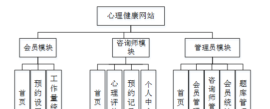

图4.1系统功能结构图

### 4.2 数据库设计

#### 4.2.1 数据库设计规范

数据可设计要遵循职责分离原则，即在设计时应该要考虑系统独立性，即每个系统之间互不干预不能混乱数据表和系统关系。

数据库命名也要遵循一定规范，否则容易混淆，数据库字段名要尽量做到与表名类似，多使用小写英文字母和下划线来命名并尽量使用简单单词。

#### 4.2.2 E-R图

用户管理E-R图，如图4-2所示：

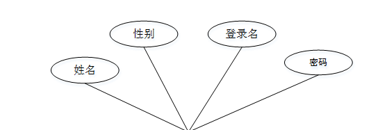

图4-2用户管理E-R图

咨询师管理E-R图如图4-3所示。

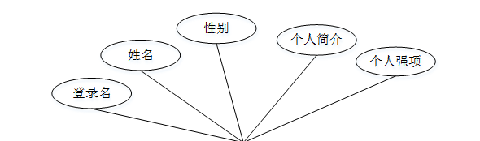

图4-3咨询师管理E-R图

### 会员功能模块

会员通过输入用户名、密码进行登录进入网站，如图5-1所示。

图5-1会员登录界面图

会员通过登录进入心理健康网站可查看首页、预约设置、工作量统计等内容，在首页还可查看预约列表信息等内容，如图5-2所示。

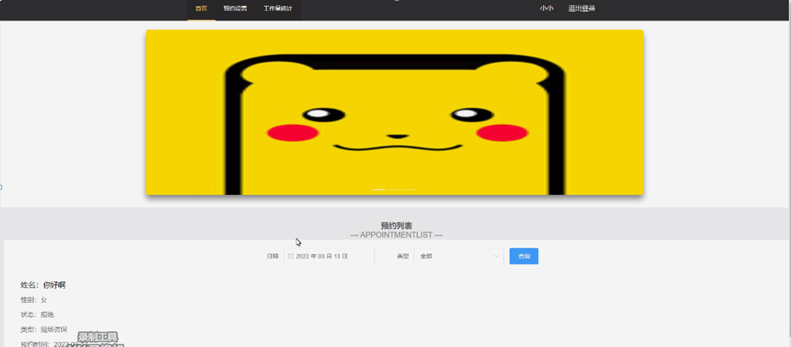

图5-2网站首页界面图

预约列表，会员可在预约列表页面查看姓名、性别、状态、类型、预约时间等内容，还可进行心理干预、心理评估等操作，如图5-3所示。

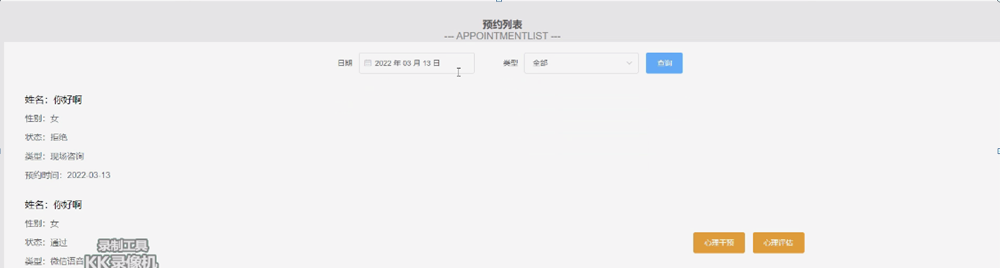

图5-3预约列表界面图

预约设置，会员可在预约设置页面通过输入日期、人数等内容进行创建等操作，如图5-4所示。

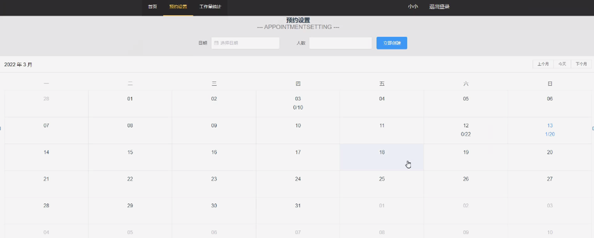

图5-4预约设置界面图

5.2咨询师功能模块

咨询师通过登录进入网站可查看首页、心理评估、预约记录、个人中心等内容，如图5-5所示。

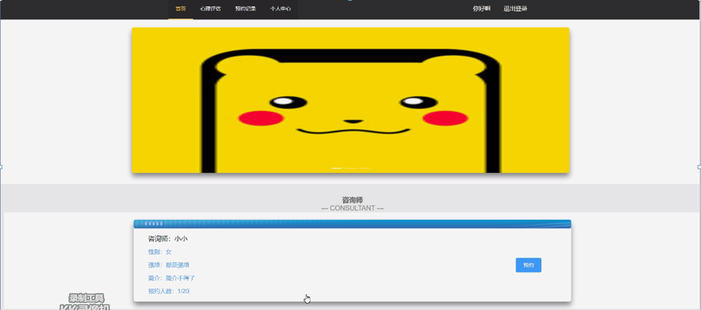

图5-5咨询师功能界面图

咨询师信息，在咨询师信息页面可查看咨询师姓名、性别、强项、简介、预约人数等内容，如图5-6所示。

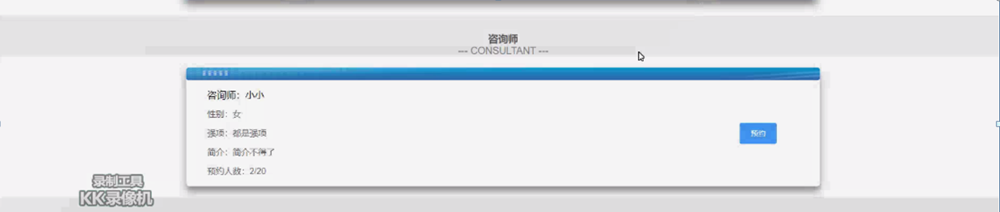图5-6咨询师信息界面图

心理评估，咨询师可在心理评估页面查看评估列表、分数、时间等内容，如图5-7所示。

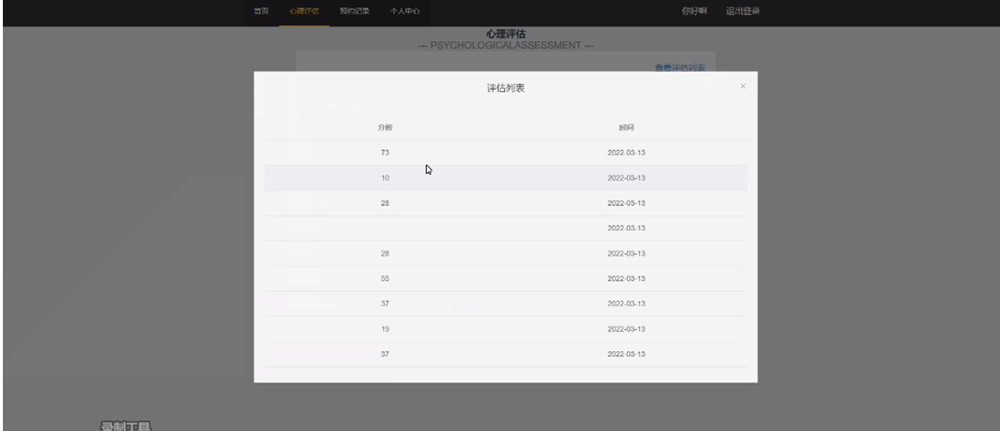

图5-7心理评估界面图

预约记录，咨询师可在预约记录页面查看姓名、性别、状态、类型、预约时间等内容，还可查询报告等操作，如图5-8所示。

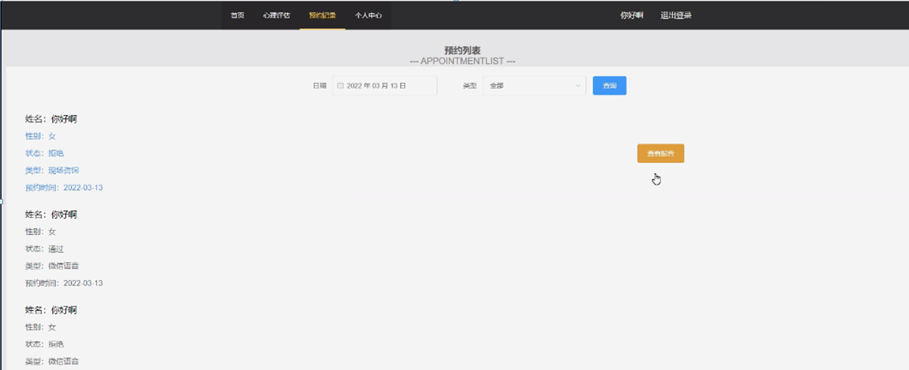

图5-8预约记录界面图

个人中心，咨询师可在个人中心页面通过输入昵称、账号、类型、注册时间、性别、密码等内容进行修改资料或修改密码等操作，如图5-9所示。

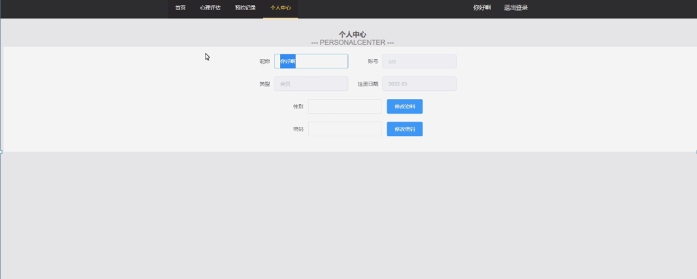

图5-9个人中心界面图

5.3管理员功能模块

管理员通过输入用户名、密码进行登录进入系统，如图5-10所示。

图5-10管理员登录界面图

管理员通过登录进入系统可查看首页、会员管理、咨询师管理、会员统计、题库管理等内容，在首页用户管理页面还可查看姓名、登录名、密码、性别等内容，还可进行编辑或删除等操作，如图5-11所示。

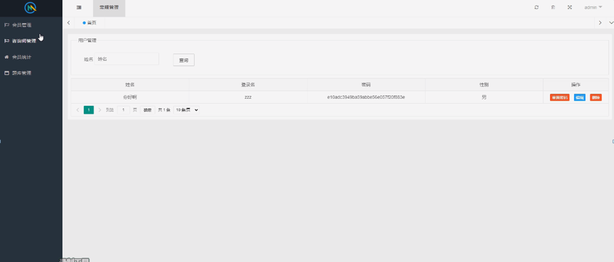

图5-11管理员功能界面图

咨询师管理，管理员可在咨询师管理页面查看姓名、登录名、性别、个人简介、个人强项等内容，还可进行添加、编辑或删除等操作，如图5-12所示。

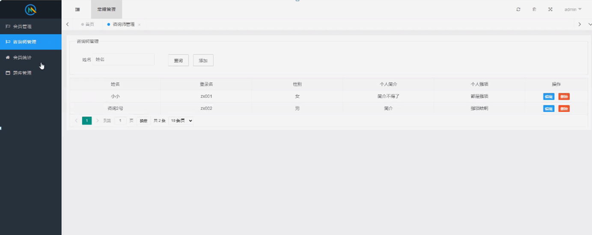

图5-12咨询师管理界面图

#### **JAVA** **毕设帮助，指导，源码分享，调试部署**

