ssm+Vue计算机毕业设计心理咨询预约系统（程序+LW文档）

**项目运行**

**环境配置：**

**Jdk1.8 + Tomcat7.0 + Mysql + HBuilderX** **（Webstorm也行）+ Eclispe（IntelliJ
IDEA,Eclispe,MyEclispe,Sts都支持）。**

**项目技术：**

**SSM + mybatis + Maven + Vue** **等等组成，B/S模式 + Maven管理等等。**

**环境需要**

**1.** **运行环境：最好是java jdk 1.8，我们在这个平台上运行的。其他版本理论上也可以。**

**2.IDE** **环境：IDEA，Eclipse,Myeclipse都可以。推荐IDEA;**

**3.tomcat** **环境：Tomcat 7.x,8.x,9.x版本均可**

**4.** **硬件环境：windows 7/8/10 1G内存以上；或者 Mac OS；**

**5.** **是否Maven项目: 否；查看源码目录中是否包含pom.xml；若包含，则为maven项目，否则为非maven项目**

**6.** **数据库：MySql 5.7/8.0等版本均可；**

**毕设帮助，指导，本源码分享，调试部署** **(** **见文末** **)**

### 系统结构

本系统架构网站系统，本系统的具体功能如下：

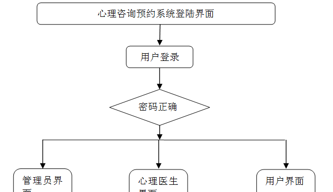

图4-2系统功能结构图

系统功能结构图，如图4-3所示：

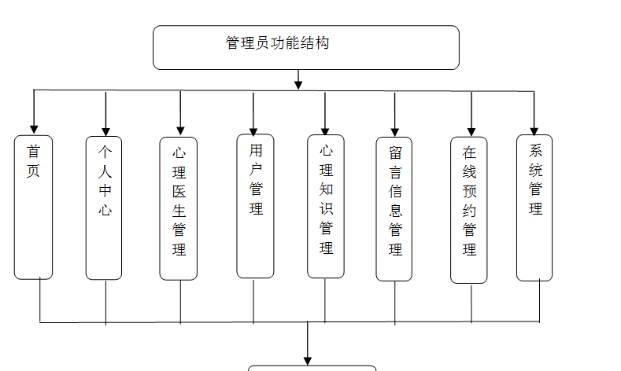

图4-3 管理员功能结构图

心理医生功能结构图，如图4-4所示：

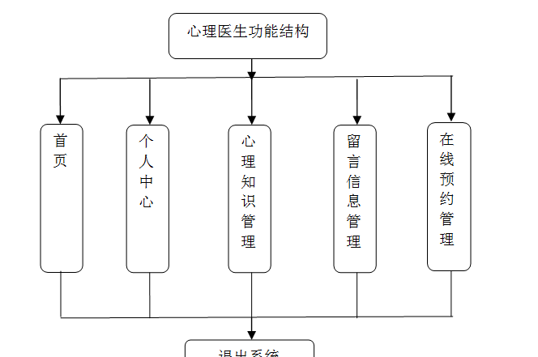

图4-4 心理医生功能结构图

用户功能结构图，如图4-5所示：

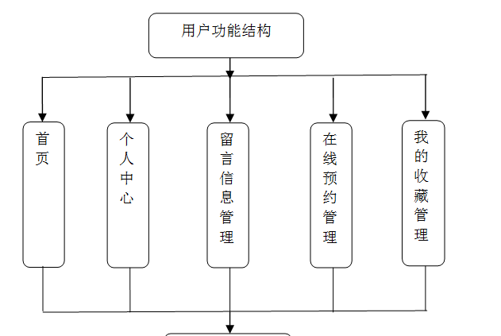

图4-5 用户功能结构图

### 4.3. 数据库设计

4.3.1 数据库实体

管理员信息结构图，如图4-6所示：

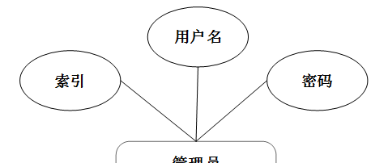

图4-6 管理员信息实体结构图

心理知识管理实体属性图，如图4-7所示：

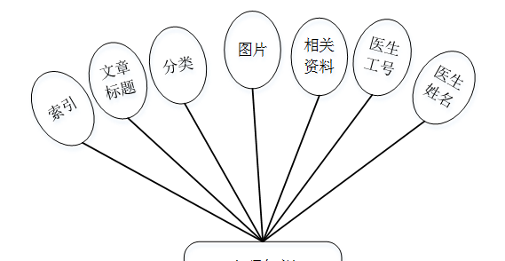

图4-7心理知识管理实体属性图

### 系统功能模块

心理咨询预约系统设计，在心理咨询预约系统首页可以查看首页、心理医生、心理知识、公告信息、个人中心、后台管理等内容，如图5-1所示。

图5-1网站首页界面图

用户注册，在用户注册页面可以查看用户名、密码、姓名、手机等信息进行注册，如图5-2所示。

图5-2用户注册界面图

心理医生，在心理医生页面可以查看医生工号、医生姓名、性别、照片、联系电话、个人简介、坐诊地址、坐诊时间等详细信息，根据需要进行留言、预约、评论或收藏，如图5-3所示。

图5-3心理医生界面图

心理知识，在心理知识页面可以查看文章标题、分类、图片、相关资料、医生工号、医生姓名、文章内容等详细信息，根据需要进行评论或收藏，如图5-4所示。

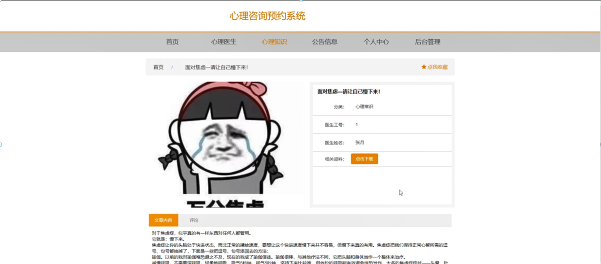

图5-4心理知识界面图

### 5.2用户功能模块

用户登录进入心理咨询预约系统可以查看首页、个人中心、留言信息管理、在线预约管理、我的收藏管理等内容，如图5-5所示。

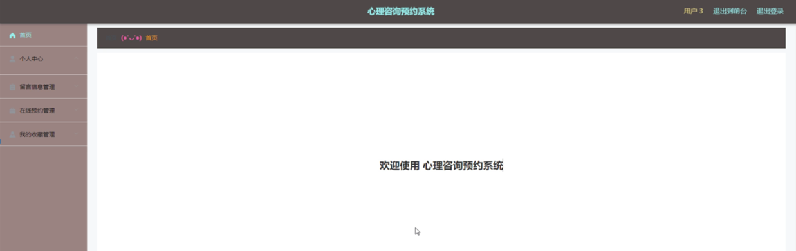

图5-5用户功能界面图

留言信息管理，在留言信息管理页面可以对索引、医生工号、医生姓名、标题、留言内容、留言时间、用户名、姓名、手机、审核回复、审核状态等信息进行详情、修改或删除等操作，如图5-6所示。

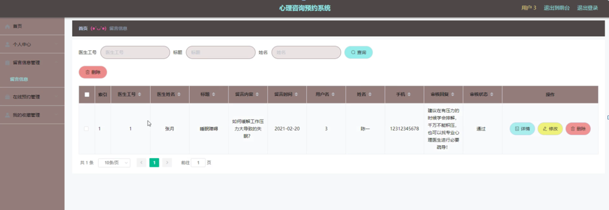

图5-6留言信息管理界面图

在线预约管理，在在线预约管理页面可以对索引、医生工号、医生姓名、坐诊地址、预约时间、就诊描述、备注、用户名、姓名、手机、审核回复、审核状态等信息进行详情、修改或删除等操作，如图5-7所示。

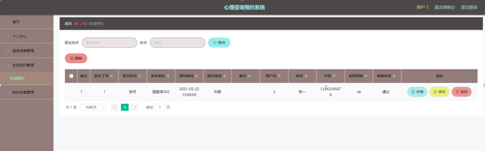

图5-7在线预约管理界面图

### 5.3管理员功能模块

管理员登录，管理员通过输入账号，密码，选择角色等信息即可进行系统登录，如图5-8所示。

图5-8管理员登录界面图

管理员登录进入心理咨询预约系统设计可以查看首页、个人中心、心理医生管理、用户管理、心理知识管理、留言信息管理、在线预约管理、系统管理等内容进行详细操作，如图5-9所示。

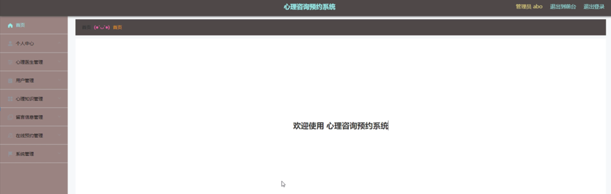

图5-9管理员功能界面图

心理医生管理，在心理医生管理页面可以对索引、医生工号、密码、医生姓名、性别、照片、联系电话、个人简介、坐诊地址、坐诊时间等信息进行详情，修改或删除等操作，如图5-10所示。

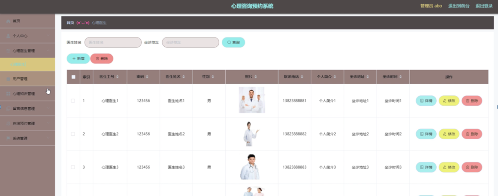

图5-10心理医生管理界面图

用户管理，在用户管理页面可以对索引、用户名、密码、姓名、头像、性别、手机等信息进行详情，修改或删除等操作，如图5-11所示。

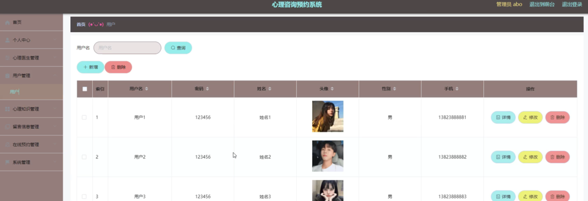

图5-11用户管理界面图

留言信息管理，在留言信息管理页面可以对索引、医生工号、医生姓名、标题、留言内容、留言时间、用户名、姓名、手机、审核回复、审核状态等信息进行详情，修改或删除等操作，如图5-12所示。

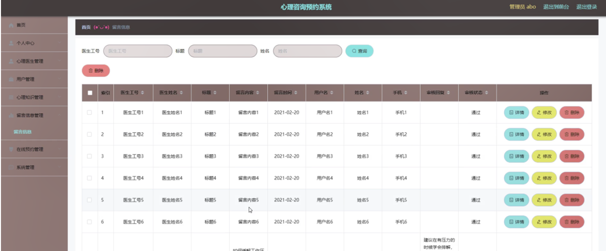

图5-12留言信息管理界面图

#### **JAVA** **毕设帮助，指导，源码分享，调试部署**

