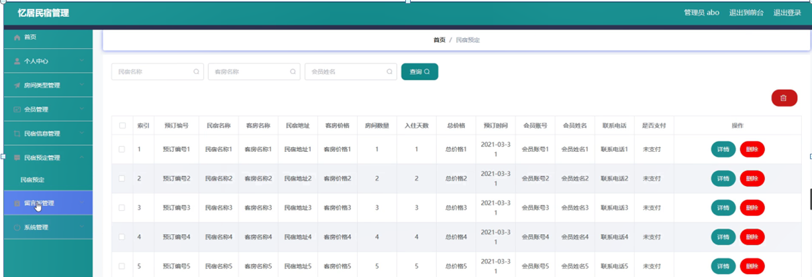

ssm+Vue计算机毕业设计忆居民宿管理（程序+LW文档）

**项目运行**

**环境配置：**

**Jdk1.8 + Tomcat7.0 + Mysql + HBuilderX** **（Webstorm也行）+ Eclispe（IntelliJ
IDEA,Eclispe,MyEclispe,Sts都支持）。**

**项目技术：**

**SSM + mybatis + Maven + Vue** **等等组成，B/S模式 + Maven管理等等。**

**环境需要**

**1.** **运行环境：最好是java jdk 1.8，我们在这个平台上运行的。其他版本理论上也可以。**

**2.IDE** **环境：IDEA，Eclipse,Myeclipse都可以。推荐IDEA;**

**3.tomcat** **环境：Tomcat 7.x,8.x,9.x版本均可**

**4.** **硬件环境：windows 7/8/10 1G内存以上；或者 Mac OS；**

**5.** **是否Maven项目: 否；查看源码目录中是否包含pom.xml；若包含，则为maven项目，否则为非maven项目**

**6.** **数据库：MySql 5.7/8.0等版本均可；**

**毕设帮助，指导，本源码分享，调试部署** **(** **见文末** **)**

### 系统结构设计

系统设计主要是管理员登录后对整个系统相关操作进行处理，可进行管理员的添加和删除，房间类型管理、会员管理、民宿信息管理、民宿预定管理、留言板管理、系统管理等操作管理。

系统的功能结构图如下图所示。

图4-1系统功能结构图

###

### 4.3数据库设计

系统里尤为关键的部分是在数据库方面，需要十分清晰的思路，所以从开始的设计时需要做到确立模块之间的联系，从而可以很明确的建立表间的联系和表中所需的内容。设计数据库还有一点是减少表的繁杂的创建，所以联系很关键，可以大大的减少，数据表中重复的事项。由此可以保证数据的完整和统一，不会造成数据的错误和重复，并且可以使数据得到数据库安全的保护，会使会员更加的放心。

#### 4.3.1 E-R图设计

概念设计是整个数据库设计的关键，在概念设计阶段，由需求分析得到了E-
R模型。E-R图是识别功能模型与数据模型间关联关系的，在主题数据库的抽取和规范化的过程中，采用的是简化的E-R图表示方法，从而避免过繁过细的E-
R图表示影响规划的直观和可用性。是对现实世界的抽象和概括，是数据库设计人员进行数据可设计的有力工具，能够方便直接地表达应用中的各种语义知识，令一方面它简单、清晰、易于会员理解。

管理员实体包括管理员名称、密码和权限三个属性。

管理员体ER图如下图所示。

图4-2管理员ER图

民宿信息管理ER图如下图所示。

图4-3民宿信息管理ER图

会员管理ER图如下图所示。

图4-4会员管理ER图

### 登录模块的实现

系统登录模块，为确保系统安全性，系统操作员只有在登录界面输入正确的管理员名、密码、权限以及验证码，单击“登录”按钮后才能够进入本系统的主界面。

管理员登录流程图如下所示。

图5-1管理员登录流程图

登录界面如下图所示。

图5-2登录界面图

### 5.2系统功能模块

忆居民宿管理系统，在系统首页可以查看首页、民宿信息、民宿公告、留言反馈、个人中心、后台管理、在线客服等内容进行详细操作，如图5-3所示。

图5-3系统首页界面图

民宿信息，在民宿信息页面可以查看民宿名称、客房名称、房间类型、客房价格、房间数量、客房图片、民宿星级、是否独立卫生间、是否带厨房、
是否配有洗衣机、联系电话、民宿地址、民宿介绍等详细内容并进行预定，评论或收藏操作，如图5-4所示。

图5-4民宿信息界面图

会员注册，在会员注册页面通过填写会员账号、会员姓名、密码、年龄、身份证、联系电话、生日、住址等信息完成注册，如图5-5所示。在个人中心页面通过填写会员账号、会员姓名、密码、性别、年龄、身份证、联系电话、生日、住址等信息进行个人信息修改操作，还可以根据需要对我的收藏进行详细操作；如图5-6所示。

图5-5会员注册界面图

图5-6个人中心界面图

### 5.3管理员功能模块

管理员登录进入忆居民宿管理系统可以查看首页、个人中心、房间类型管理、会员管理、民宿信息管理、民宿预定管理、留言板管理、系统管理等信息进行详细操作，如图5-7所示。

图5-7管理员功能界面图

房间类型管理，在房间类型管理页面中可以查看索引、房间类型等信息，并可根据需要进行详情，修改或删除等操作，如图5-8所示。

图5-8房间类型管理界面图

会员管理，在会员管理页面中可以查看索引、会员账号、会员姓名、性别、年龄、身份证、联系电话、生日、住址等信息，并可根据需要进行详情，修改或删除等操作，如图5-9所示。

图5-9会员管理界面图

民宿信息管理，在民宿信息管理页面中可以查看索引、民宿名称、客房名称、房间类型、客房价格、房间数量、客房图片、民宿星级、是否独立卫生间、是否带厨房、
是否配有洗衣机、联系电话、民宿地址等信息，并可根据需要进行详情、修改、查看评论或删除等操作，如图5-10所示。

图5-10民宿信息管理界面图

民宿预定管理，在民宿预定管理页面中可以查看索引、预订编号、民宿名称、客房名称、民宿地址、客房价格、房间数量、入住天数、总价格、预订时间、会员账号、会员姓名、联系电话、是否支付等信息，并可根据需要进行详情或删除等操作，如图5-11所示。

图5-11民宿预定管理界面图

留言板管理，在留言板管理页面中可以查看索引、用户名、留言内容、回复内容等信息，并可根据需要进行详情、修改、回复或删除等操作，如图5-12所示。

图5-12留言板管理界面图

**JAVA** **毕设帮助，指导，源码分享，调试部署**

