ssm+Vue计算机毕业设计志愿者招募系统（程序+LW文档）

**项目运行**

**环境配置：**

**Jdk1.8 + Tomcat7.0 + Mysql + HBuilderX** **（Webstorm也行）+ Eclispe（IntelliJ
IDEA,Eclispe,MyEclispe,Sts都支持）。**

**项目技术：**

**SSM + mybatis + Maven + Vue** **等等组成，B/S模式 + Maven管理等等。**

**环境需要**

**1.** **运行环境：最好是java jdk 1.8，我们在这个平台上运行的。其他版本理论上也可以。**

**2.IDE** **环境：IDEA，Eclipse,Myeclipse都可以。推荐IDEA;**

**3.tomcat** **环境：Tomcat 7.x,8.x,9.x版本均可**

**4.** **硬件环境：windows 7/8/10 1G内存以上；或者 Mac OS；**

**5.** **是否Maven项目: 否；查看源码目录中是否包含pom.xml；若包含，则为maven项目，否则为非maven项目**

**6.** **数据库：MySql 5.7/8.0等版本均可；**

**毕设帮助，指导，本源码分享，调试部署** **(** **见文末** **)**

### 系统结构设计

管理员登录后对整个系统相关操作进行处理，可进行系统管理。系统的功能结构图如下图所示。

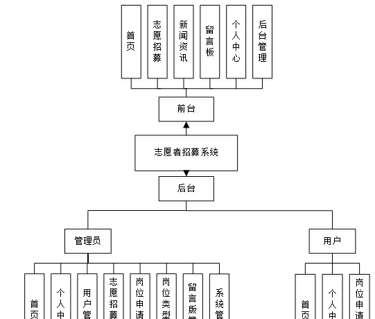

图3-1 系统结构图

### 3.6数据库设计

数据可设计要遵循职责分离原则，即在设计时应该要考虑系统独立性，即每个系统之间互不干预不能混乱数据表和系统关系。

数据库命名也要遵循一定规范，否则容易混淆，数据库字段名要尽量做到与表名类似，多使用小写英文字母和下划线来命名并尽量使用简单单词。

#### 3.6.1 E-R图设计

概念模型是对现实中的问题出现的事物的进行描述，ER图是由实体及其关系构成的图，通过E-R图可以清楚地描述系统涉及到的实体之间的相互关系。

用户注册E-R图如下所示：

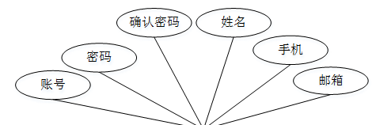

图3-2用户注册E-R图

志愿招募管理E-R图如下所示：

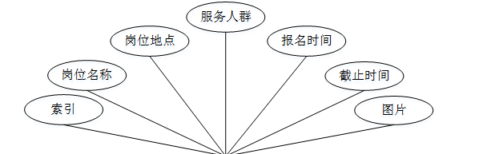

图3-3志愿招募管理ER图

### 系统功能模块

志愿者招募系统，在系统首页可以查看首页,志愿招募，新闻资讯，留言板，个人中心,后台管理等内容，并进行详细操作；如图4-1所示。

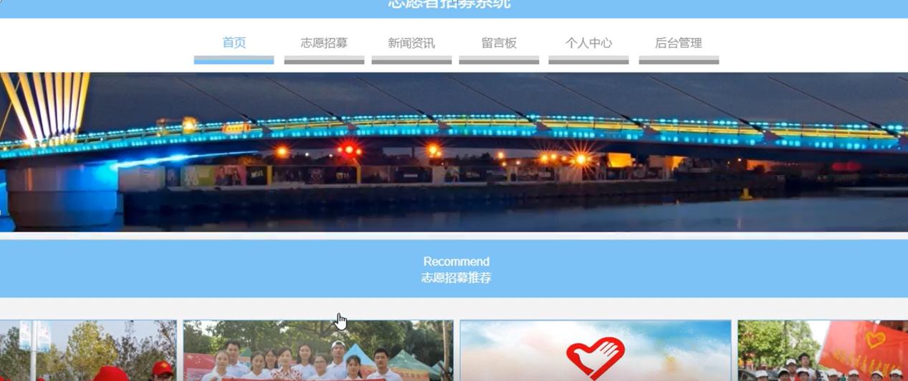

图4-1系统首页界面图

用户注册，在用户注册页面通过填写用户名,密码,确认密码，姓名,手机，邮箱等内容进行注册操作，如图4-2所示。

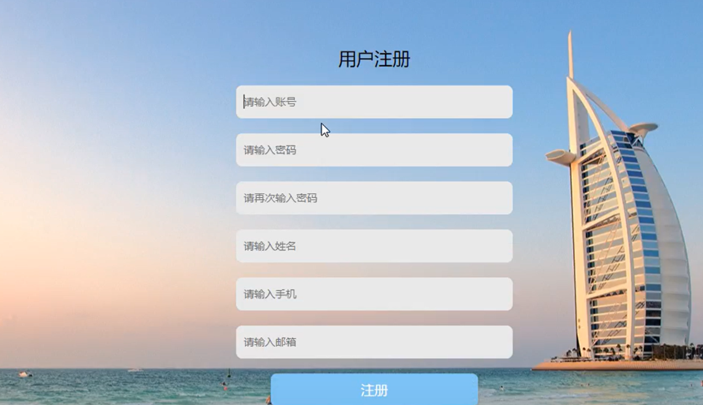

图4-2用户注册界面图

志愿招募，在志愿招募页面可以查看岗位地点，服务人群，岗位要求，报名时间，截止时间，点击次数等内容，并进行申请操作；如图4-3所示。

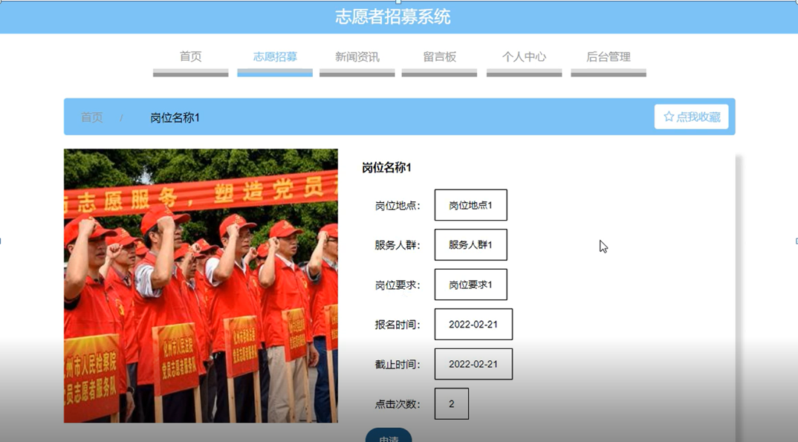

图4-3志愿招募界面图

个人中心，在个人中心页面通过填写账号,密码,姓名,性别,手机，邮箱，上传图片等内容进行更新信息，还可以根据需要对我的收藏进行详细操作，如图4-4所示。

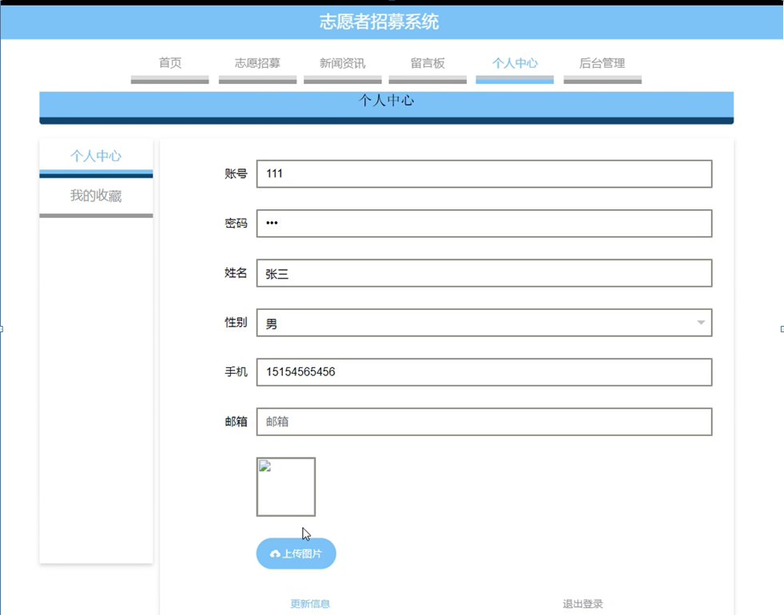

图4-4个人中心界面图

### 4.2 管理员功能模块

管理员登录，管理员通过填写注册时输入的用户名，密码，选择角色等信息进行登录操作，如图4-5所示。

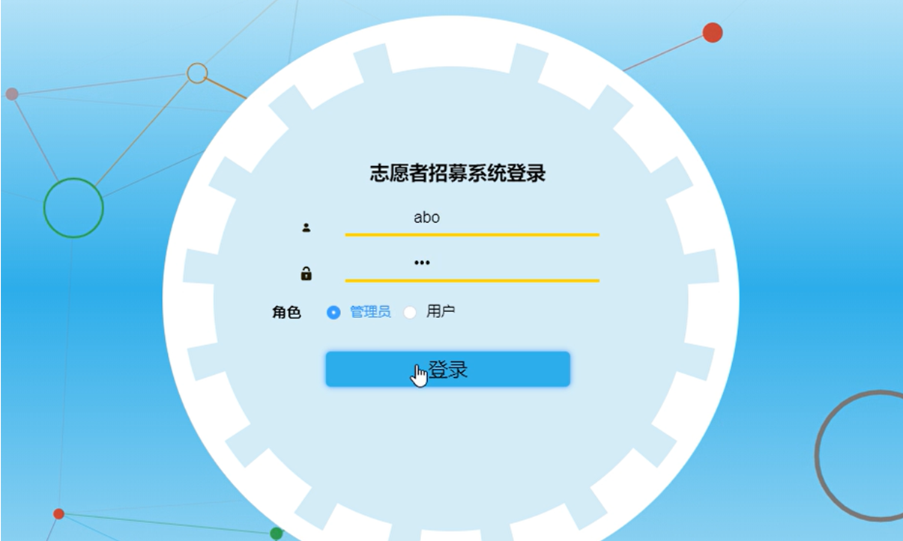

图4-5管理员登录界面图

管理员登录进入系统可以查看首页,个人中心,用户管理,志愿招募管理，岗位申请管理，岗位类型管理，留言板管理，系统管理等功能，并进行详细操作，如图4-6所示。

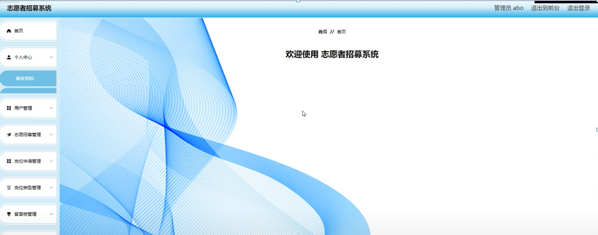

图4-6管理员功能界面图

用户管理；在用户管理页面中可以对索引,账号,姓名,性别,手机，邮箱，图片等内容进行详情，修改和删除操作；如图4-7所示。

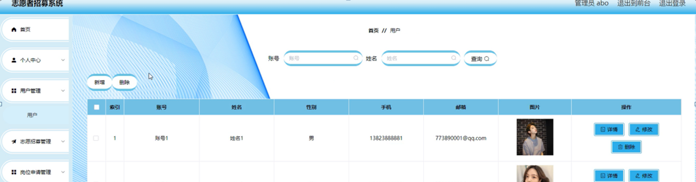

图4-7用户管理界面图

志愿招募管理；在志愿招募管理页面中可以对索引,岗位名称，岗位地点，服务人群，报名时间，截止时间，图片等内容进行详情，修改，查看评论和删除操作；如图4-8所示。

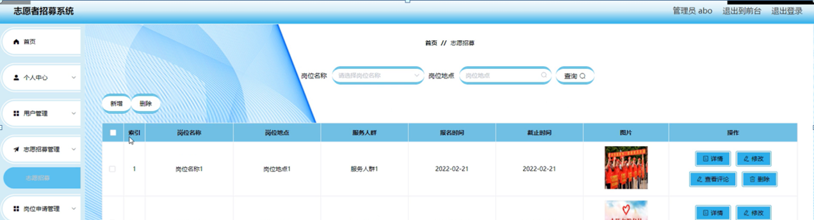

图4-8志愿招募管理界面图

岗位申请管理；在岗位申请管理页面中可以对索引,岗位名称,岗位地点，服务人群，申请时间，申请说明，账号，姓名，手机，审核回复，审核状态，审核等内容进行详情和删除操作；如图4-9所示。

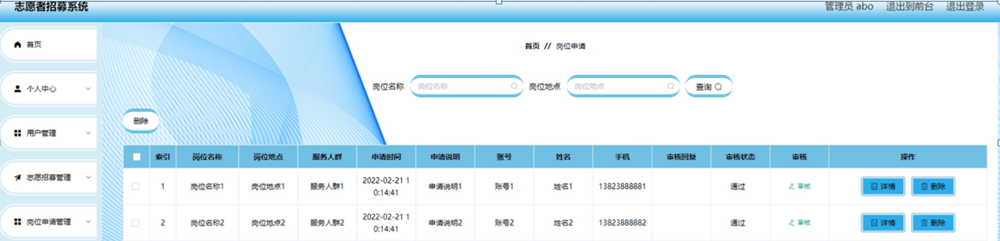

图4-9岗位申请管理界面图

留言板管理；在留言板管理页面中可以对索引,用户名，留言内容，留言图片，回复内容，回复图片等内容进行详情，修改，回复和删除操作；如图4-10所示。

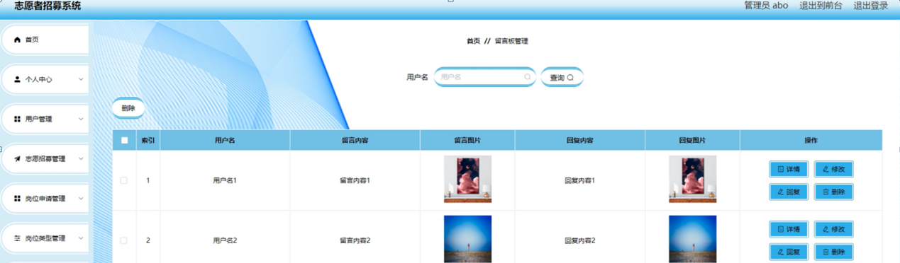

图4-10留言板管理界面图

系统管理；在新闻资讯页面中可以对索引,标题,图片等内容进行详情，修改和删除操作；还可以对轮播图管理进行详细操作；如图4-11所示。

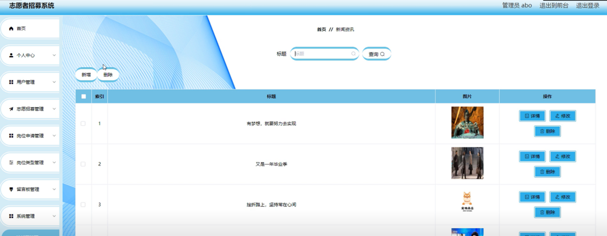

图4-11系统管理界面图

### 4.3用户功能模块

用户登录进入系统可以查看首页,个人中心,岗位申请管理等功能，并进行详细操作，如图4-12所示。

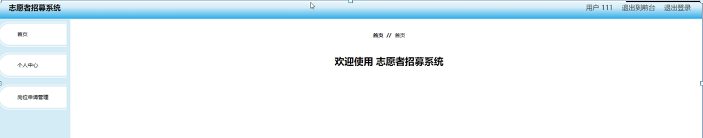

图4-12用户功能界面图

**JAVA** **毕设帮助，指导，源码分享，调试部署**

