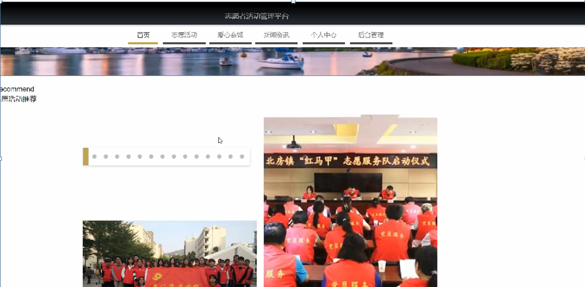
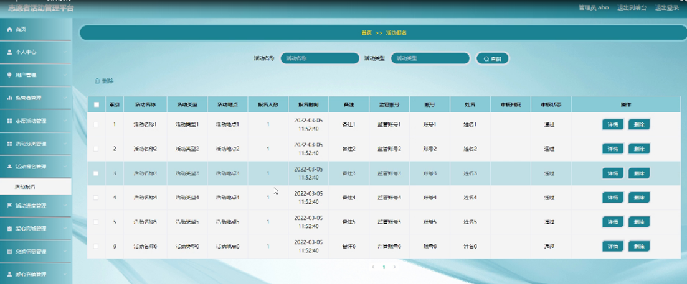

ssm+Vue计算机毕业设计志愿者活动管理平台（程序+LW文档）

**项目运行**

**环境配置：**

**Jdk1.8 + Tomcat7.0 + Mysql + HBuilderX** **（Webstorm也行）+ Eclispe（IntelliJ
IDEA,Eclispe,MyEclispe,Sts都支持）。**

**项目技术：**

**SSM + mybatis + Maven + Vue** **等等组成，B/S模式 + Maven管理等等。**

**环境需要**

**1.** **运行环境：最好是java jdk 1.8，我们在这个平台上运行的。其他版本理论上也可以。**

**2.IDE** **环境：IDEA，Eclipse,Myeclipse都可以。推荐IDEA;**

**3.tomcat** **环境：Tomcat 7.x,8.x,9.x版本均可**

**4.** **硬件环境：windows 7/8/10 1G内存以上；或者 Mac OS；**

**5.** **是否Maven项目: 否；查看源码目录中是否包含pom.xml；若包含，则为maven项目，否则为非maven项目**

**6.** **数据库：MySql 5.7/8.0等版本均可；**

**毕设帮助，指导，本源码分享，调试部署** **(** **见文末** **)**

系统对这些功能进行整合，产生的功能结构图如下：

图4-1 系统总体结构图

### 4.2数据库设计

#### 4.2.1概念模型设计

概念模型是对现实中的问题出现的事物的进行描述，ER图是由实体及其关系构成的图，通过E-R图可以清楚地描述系统涉及到的实体之间的相互关系。

用户注册实体图如图4-2所示：

图4-2用户注册实体图

监管者注册实体图如图4-3所示：

图4-3监管者注册实体图

志愿活动实体图如图4-4所示：

图4-4志愿活动实体图

### 系统功能模块

志愿者活动管理平台，在系统首页可以查看首页，志愿活动，爱心商城，新闻资讯，个人中心，后台管理等内容，并进行详细操作，如图5-1所示。

图5-1系统首页界面图

用户注册，在用户注册页面通过填写账号，密码，确认密码，姓名，手机，地址等信息进行注册操作，如图5-2所示。

图5-2用户注册界面图

监管者注册，在监管者注册页面通过填写监管者账号，密码，确认密码，监管者姓名，联系电话等信息进行注册操作，如图5-3所示。

图5-3监管者注册界面图

志愿活动，在志愿活动页面可以查看活动名称，活动类型，活动地点，报名人数，开始时间，结束时间，监管账号，联系电话，点击次数等内容，可以进行报名操作，并可以根据需要进行点我收藏操作，如图5-4所示。

图5-4志愿活动界面图

爱心商城，在爱心商城页面可以查看商品名称，商品类型，规格，兑换爱心，上架时间等内容，并进行兑换，赞一下，评论和收藏等操作，如图5-5所示。

图5-5爱心商城界面图

个人中心，在个人中心页面通过填写账号，密码，姓名，性别，手机，地址，爱心数，图片等内容进行更新信息操作，还可以对我的收藏进行详细操作，如图5-6所示。

图5-6个人中心界面图

### 5.2后台功能模块

后台登录，进入系统前在登录页面根据要求填写用户名和密码，选择角色等信息，点击登录进行登录操作，如图5-7所示。

图5-7后台登录界面图

#### 5.2.1管理员功能模块

管理员登录系统后，可以对首页，个人中心，用户管理，监管者管理，志愿活动管理，活动分类管理，活动报名管理，活动进度管理，爱心商城管理，兑换信息管理，爱心充值管理，爱心扣除管理，系统管理等功能进行相应的操作，如图5-8所示。

图5-8管理员功能界面图

用户管理，在用户管理页面可以对索引，账号，姓名，性别，手机，地址，爱心数，头像等内容进行详情，充值，扣除，修改，删除等操作，如图5-9所示。

图5-9用户管理界面图

监管者管理，在监管者管理页面可以对索引，监管账号，监管姓名，性别，联系电话，头像等信息进行详情，修改和删除等操作，如图5-10所示。

图5-10监管者管理界面图

志愿活动管理，在志愿活动管理页面可以对索引，活动名称，活动地点，报名人数，开始时间，截止时间，活动图片，监管账号，联系电话等内容进行详情，查看评论，删除等操作，如图5-11所示。

图5-11志愿活动管理界面图

活动报名管理，在活动报名管理页面可以对索引，活动名称，活动类型，活动地点，报名人数，报名时间，备注，监管账号，账号，姓名，审核回复，审核状态等内容进行详情和删除等操作，如图5-12所示。

图5-12活动报名管理界面图

#### **JAVA** **毕设帮助，指导，源码分享，调试部署**

