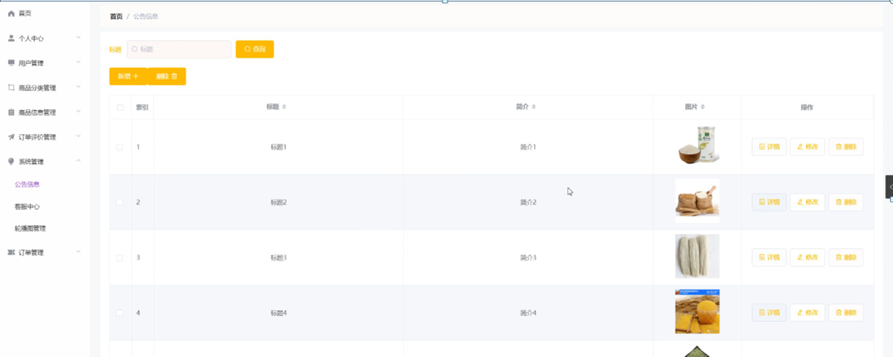

ssm+Vue计算机毕业设计忻府区饭中有豆粮油销售系统（程序+LW文档）

**项目运行**

**环境配置：**

**Jdk1.8 + Tomcat7.0 + Mysql + HBuilderX** **（Webstorm也行）+ Eclispe（IntelliJ
IDEA,Eclispe,MyEclispe,Sts都支持）。**

**项目技术：**

**SSM + mybatis + Maven + Vue** **等等组成，B/S模式 + Maven管理等等。**

**环境需要**

**1.** **运行环境：最好是java jdk 1.8，我们在这个平台上运行的。其他版本理论上也可以。**

**2.IDE** **环境：IDEA，Eclipse,Myeclipse都可以。推荐IDEA;**

**3.tomcat** **环境：Tomcat 7.x,8.x,9.x版本均可**

**4.** **硬件环境：windows 7/8/10 1G内存以上；或者 Mac OS；**

**5.** **是否Maven项目: 否；查看源码目录中是否包含pom.xml；若包含，则为maven项目，否则为非maven项目**

**6.** **数据库：MySql 5.7/8.0等版本均可；**

**毕设帮助，指导，本源码分享，调试部署** **(** **见文末** **)**

### 系统结构设计

系统架构图属于系统设计阶段，系统架构图只是这个阶段一个产物，系统的总体架构决定了整个系统的模式，是系统的基础。忻府区饭中有豆粮油销售系统的整体结构设计如图4-2所示。

图4-2 系统结构图

### 4.3数据库设计

数据库是计算机信息系统的基础。目前，电脑系统的关键与核心部分就是数据库。数据库开发的优劣对整个系统的质量和速度有着直接影响。

#### 4.3.1 数据库设计原则

数据库的概念结构设计采用实体—联系（E-R）模型设计方法。E-R模型法的组成元素有：实体、属性、联系，E-R模型用E-
R图表示，是提示用户工作环境中所涉及的事物，属性则是对实体特性的描述。在系统设计当中数据库起着决定性的因素。下面设计出这几个关键实体的实体—关系图。

#### 4.3.2 数据库实体

数据模型中的实体（Entity），也称为实例，对应现实世界中可区别于其他对象的“事件”或“事物”。例如，公司中的每个员工，家里中的每个家具。

本系统的E-R图如下图所示：

1、用户信息实体图如图4-3所示：

图4-3用户信息实体图

2、订单管理实体图如图4-4所示：

图4-4订单管理实体图

### 系统功能模块

忻府区饭中有豆粮油销售，在系统首页可以查看首页、商品信息、公告信息、个人中心、后台管理、购物车、客服中心等内容，如图5-1所示。

图5-1系统首页界面图

用户注册，在用户注册页面通过填写用户名、密码、姓名、手机、邮箱、身份证等信息完成用户注册，如图5-2所示。

图5-2用户注册界面图

商品信息，在商品信息页面可以查看商品名称、分类、图片、规格、品牌、产地、生产日期、保质期、价格、点击次数等详细内容，进行添加到购物车，如图5-3所示。

图5-3商品信息界面图

个人中心，在个人中心页面通过填写用户名、密码、姓名、性别、手机、邮箱、身份证、余额等信息进行更新信息，根据需要对我的订单、我的地址、我的收藏进行相对应操作，如图5-4所示。

图5-4个人中心界面图

购物车，在购物车页面可以查看购买商品、价格、数量、总价等内容，点击购买，如图5-5所示。

图5-5购物车界面图

### 5.2管理员功能模块

管理员登录，通过填写注册时输入的用户名、密码、角色进行登录，如图5-6所示。

图5-6管理员登录界面图

管理员登录进入忻府区饭中有豆粮油销售可以查看首页、个人中心、用户管理、商品分类管理、商品信息管理、订单评价管理、系统管理、订单管理等信息，如图5-7所示。

图5-7管理员功能界面图

用户管理，在用户管理页面中可以查看索引、用户名、姓名、性别、头像、手机、邮箱、身份证等信息，并可根据需要进行修改或删除等操作，如图5-8所示。

图5-8用户管理界面图

商品分类管理，在商品分类管理页面中可以查看索引、分类等信息，并可根据需要进行修改或删除等操作，如图5-9所示。

图5-9商品分类管理界面图

商品信息管理，在商品信息管理页面中可以查看索引、商品名称、分类、图片、规格、品牌、产地、生产日期、保质期、价格等信息，并可根据需要进行查看评论、修改或删除等操作，如图5-10所示。

图5-10商品信息管理界面图

订单评价管理，在订单评价管理页面中可以查看索引、订单编号、评价标题、订单评分、评价日期、用户名、手机、审核回复、审核状态、审核等信息，并可根据需要进行修改或删除等操作，如图5-11所示。

图5-11订单评价管理界面图

系统管理，在公告信息页面中可以查看索引、标题、简介、图片等信息，并可根据需要对客服中心、轮播图管理进行相对应等操作，如图5-12所示。

图5-12系统管理界面图

#### **JAVA** **毕设帮助，指导，源码分享，调试部署**

