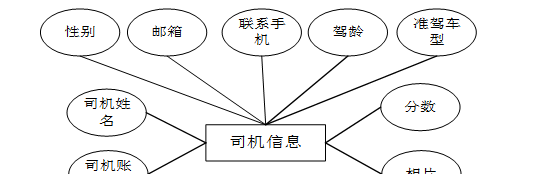
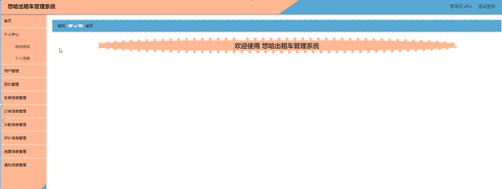

ssm+Vue计算机毕业设计悠哈出租车管理系统（程序+LW文档）

**项目运行**

**环境配置：**

**Jdk1.8 + Tomcat7.0 + Mysql + HBuilderX** **（Webstorm也行）+ Eclispe（IntelliJ
IDEA,Eclispe,MyEclispe,Sts都支持）。**

**项目技术：**

**SSM + mybatis + Maven + Vue** **等等组成，B/S模式 + Maven管理等等。**

**环境需要**

**1.** **运行环境：最好是java jdk 1.8，我们在这个平台上运行的。其他版本理论上也可以。**

**2.IDE** **环境：IDEA，Eclipse,Myeclipse都可以。推荐IDEA;**

**3.tomcat** **环境：Tomcat 7.x,8.x,9.x版本均可**

**4.** **硬件环境：windows 7/8/10 1G内存以上；或者 Mac OS；**

**5.** **是否Maven项目: 否；查看源码目录中是否包含pom.xml；若包含，则为maven项目，否则为非maven项目**

**6.** **数据库：MySql 5.7/8.0等版本均可；**

**毕设帮助，指导，本源码分享，调试部署** **(** **见文末** **)**

### 系统结构图

整个系统的模块划分包含用户管理模块、司机管理模块和管理员管理模块, 又划分了若干了子模块,为了方便更直观的理解,下图以图形形式给出关于整个网站的结构图。

网站总体功能结构图3-1如图所示：

图3-2网站总体功能结构图

### 数据库概念设计

在对数据库设计之前首先要分析一下悠哈出租车管理系统的功能，和各模块之间的关系，再对数据表进行设计。每一个模块的实体都会对应多个实体对象，下面是几个系统中的数据实体。

用户信息实体E-R图如图4-1所示：

图4-1用户信息E-R图

车辆信息实体E-R图如图4-2所示：

图4-2车辆信息实体E-R图

司机信息实体E-R图如图4-3所示：

图4-3司机信息实体E-R图

订单信息实体E-R图如图4-4所示：

图4-4订单信息实体E-R图

### 管理员功能模块

管理员进行登录，进入系统前在登录页面根据要求填写用户名和密码，选择角色等信息，点击登录进行登录操作，如图5-1所示。

图5-1管理员登录界面图

管理员登录系统后，可以对首页、个人中心、用户管理、司机管理、车辆信息管理、订单信息管理、分配信息管理、评价信息管理、违章信息管理、通知信息管理等进行相应的操作管理，如图5-2所示。

图5-2管理员功能界面图

个人中心，在个人中心页面可以修改密码和修改个人信息，管理员个人中心管理如图5-3所示。

图5-3个人中心界面图

用户管理，在用户管理页面可以对账号、姓名、性别、邮箱、手机号码、相片等内容进行详情、修改、删除等操作，如图5-4所示。

图5-4用户管理界面图

司机管理，在司机管理页面可以对司机账号、司机姓名、性别、邮箱、联系手机、驾龄、准驾车型、分数、相片等内容进行详情、违章、通知、修改、删除等操作，如图5-5所示。

图5-5司机管理管理界面图

车辆信息管理，在车辆信息管理页面可以对车牌号、车辆品牌、排量、座椅、颜色、车车辆状态、购买日期等内容进行详情、修改、删除等操作，如图5-6所示。

图5-6车辆信息管理界面图

订单信息管理，在订单信息管理页面可以对订单编号、出发地、目的地、账号、姓名、手机号码、健康码、申请日期、审核回复、审核状态、审核等内容进行详情、安排、删除等操作，如图5-7所示。

图5-7订单信息管理界面图

分配信息管理，在分配信息管理页面可以对订单编号、出发地、目的地、账号、姓名、手机号码、健康码、备注、申请日期、司机账号、司机姓名、联系手机、疫苗情况、车辆信息、颜色、费用、是否支付、审核回复、审核状态、审核等内容进行详情等操作，如图5-8所示。

图5-8分配信息管理界面图

评价信息管理，在评价信息管理页面可以对订单编号、司机账号、司机姓名、账号、姓名、评价日期等内容进行详情、删除等操作，如图5-9所示。

图5-9评价信息管理界面图

### 5.2司机功能模块

司机，在登录页面填写用户名、密码进行登录，如果出现错误信息会有相应提示，信息无误进入系统页面。如图5-10所示。

图5-10司机登录界面图

司机登录到系统，可以对首页、个人中心、车辆信息管理、分配信息管理、评价信息管理、违章信息管理、通知信息管理进行操作，如图5-11所示。

图5-11司机功能界面图

个人中心，司机在个人中心页面进行修改密码，还能输入司机账号、司机姓名、性别、邮箱、联系手机、驾龄、准驾车型、分数、相片等内容来修改个人信息，如图5-12
5-13所示。

图5-12修改密码界面图

图5-13个人信息界面图

#### **JAVA** **毕设帮助，指导，源码分享，调试部署**

