ssm+Vue计算机毕业设计招聘信息管理平台（程序+LW文档）

**项目运行**

**环境配置：**

**Jdk1.8 + Tomcat7.0 + Mysql + HBuilderX** **（Webstorm也行）+ Eclispe（IntelliJ
IDEA,Eclispe,MyEclispe,Sts都支持）。**

**项目技术：**

**SSM + mybatis + Maven + Vue** **等等组成，B/S模式 + Maven管理等等。**

**环境需要**

**1.** **运行环境：最好是java jdk 1.8，我们在这个平台上运行的。其他版本理论上也可以。**

**2.IDE** **环境：IDEA，Eclipse,Myeclipse都可以。推荐IDEA;**

**3.tomcat** **环境：Tomcat 7.x,8.x,9.x版本均可**

**4.** **硬件环境：windows 7/8/10 1G内存以上；或者 Mac OS；**

**5.** **是否Maven项目: 否；查看源码目录中是否包含pom.xml；若包含，则为maven项目，否则为非maven项目**

**6.** **数据库：MySql 5.7/8.0等版本均可；**

**毕设帮助，指导，本源码分享，调试部署** **(** **见文末** **)**

总体设计

招聘信息管理平台采用了结构化开发的方法。这种开发方法的优点是控制性比较强，开发过程中采用了结构化和模块化的设计思想，自顶向下，从总体到部分，合理划分系统的结构和模块。结构化开发时使用模块式开发，各模块之间互不影响，方便系统的开发与管理。

本系统的设计是基于
B/S架构的三层体系结构，也就是浏览器和服务器结构。计算机技术发展的速度非常快，以前的设计结构都以C/S的模式为主，也就是前台和后台模式。但随着网页技术的发展，越来越多的用户习惯于使用浏览器。现在的网页技术可以在浏览器中实现非常漂亮的效果，以前的单一低调的前台页面已经无法满足用户的需求。在B/S这种结构下，技术人员可以很轻松的设计出用户所需要的工作界面，页面代码通过浏览器进行解析展示，在浏览器中不做过多的事务逻辑的处理。主要的事务逻辑放在后台进行处理。这样用户的电脑就不会承载过多的东西，只需要浏览器展示即可。对于开发人员也很方便进行系统的维护和升级。开发人员只需要在服务端进行系统的维护就可以了。使用Java这样的跨平台性非常好的语言，这样的开发模式更加的方便，高效。本系统合理的进行了模块划分和组合，因此由于各个模块之间基本上是相互独立的，所以每个模块都可以独立的被解释、执行、调试和修改，让繁琐的系统设计工作简单化。系统总体设计图如下图4-1所示：

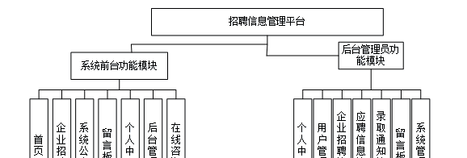 图4-1系统总体设计图

### 4.2 数据库设计

#### 4.2.1 概念模型设计

数据可设计要遵循职责分离原则，即在设计时应该要考虑系统独立性，即每个系统之间互不干预不能混乱数据表和系统关系。

数据库命名也要遵循一定规范，否则容易混淆，数据库字段名要尽量做到与表名类似，多使用小写英文字母和下划线来命名并尽量使用简单单词。

概念模型是对现实中的问题出现的事物的进行描述，ER图是由实体及其关系构成的图，通过E-R图可以清楚地描述系统涉及到的实体之间的相互关系。

留言板实体图如图4-2所示：

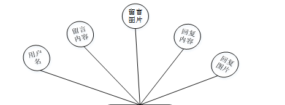

图4-2留言板实体图

用户信息实体图如图4-3所示：

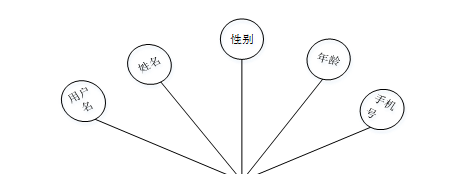

图4-3用户信息实体图

录取通知实体图如图4-4所示：

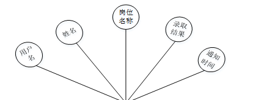

图4-4录取通知实体图

系统功能模块

招聘信息管理平台，在系统首页可查看首页、企业招聘、系统公告、留言板、个人中心、后台管理、在线咨询等内容，如图5-1所示。

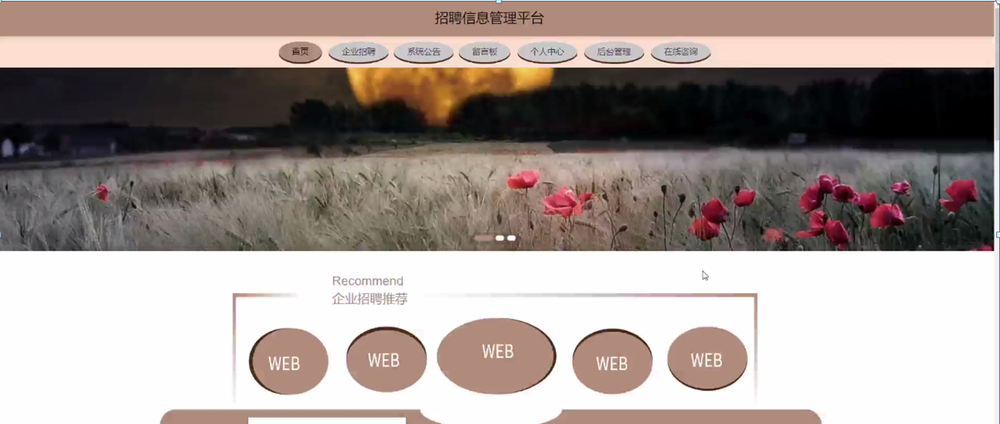图5-1系统首页界面图

用户注册，用户通过输入用户名、密码、姓名、年龄、手机进行注册，如图5-2所示。

图5-2用户注册界面图

企业招聘，用户可在企业招聘页面查看标题、上班地点、上班时间、薪资待遇、招聘人数、联系方式、封面、点击次数等内容，还可进行应聘、评论或收藏等操作，如图5-3所示。

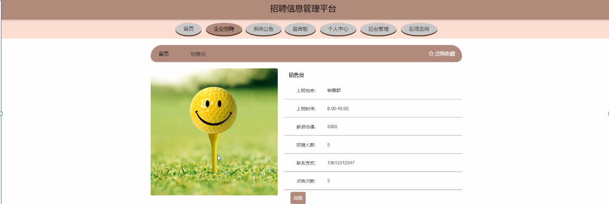

图5-3企业招聘界面

留言板，用户可通过输入留言、上传图片进行提交或重置等操作，如图5-4所示。

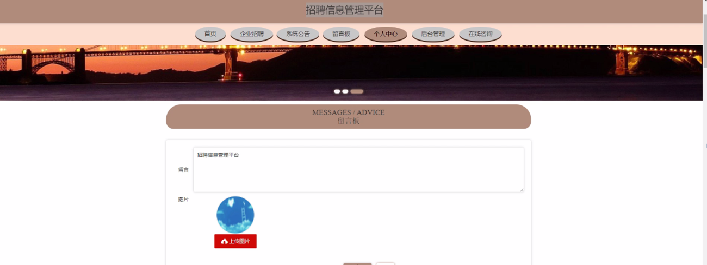

图5-4留言板界面图

后台管理，用户可在后台管理页面查看个人中心、应聘信息管理、录取通知管理等内容，如图5-5所示。

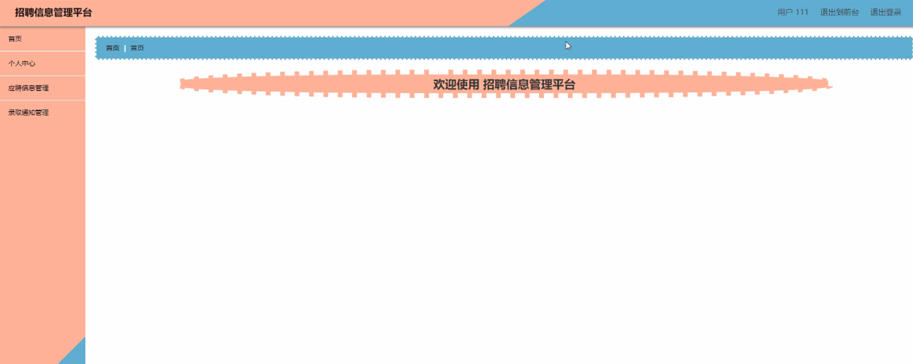

图5-5用户后台功能界面图

个人中心， 用户可在个人中心页面通过输入用户名、姓名、性别、年龄、手机号进行修改个人信息或修改密码等操作，如图5-6所示。

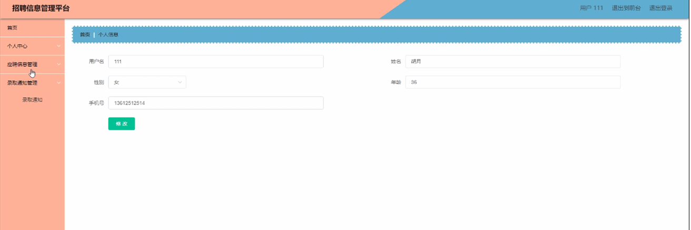

图5-6个人中心界面图

应聘信息管理，用户可在应聘信息管理页面查看岗位名称、头像、薪资待遇、用户名、姓名、手机号、特长、服从调配、个人简历、应聘时间、审核回复、审核状态等内容，还可进行删除等操作，如图5-7所示。

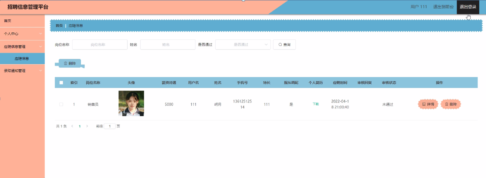

图5-7应聘信息管理界面图

录取通知管理，用户可在录取通知管理页面查看岗位名称、用户名、姓名、录取结果、通知时间等内容，还可进行删除等操作，如图5-8所示。

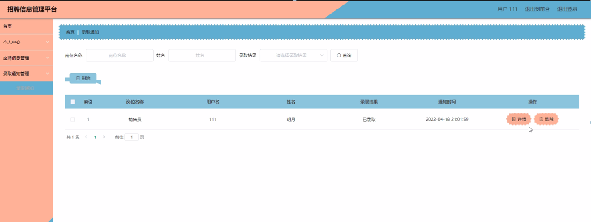

图5-8录取通知管理订单界面

5.2管理员功能模块

管理员通过输入用户名、密码、角色进行登录，如图5-9所示。

图5-9管理员登录界面

管理员通过登录进入系统可查看个人中心、用户管理、企业招聘管理、应聘信息管理、录取通知管理、留言板、系统管理等内容，如图5-10所示。

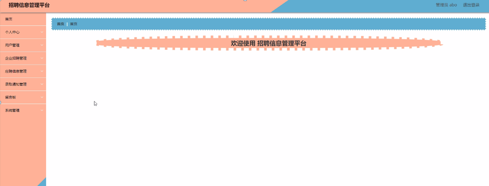图5-10管理员功能界面

用户管理，管理员可在用户管理页面查看用户名、姓名、性别、年龄、手机号等内容，还可进行新增、修改或删除等操作，如图5-11所示。

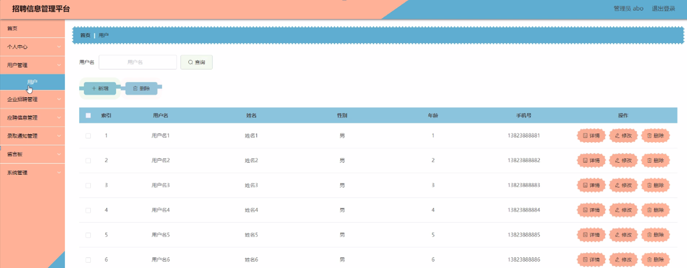图5-11用户管理界面图

企业招聘管理，管理员可在企业招聘管理页面查看岗位名称、图片、上班地点、上班时间、薪资待遇、招聘人数、联系方式等内容，还可进行新增、修改、查看评论或删除等操作，如图5-12所示。

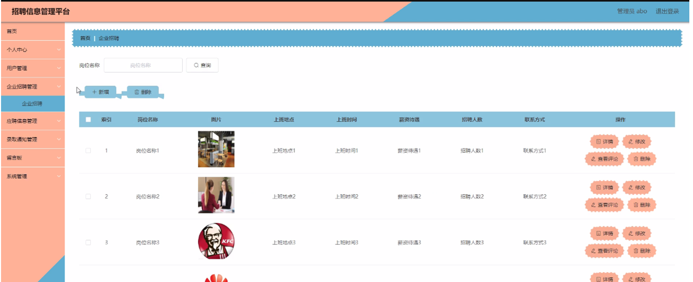图5-12企业招聘管理界面图

**JAVA** **毕设帮助，指导，源码分享，调试部署**

