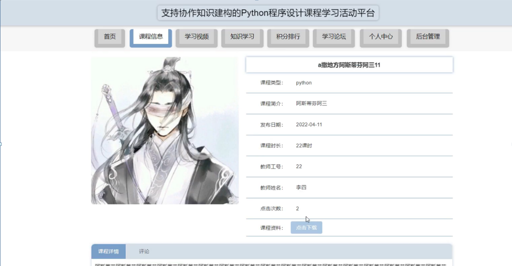

ssm+Vue计算机毕业设计支持协作知识建构的Python程序设计课程学习活动平台（程序+LW文档）

**项目运行**

**环境配置：**

**Jdk1.8 + Tomcat7.0 + Mysql + HBuilderX** **（Webstorm也行）+ Eclispe（IntelliJ
IDEA,Eclispe,MyEclispe,Sts都支持）。**

**项目技术：**

**SSM + mybatis + Maven + Vue** **等等组成，B/S模式 + Maven管理等等。**

**环境需要**

**1.** **运行环境：最好是java jdk 1.8，我们在这个平台上运行的。其他版本理论上也可以。**

**2.IDE** **环境：IDEA，Eclipse,Myeclipse都可以。推荐IDEA;**

**3.tomcat** **环境：Tomcat 7.x,8.x,9.x版本均可**

**4.** **硬件环境：windows 7/8/10 1G内存以上；或者 Mac OS；**

**5.** **是否Maven项目: 否；查看源码目录中是否包含pom.xml；若包含，则为maven项目，否则为非maven项目**

**6.** **数据库：MySql 5.7/8.0等版本均可；**

**毕设帮助，指导，本源码分享，调试部署** **(** **见文末** **)**

#### 系统模块设计

系统分为管理员功能模块，教师功能模块，学生前台。

学生主要在前台浏览平台的各种信息，主要包括首页、课程学习、学习视频、知识学习、积分排行、学习论坛、个人中心、后台管理等功能；

管理员功能模块为管理员操作界面，主要包括首页、个人中心、学生管理、教师管理、课程类型管理、课程信息管理、视频类型管理、学习视频管理、知识学习管理、积分排行管理、学习论坛、系统管理等功能；

教师功能模块为教师操作界面，主要包括首页、个人中心、课程信息管理、学习视频管理等功能；

系统整体功能如下图4-2所示。

图4-2系统总体功能图

#### 4.1.3数据库设计

（1）根据用户需求，确定数据库信息进行保存

对用户的需求分析是数据库设计的第一阶段，用户的需求调研，熟悉企业运作流程，系统要求，这些都是以概念模型为基础的。

（2）设计数据的概念模型

概念模型与数据建模用户的观点一致，用于信息世界的建模工具。通过E-R图可以清楚地描述系统涉及到的实体之间的相互关系。

课程信息实体图如图4-3所示：

图4-3课程信息实体图

学习视频实体图如图4-4所示：

图4-4学习视频信息实体图

### 系统功能模块

课程学习活动平台，学生进入到平台首页，可以查看首页、课程学习、学习视频、知识学习、积分排行、学习论坛、个人中心、后台管理等内容进行操作，如图5-1所示。

图5-1平台首页界面图

学生注册，学生通过填写学号、姓名、密码、确认密码、手机、学院、专业等信息完成注册，如图5-2所示。

图5-2学生注册界面图

课程信息，在课程信息页面中可以查看课程名称、课程图片、课程类型、课程简介、发布日期、课程时长、教师工号、教师姓名、点击次数、课程资料、课程详情等内容；并进行评论和收藏管理，如图5-3所示。

图5-3课程信息界面图

学习视频，在学习视频页面中可以查看课程名称、课程图片、标签、视频类型、视频介绍、发布日期、教师工号、点击次数等内容；并进行评论和收藏管理，如图5-4所示。

图5-4学习视频界面图

知识学习，在知识学习页面中可以查看知识名称、知识图片、课程类型、发布日期、教师工号、点击次数、相关资料、学习资料等内容；并进行评论和收藏管理，如图5-5所示。

图5-5知识学习界面图

个人中心，在个人中心页面中输入学号、姓名、密码、手机、学院、专业等内容进行更新信息，并可以根据需要对我的发布，我的收藏进行相应的操作，如图5-6所示。

图5-6个人中心界面图

### 5.2 后台功能模块

系统登录，用户进入系统前在登录页面根据要求填写用户名和密码，点击登录进行登录操作，如图5-7所示。

图5-7系统登录界面图

#### 5.2.1管理员功能模块

管理员登录系统后，可以对首页、个人中心、学生管理、教师管理、课程类型管理、课程信息管理、视频类型管理、学习视频管理、知识学习管理、积分排行管理、学习论坛、系统管理等进行相应的操作管理，如图5-8所示。

图5-8管理员功能界面图

学生管理，在学生管理页面可以对索引、学号、姓名、性别、手机、学院、专业等内容进行详情，修改和删除等操作，如图5-9所示。

图5-9学生管理界面图

教师管理，在教师管理页面可以对索引、教师工号、教师姓名、性别、职称、电话等内容进行详情，修改和删除等操作，如图5-10所示。

图5-10教师管理界面图

课程信息管理，在课程信息管理页面可以对索引、课程名称、课程类型、图片、课程简介、发布日期、课程时长、教师工号、教师姓名、课程资料等内容进行详情，修改，查看评论和删除等操作，如图5-11所示。

图5-11课程信息管理界面图

学习视频管理，在学习视频管理页面可以对索引、课程名称、标签、视频类型、封面图、视频、发布日期、教师工号等内容进行详情，修改，查看评论和删除等操作，如图5-12所示。

图5-12学习视频管理界面图

**JAVA** **毕设帮助，指导，源码分享，调试部署**

