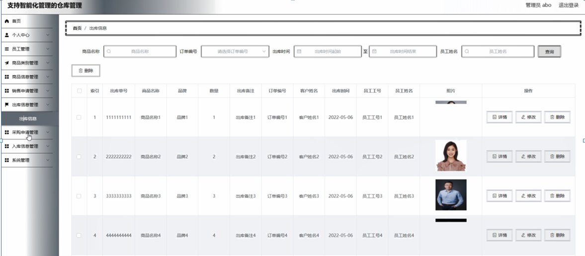

ssm+Vue计算机毕业设计支持智能化管理的仓库管理（程序+LW文档）

**项目运行**

**环境配置：**

**Jdk1.8 + Tomcat7.0 + Mysql + HBuilderX** **（Webstorm也行）+ Eclispe（IntelliJ
IDEA,Eclispe,MyEclispe,Sts都支持）。**

**项目技术：**

**SSM + mybatis + Maven + Vue** **等等组成，B/S模式 + Maven管理等等。**

**环境需要**

**1.** **运行环境：最好是java jdk 1.8，我们在这个平台上运行的。其他版本理论上也可以。**

**2.IDE** **环境：IDEA，Eclipse,Myeclipse都可以。推荐IDEA;**

**3.tomcat** **环境：Tomcat 7.x,8.x,9.x版本均可**

**4.** **硬件环境：windows 7/8/10 1G内存以上；或者 Mac OS；**

**5.** **是否Maven项目: 否；查看源码目录中是否包含pom.xml；若包含，则为maven项目，否则为非maven项目**

**6.** **数据库：MySql 5.7/8.0等版本均可；**

**毕设帮助，指导，本源码分享，调试部署** **(** **见文末** **)**

### 系统设计主要功能

通过市场调研及咨询研究，了解了使用者及管理者的使用需求，于是制定了管理员和员工等模块。其功能结构图如下图4-1所示：

图4-1系统功能结构图

### 4.2 数据库设计

#### 4.2.1 数据库设计规范

数据可设计要遵循职责分离原则，即在设计时应该要考虑系统独立性，即每个系统之间互不干预不能混乱数据表和系统关系。

数据库命名也要遵循一定规范，否则容易混淆，数据库字段名要尽量做到与表名类似，多使用小写英文字母和下划线来命名并尽量使用简单单词。

#### 4.2.2 E-R图

员工管理E-R图，如图4-2所示：

图4-2 员工管理E-R图

商品信息管理E-R图，如图4-3所示：

图4-3商品信息管理E-R图

出库信息管理E-R图如图4-4所示。

图4-4出库信息管理E-R图

登录，通过填写注册时输入的用户名、密码、选择角色等信息进行登录操作，如图5-1所示。

图5-1系统登录界面图

### 5.1 管理员功能模块

管理员登录进入支持智能化管理的仓库管理系统可以查看首页，个人中心，员工管理，商品类别管理，商品信息管理，销售申请管理，出库信息管理，采购申请管理，入库信息管理，系统管理等功能进行详细操作，如图5-2所示。

图5-2管理员功能界面图

员工管理；在员工管理页面中可以对索引，员工工号，员工姓名，头像，性别，联系电话等内容进行详情，修改和删除操作；如图5-3所示。

图5-3员工管理界面图

商品类别管理；在商品类别管理页面中可以对索引，商品类别等内容进行详情，修改和删除操作；如图5-4所示。

图5-4商品类别管理界面图

部门信息管理；在部门信息管理页面中可以对索引，商品编号，商品名称，封面，商品类别，品牌，规格，数量，单价等内容进行详情，修改和删除操作；如图5-5所示。

图5-5部门信息管理界面图

销售申请管理；在销售申请管理页面中可以对索引，订单编号，商品名称，商品类型，品牌，规格，单价，数量，总金额，客户姓名，销售日期，员工工号，员工姓名，审核回复，审核状态，审核等内容进行详情，修改和删除操作；如图5-6所示。

图5-6销售申请管理界面图

出库信息管理；在出库信息管理页面中可以对索引，出库单号，商品名称，品牌，数量，出库备注，订单编号，客户姓名，出库时间，员工工号，员工姓名，照片等内容进行详情，修改和删除操作；如图5-7所示。

图5-7出库信息管理界面图

采购申请管理；在采购申请管理页面中可以对索引，采购单号，商品名称，商品类别，品牌，进货价格，数量，进货总额，供应商，采购时间，员工工号，员工姓名，审核回复，审核状态，审核等内容进行修改和删除操作；如图5-8所示。

图5-8采购申请管理界面图

入库信息管理；在入库信息管理页面中可以对索引，入库单号，商品名称，品牌，数量，入库备注，采购单号，供应商，入库时间，员工工号，员工姓名，照片等内容进行查看，修改和删除操作；如图5-9所示。

图5-9入库信息管理界面图

系统管理；在公告信息页面中可以对索引，标题，图片等信息，并进行详情，修改，删除等操作；如图5-10所示。

图5-10系统管理界面图

### 5.2员工功能模块

员工登录进入仓库管理系统可以查看首页，个人中心，商品信息管理，销售申请管理，出库信息管理，采购申请管理，入库信息管理，系统管理等功能，并进行详细操作，如图5-11所示。

图5-11员工功能界面图

个人中心；在个人信息页面通过填写员工工号，员工姓名，头像，性别，联系电话等内容并提交进行个人信息修改操作；如图5-12所示。

图5-12个人中心界面图

**JAVA** **毕设帮助，指导，源码分享，调试部署**

