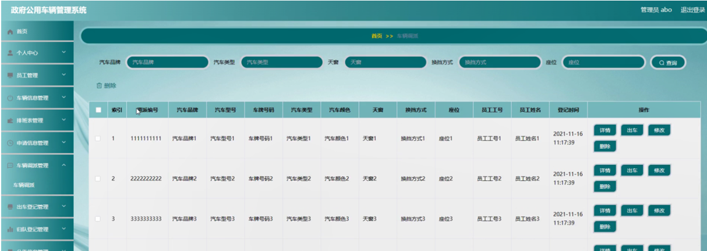
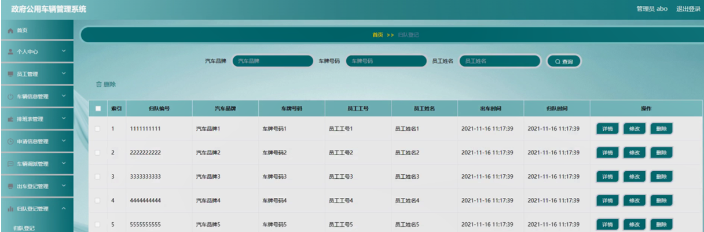

ssm+Vue计算机毕业设计政府公用车辆管理系统（程序+LW文档）

**项目运行**

**环境配置：**

**Jdk1.8 + Tomcat7.0 + Mysql + HBuilderX** **（Webstorm也行）+ Eclispe（IntelliJ
IDEA,Eclispe,MyEclispe,Sts都支持）。**

**项目技术：**

**SSM + mybatis + Maven + Vue** **等等组成，B/S模式 + Maven管理等等。**

**环境需要**

**1.** **运行环境：最好是java jdk 1.8，我们在这个平台上运行的。其他版本理论上也可以。**

**2.IDE** **环境：IDEA，Eclipse,Myeclipse都可以。推荐IDEA;**

**3.tomcat** **环境：Tomcat 7.x,8.x,9.x版本均可**

**4.** **硬件环境：windows 7/8/10 1G内存以上；或者 Mac OS；**

**5.** **是否Maven项目: 否；查看源码目录中是否包含pom.xml；若包含，则为maven项目，否则为非maven项目**

**6.** **数据库：MySql 5.7/8.0等版本均可；**

**毕设帮助，指导，本源码分享，调试部署** **(** **见文末** **)**

### 系统设计主要功能

通过市场调研及咨询研究，了解了政府公用车辆及管理者的使用需求，于是制定了管理员和员工等模块。功能结构图如下所示：

图4-1系统功能结构图

### 4.2 数据库设计

#### 4.2.1 数据库设计规范

数据可设计要遵循职责分离原则，即在设计时应该要考虑系统独立性，即每个系统之间互不干预不能混乱数据表和系统关系。

数据库命名也要遵循一定规范，否则容易混淆，数据库字段名要尽量做到与表名类似，多使用小写英文字母和下划线来命名并尽量使用简单单词。

#### 4.2.2  E/R图

车辆信息E/R图，如下所示：

图4-2 车辆信息E/R图

排班表E/R图，如下所示：

图4-3排班表E/R图

公告信息E/R图，如下所示。

图4-4公告信息E/R图

### 登录注册

登录，管理员通过输入用户名，密码，选择角色并点击登录进行系统登录操作，如图5-1所示。

图5-1登录界面图

政府公用车辆管理系统注册，在政府公用车辆管理系统注册页面通过填写员工工号，员工姓名，密码，部门，联系电话，职位等信息完成注册操作，如图5-2所示。

图5-2政府公用车辆管理系统注册界面图

### 5.2 管理员功能模块

管理员登录系统后，可以对首页，个人中心，员工管理，车辆信息管理，排班表管理，申请信息管理，车辆调派管理，出车登记管理，归队登记管理，公告信息管理等功能模块进行相应操作，如图5-3所示。

图5-3管理员功能界图面

员工管理，在员工管理页面可以对索引，员工工号，员工姓名，部门，性别，联系电话，职位，头像等内容进行详情，修改和删除等操作，如图5-4所示。

图5-4员工管理界面图

车辆信息管理，在车辆信息管理页面可以对索引，汽车品牌，汽车型号，车牌号码，汽车类型，汽车颜色，汽车图片，车辆状态，天窗，换挡方式，座位，汽车排量等内容进行详情，调派，修改，查看评论和删除等操作，如图5-5所示。

图5-5车辆信息管理界面图

排班表管理，在排班表管理页面可以对索引，月份，员工工号，员工姓名，登记时间等内容进行详情，修改和删除等操作，如图5-6所示。

图5-6排班表管理界面图

申请信息管理，在申请信息管理页面可以对索引，申请编号，汽车品牌，汽车型号，汽车类型，车牌号码，汽车颜色，天窗，换挡方式，座位，员工工号，员工姓名，申请时间，审核回复，审核状态，审核等内容进行详情，出车，修改和删除等操作，如图5-7所示。

图5-7申请信息管理界面图

车辆调派管理，在车辆调派管理页面可以对索引，调派编号，汽车品牌，汽车型号，车牌号码，汽车类型，汽车颜色，天窗，换挡方式，座位，员工工号，员工姓名，登记时间等内容进行详情，出车，修改和删除等操作，如图5-8所示。

图5-8车辆调派管理界面图

出车登记管理，在出车登记管理页面可以对索引，出车编号，汽车品牌，车牌号码，员工工号，员工姓名，出车时间等内容进行详情，归队，修改和删除等操作，如图5-9所示。

图5-9出车登记管理界面图

归队登记管理，在归队登记管理页面可以对索引，归队编号，汽车品牌，车牌号码，员工工号，员工姓名，出车时间，归队时间等内容进行详情，修改和删除等操作，如图5-10所示。

图5-10归队登记管理界面图

公告信息管理，在公告信息管理页面可以对索引，标题，发布时间，封面等内容进行详情，修改和删除等操作，如图5-11所示。

图5-11公告信息管理界面图

### 5.3 员工功能模块

员工登录进入系统后，可以对首页，个人中心，车辆信息管理，排班表管理，申请信息管理，车辆调派管理，出车登记管理，归队登记管理，公告信息管理等功能模块进行相应操作，如图5-12所示。

图5-12员工功能界面图

#### **JAVA** **毕设帮助，指导，源码分享，调试部署**

