ssm+Vue计算机毕业设计政府机关门禁管理系统（程序+LW文档）

**项目运行**

**环境配置：**

**Jdk1.8 + Tomcat7.0 + Mysql + HBuilderX** **（Webstorm也行）+ Eclispe（IntelliJ
IDEA,Eclispe,MyEclispe,Sts都支持）。**

**项目技术：**

**SSM + mybatis + Maven + Vue** **等等组成，B/S模式 + Maven管理等等。**

**环境需要**

**1.** **运行环境：最好是java jdk 1.8，我们在这个平台上运行的。其他版本理论上也可以。**

**2.IDE** **环境：IDEA，Eclipse,Myeclipse都可以。推荐IDEA;**

**3.tomcat** **环境：Tomcat 7.x,8.x,9.x版本均可**

**4.** **硬件环境：windows 7/8/10 1G内存以上；或者 Mac OS；**

**5.** **是否Maven项目: 否；查看源码目录中是否包含pom.xml；若包含，则为maven项目，否则为非maven项目**

**6.** **数据库：MySql 5.7/8.0等版本均可；**

**毕设帮助，指导，本源码分享，调试部署** **(** **见文末** **)**

### 系统结构

系统架构图属于系统设计阶段，系统架构图只是这个阶段一个产物，系统的总体架构决定了整个系统的模式，是系统的基础。政府机关门禁管理系统的整体结构设计如图4-2所示。

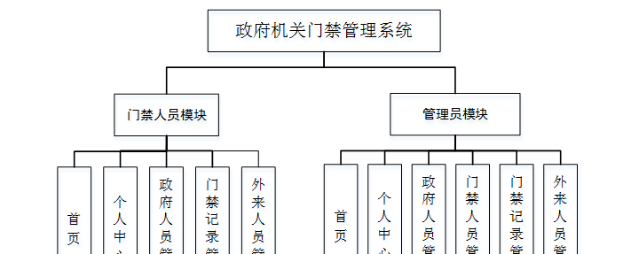

图4-2 系统结构图

### 4.3. 数据库设计

#### 4.3.1 数据库实体

政府人员管理结构图，如图4-5所示：

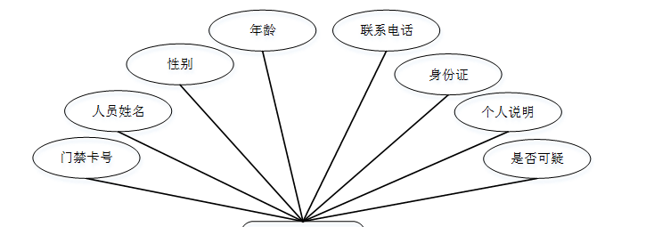

图4-5政府人员管理结构图

门禁人员管理实体属性图，如图4-6所示：

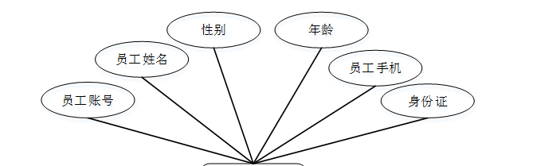

图4-6门禁人员管理实体属性图

外来人员管理实体属性图，如图4-7所示：

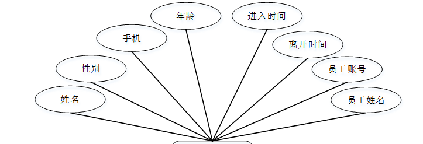

图4-6外来人员管理实体属性图

### 管理员功能模块

管理员登录，管理员通过输入账号，密码，验证码，选择角色等信息即可进行系统登录，如图5-1所示。

图5-1管理员登录界面图

管理员登录进入政府机关门禁管理系统可以查看首页、个人中心、政府人员管理、门禁人员管理、门禁记录管理、外来人员管理等内容进行详细操作，如图5-2所示。

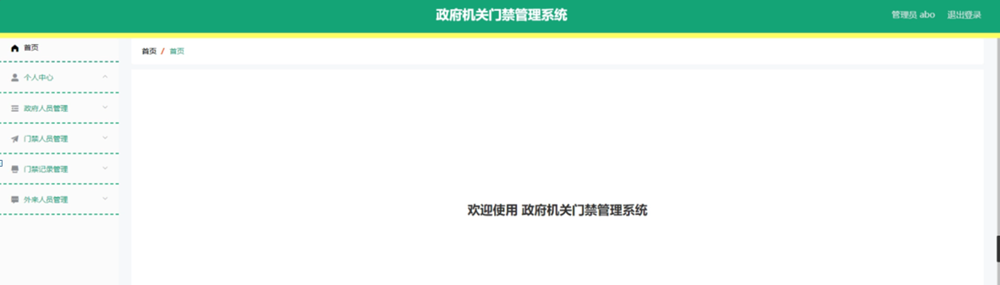

图5-2管理员功能界面图

政府人员管理，在政府人员管理页面可以对门禁卡号、人员姓名、性别、年龄、联系电话、身份证、个人说明、是否可疑等信息进行详情，修改或删除等操作，如图5-3所示。

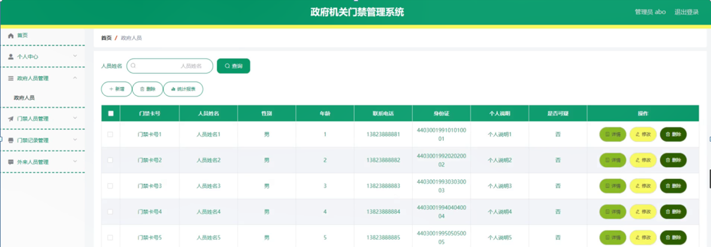

图5-3政府人员管理界面图

门禁人员管理，在门禁人员管理页面可以对员工账号、员工姓名、性别、年龄、员工手机、身份证等信息进行详情，修改或删除等操作，如图5-4所示。

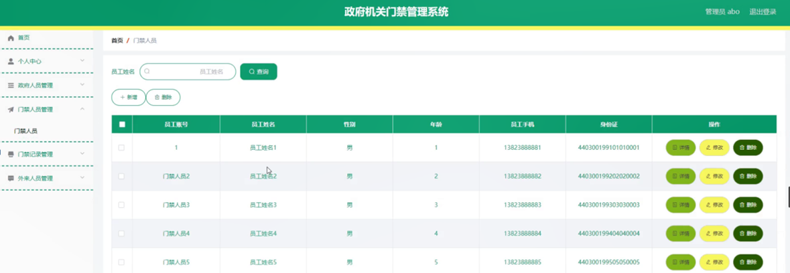

图5-4门禁人员管理界面图

门禁记录管理，在门禁记录管理页面可以对员工账号、员工姓名、门禁卡号、人员姓名、操作时间、操作结果等信息进行详情，修改或删除等操作，如图5-5所示。

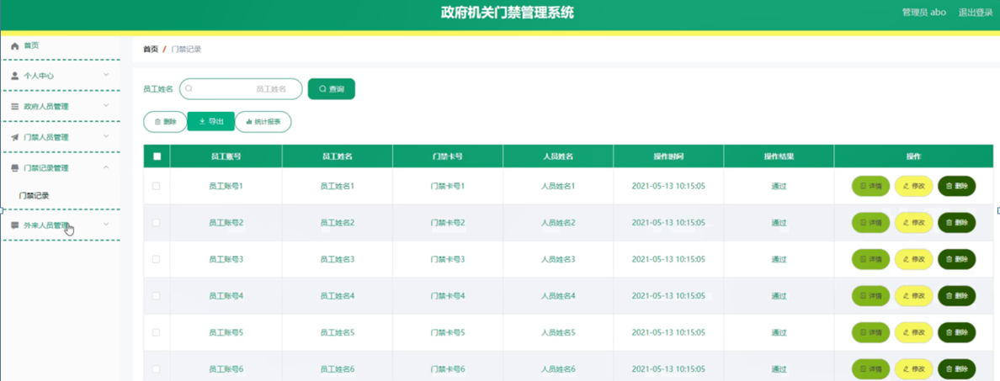

图5-5门禁记录管理界面图

外来人员管理，在外来人员管理页面可以对姓名、性别、手机、年龄、进入时间、离开时间、员工账号、员工姓名等信息进行详情，修改或删除等操作，如图5-6所示。

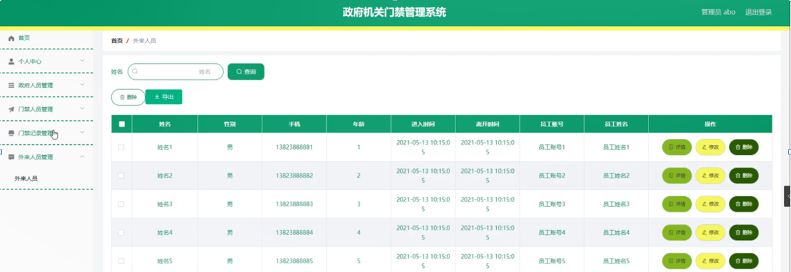

图5-6外来人员管理界面图

### 5.2门禁人员功能模块

门禁人员登录进入政府机关门禁管理系统可以查看首页、个人中心、政府人员管理、门禁记录管理、外来人员管理等内容进行详细操作，如图5-7所示。

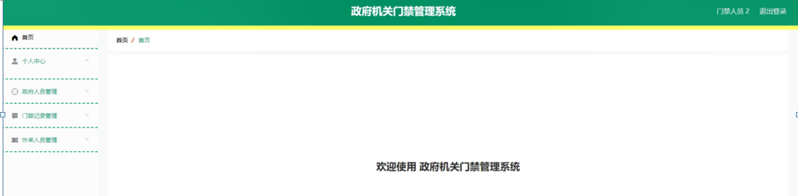

图5-7门禁人员功能界面图

个人中心，在个人中心页面通过填写员工账号、员工姓名、性别、年龄、员工手机、身份证等信息进行个人信息修改操作，如图5-8所示。

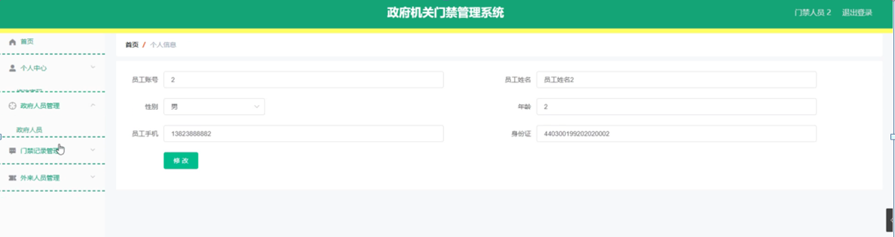

图5-8个人中心界面图

政府人员管理，在政府人员管理页面可以对门禁卡号、人员姓名、性别、年龄、联系电话、身份证、个人说明、是否可疑等信息进行详情，修改或删除等操作，如图5-9所示。

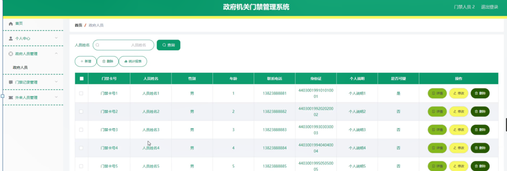

图5-9政府人员管理界面图

门禁记录管理，在门禁记录管理页面可以对员工账号、员工姓名、门禁卡号、人员姓名、操作时间、操作结果等信息进行详情，修改或删除等操作，如图5-10所示。

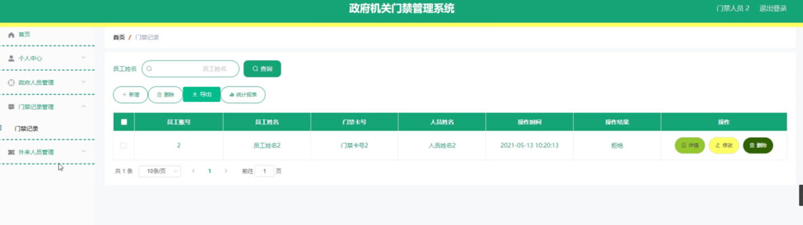

图5-10门禁记录管理界面图

外来人员管理，在外来人员管理页面可以对姓名、性别、手机、年龄、进入时间、离开时间、员工账号、员工姓名等信息进行详情，修改或删除等操作，如图5-11所示。

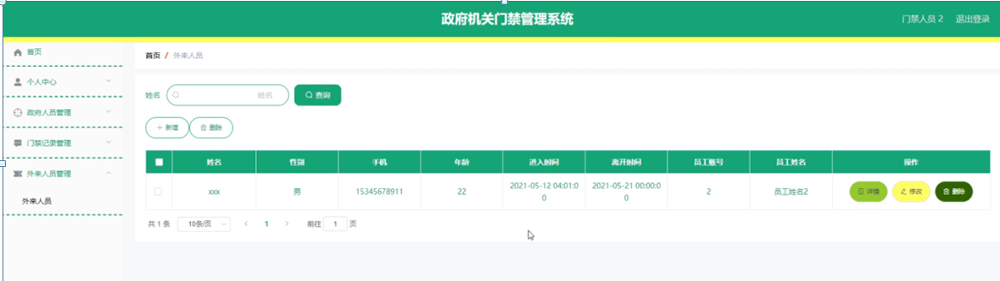

图5-11外来人员管理界面图

**JAVA** **毕设帮助，指导，源码分享，调试部署**

