ssm+Vue计算机毕业设计整形医院管理系统（程序+LW文档）

**项目运行**

**环境配置：**

**Jdk1.8 + Tomcat7.0 + Mysql + HBuilderX** **（Webstorm也行）+ Eclispe（IntelliJ
IDEA,Eclispe,MyEclispe,Sts都支持）。**

**项目技术：**

**SSM + mybatis + Maven + Vue** **等等组成，B/S模式 + Maven管理等等。**

**环境需要**

**1.** **运行环境：最好是java jdk 1.8，我们在这个平台上运行的。其他版本理论上也可以。**

**2.IDE** **环境：IDEA，Eclipse,Myeclipse都可以。推荐IDEA;**

**3.tomcat** **环境：Tomcat 7.x,8.x,9.x版本均可**

**4.** **硬件环境：windows 7/8/10 1G内存以上；或者 Mac OS；**

**5.** **是否Maven项目: 否；查看源码目录中是否包含pom.xml；若包含，则为maven项目，否则为非maven项目**

**6.** **数据库：MySql 5.7/8.0等版本均可；**

**毕设帮助，指导，本源码分享，调试部署** **(** **见文末** **)**

总体设计

根据整形医院管理系统的功能需求，进行系统设计。

前台功能：用户进入系统可以实现首页，门诊信息，项目信息，医院公告，个人中心，后台管理，在线咨询等进行操作；

后台主要是管理员，管理员功能包括首页，个人中心，用户管理，医师管理，科室类型管理，门诊信息管理，项目类型管理，项目信息管理，项目订单管理，病房类型管理，病房信息管理，物资类型管理，物资信息管理，药房类型管理，药房信息管理，系统管理等；

系统对这些功能进行整合，产生的功能结构图如下：

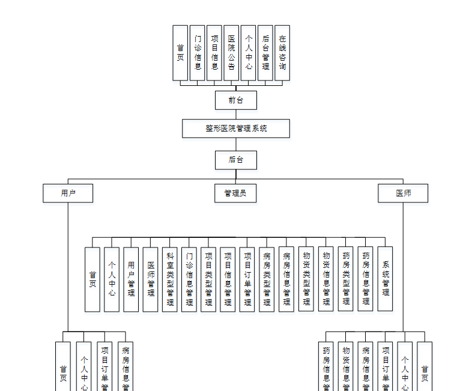

图3-1系统总体结构图

3.4 数据库设计与实现

在每一个系统中数据库有着非常重要的作用，数据库的设计得好将会增加系统的效率以及系统各逻辑功能的实现。所以数据库的设计我们要从系统的实际需要出发，才能使其更为完美的符合系统功能的实现。

#### 3.4.1 数据库概念结构设计

数据库的E-R图反映了实体、实体的属性和实体之间的联系。下面是各个实体以及实体的属性。

门诊信息实体属性图如下所示：

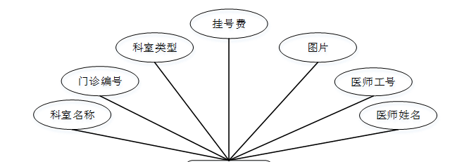

图3-2门诊信息实体属性图

项目信息实体属性图如下所示：

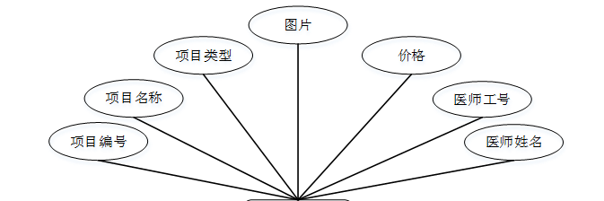

图3-3项目信息实体属性图

### 系统功能模块

整形医院管理系统，用户进入到系统首页，可以查看首页、门诊信息、项目信息、医院公告、个人中心、后台管理、在线咨询等内容进行操作，如图4-1所示。

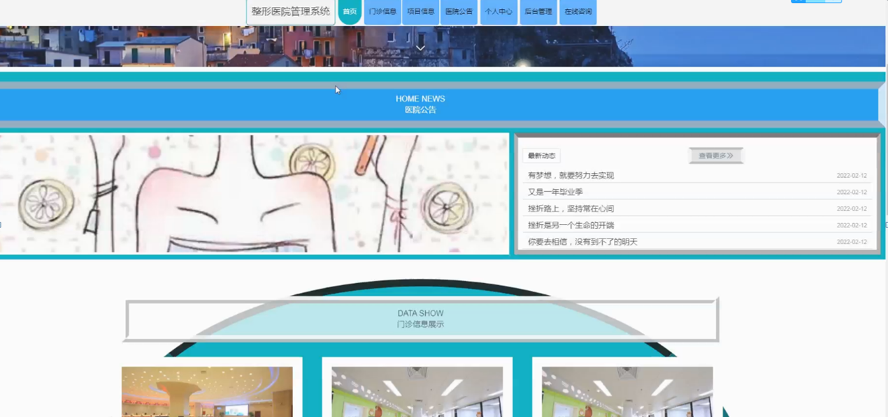

图4-1系统首页界面图

门诊信息；在门诊信息页面中可以查看科室名称，门诊编号，科室类型，图片，挂号费，医师工号，医师姓名等内容；如图4-2所示。

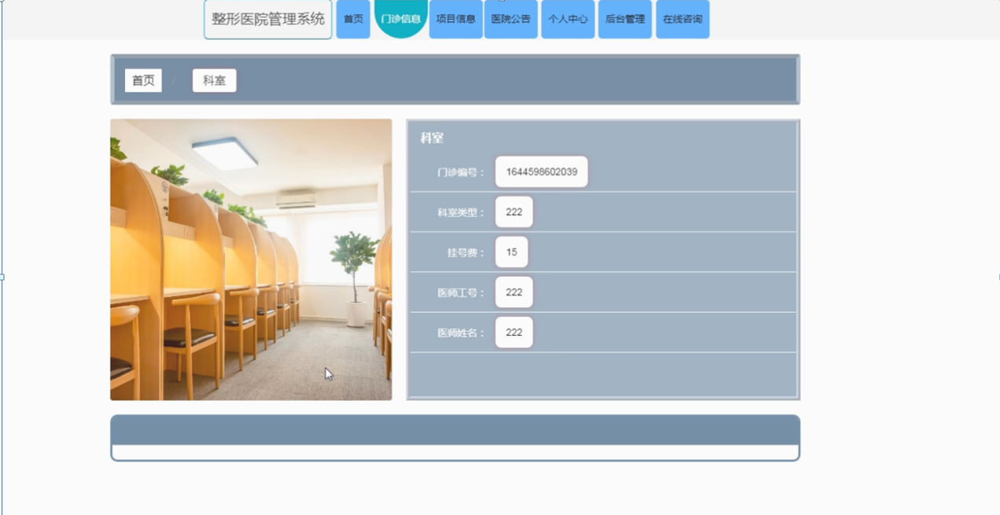

图4-2门诊信息界面图

项目信息；在项目信息页面中可以查看项目名称，项目编号，项目类型，项目内容，价格，注意事项，图片，医师工号，医师姓名，项目详情等内容，并进行下单操作；如图4-3所示。

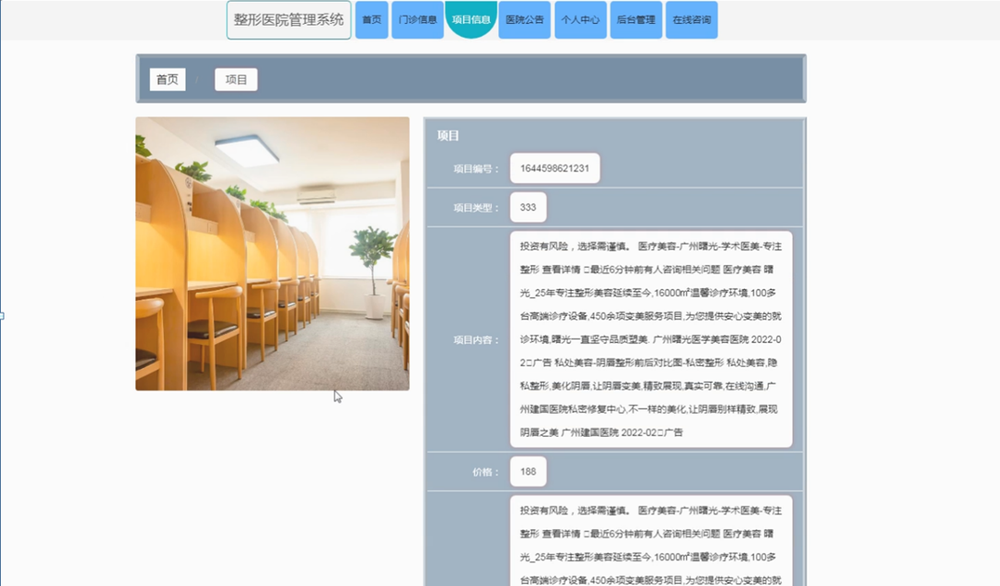

图4-3项目信息界面图

用户注册；在用户注册页面中输入用户账号，用户姓名，密码，确认密码，电话号码等内容进行用户注册操作；如图4-4所示。

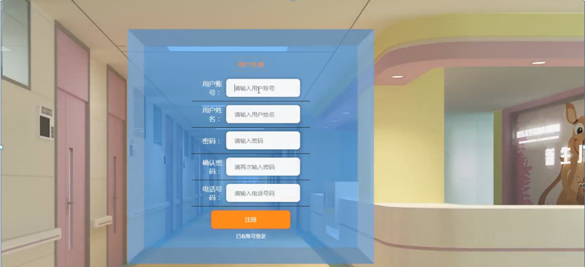

图4-4用户注册界面图

个人中心；在个人中心页面中输入用户账号，用户姓名，密码，性别，上传图片，电话号码等内容进行更新信息，如图4-5所示。

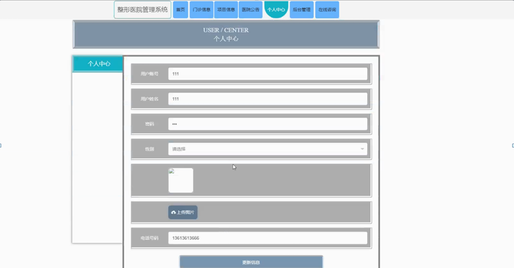

图4-5个人中心界面图

### 4.2 管理员功能模块

管理员登录，通过填写注册时输入的用户名、密码、选择角色等信息进行登录操作，如图4-6所示。

图4-6管理员登录界面图

管理员登录进入整形医院管理系统可以查看首页，个人中心，用户管理，医师管理，科室类型管理，门诊信息管理，项目类型管理，项目信息管理，项目订单管理，病房类型管理，病房信息管理，物资类型管理，物资信息管理，药房类型管理，药房信息管理，系统管理等信息进行详细操作，如图4-7所示。

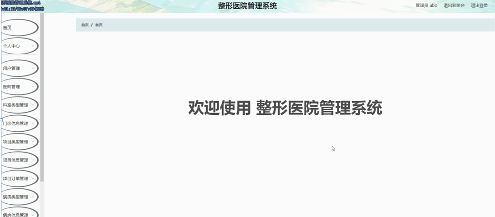

图4-7管理员功能界面图

用户管理；在用户管理页面中可以查看索引，用户账号，用户姓名，性别，头像，电话号码等内容，并进行详情，修改和删除等操作；如图4-8所示。

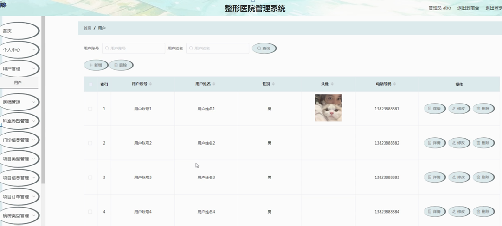

图4-8用户管理界面图

医师管理：在医师管理页面中可以查看索引，医师工号，医师姓名，性别，头像，电话号码等内容，并进行详情，修改和删除等操作，如图4-9所示。

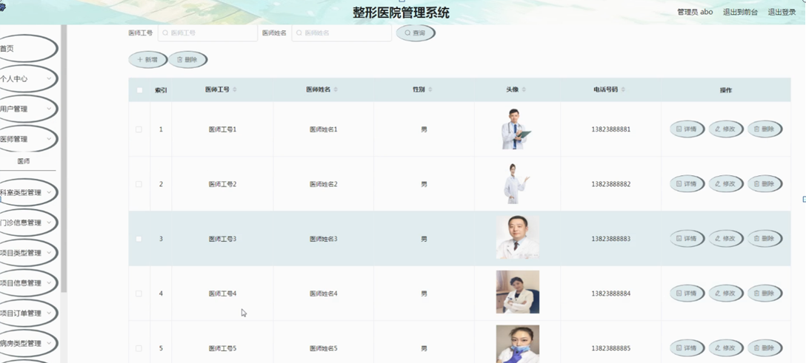

图4-9医师管理界面图

门诊信息管理；在门诊信息管理页面中可以查看索引，门诊编号，科室名称，科室类型，图片，挂号费，医师工号，医师姓名等内容，并进行详情，修改和删除等操作；如图4-10所示。

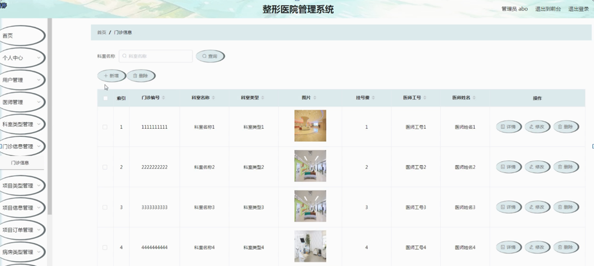

图4-10门诊信息管理界面图

项目信息管理；在项目信息管理页面中可以查看索引，项目编号，项目名称，项目类型，图片，价格，医师工号，医师姓名等内容，并进行详情，修改和删除等操作；如图4-11所示。

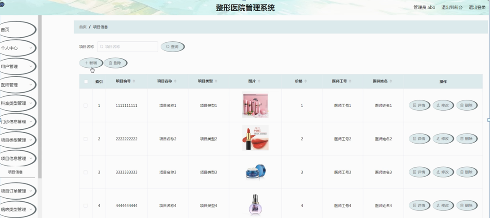

图4-11项目信息管理界面图

项目订单管理；在项目订单管理页面中可以查看索引，订单编号，项目名称，项目类型，价格，下单时间，用户账号，用户姓名，医师工号，医师姓名，是否支付，审核回复，审核状态等内容，并进行详情，修改和删除等操作；如图4-12所示。

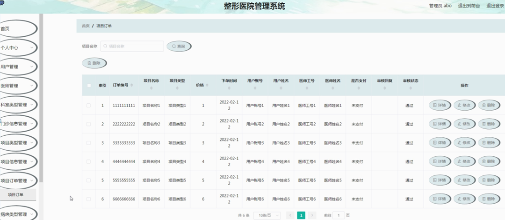

图4-12项目订单管理界面图

#### **JAVA** **毕设帮助，指导，源码分享，调试部署**

