ssm+Vue计算机毕业设计新冠疫苗接种管理系统（程序+LW文档）

**项目运行**

**环境配置：**

**Jdk1.8 + Tomcat7.0 + Mysql + HBuilderX** **（Webstorm也行）+ Eclispe（IntelliJ
IDEA,Eclispe,MyEclispe,Sts都支持）。**

**项目技术：**

**SSM + mybatis + Maven + Vue** **等等组成，B/S模式 + Maven管理等等。**

**环境需要**

**1.** **运行环境：最好是java jdk 1.8，我们在这个平台上运行的。其他版本理论上也可以。**

**2.IDE** **环境：IDEA，Eclipse,Myeclipse都可以。推荐IDEA;**

**3.tomcat** **环境：Tomcat 7.x,8.x,9.x版本均可**

**4.** **硬件环境：windows 7/8/10 1G内存以上；或者 Mac OS；**

**5.** **是否Maven项目: 否；查看源码目录中是否包含pom.xml；若包含，则为maven项目，否则为非maven项目**

**6.** **数据库：MySql 5.7/8.0等版本均可；**

**毕设帮助，指导，本源码分享，调试部署** **(** **见文末** **)**

### 系统设计主要功能

通过市场调研及咨询研究，了解了新冠疫苗接种管理系统及管理者的使用需求，于是制定了管理员，用户，医院等模块。功能结构图如下所示：

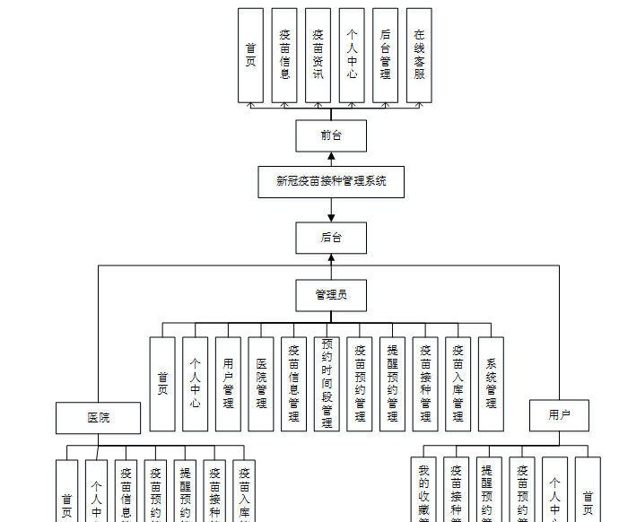

图4-1系统功能结构图

### 4.2 数据库设计

#### 4.2.1 数据库设计规范

数据可设计要遵循职责分离原则，即在设计时应该要考虑系统独立性，即每个系统之间互不干预不能混乱数据表和系统关系。

数据库命名也要遵循一定规范，否则容易混淆，数据库字段名要尽量做到与表名类似，多使用小写英文字母和下划线来命名并尽量使用简单单词。

#### 4.2.2 E/R图

用户注册E/R图，如下所示：

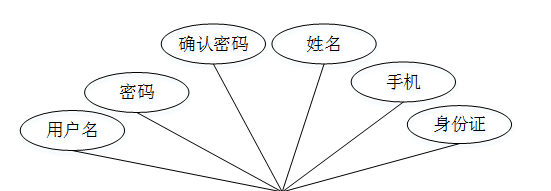

图4-2用户注册E/R图

疫苗信息E/R图，如下所示：

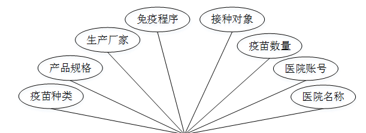

图4-3疫苗信息E/R图

### 系统功能模块

新冠疫苗接种管理系统，在网站首页可以查看首页，疫苗信息，疫苗资讯 ，个人中心，后台管理，在线客服等内容，并进行详细操作；如图5-1所示。

图5-1网站首页界面图

用户注册，在用户注册页面通过填写用户名，密码，确认密码，姓名，手机，身份证等信息进行注册操作，如图5-2所示。

图5-2用户注册界面图

疫苗信息，在疫苗信息页面可以查看疫苗种类，产品规格，生产厂家，免疫程序，接种对象，疫苗数量，医院账号，医院名称等内容，如图5-3所示。

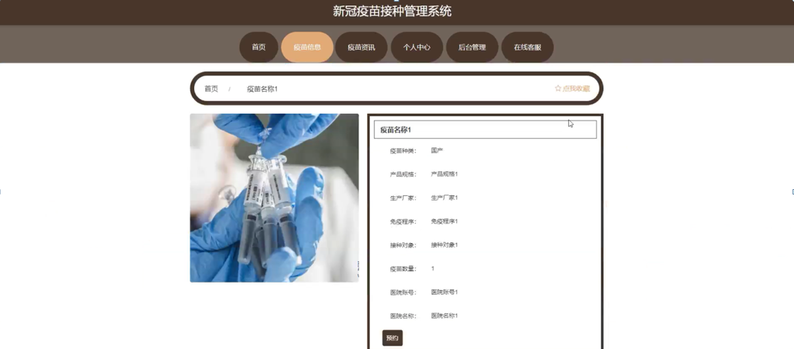

图5-3疫苗信息界面图

个人中心，在个人中心页面通过填写用户名,密码,姓名，性别，上传图片，手机，身份证等内容进行更新信息，还可以根据需要对我的收藏进行相对应操作，如图5-45所示。

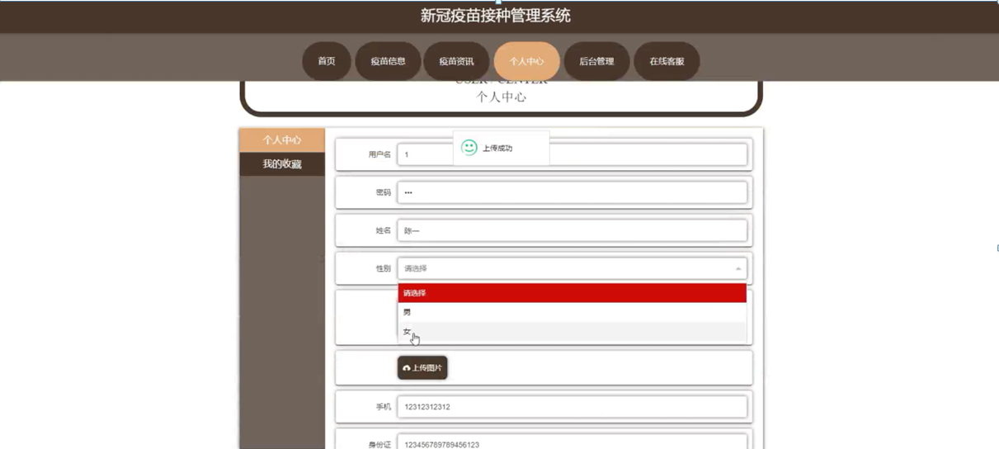

图5-4个人中心界面图

### 5.2后台模块

系统登录，通过填写注册时输入的用户名、密码、选择角色等信息进行登录操作，如图5-5所示。

图5-5系统登录界面图

#### 5.2.1 管理员功能模块

管理员登录进入系统可以查看首页，个人中心，用户管理，医院管理，疫苗信息管理，预约时间段管理，疫苗预约管理，提醒预约管理，疫苗接种管理，疫苗入库管理，系统管理等功能，并进行详细操作，如图5-6所示。

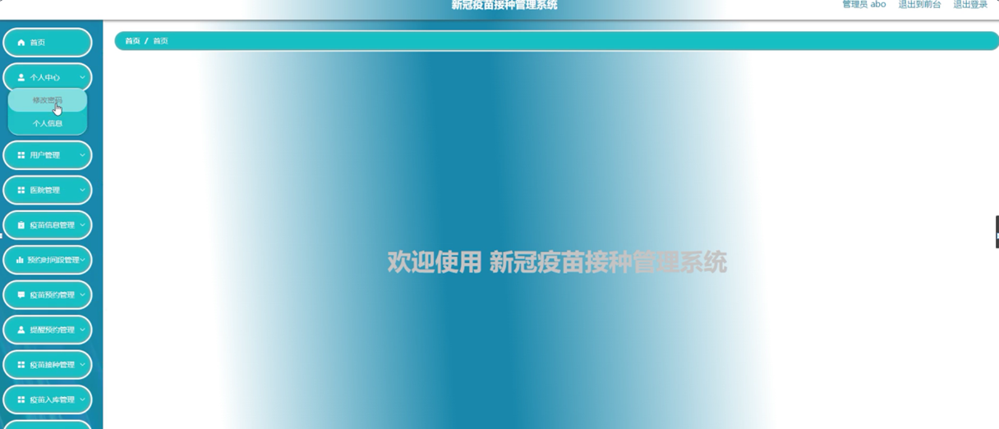

图5-6管理员功能界面图

疫苗资讯管理；在疫苗资讯管理页面中可以查看索引,标题,图片等内容，并进行详情，修改和删除等操作；还可以对轮播图管理，在线客服进行详细操作；如图5-7所示。

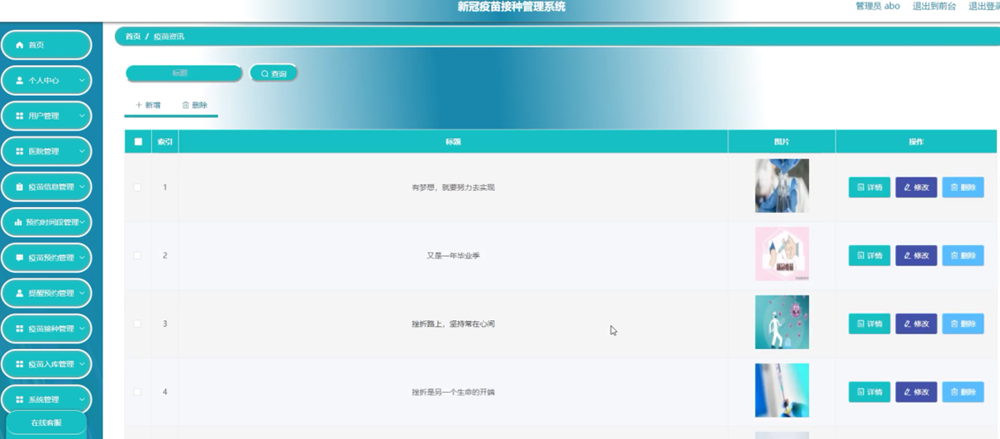

图5-7系统管理界面图

用户管理；在用户管理页面中可以查看索引,用户名，姓名，性别，头像，手机，身份证等内容，并进行详情，修改，删除操作；如图5-8所示。

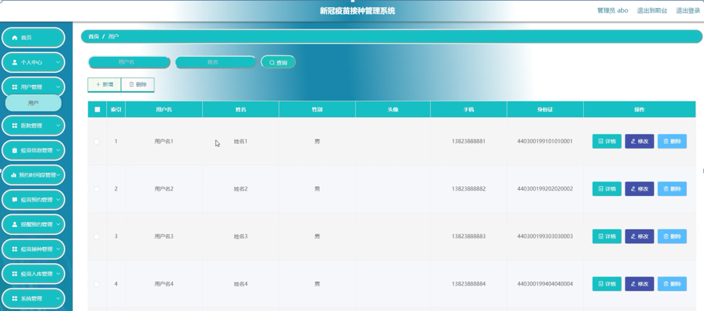

图5-8用户管理界面图

医院管理；在医院管理页面中可以查看索引,医院账号，医院名称，照片，联系电话，医院地址等内容，并进行详情，修改，删除操作；如图5-9所示。

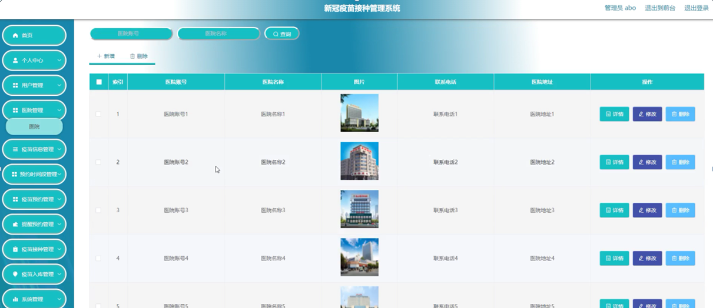

图5-9医院管理界面图

预约时段管理；在预约时段管理页面中可以查看索引,时间段等内容，并进行详情，修改，删除操作；如图5-10所示。

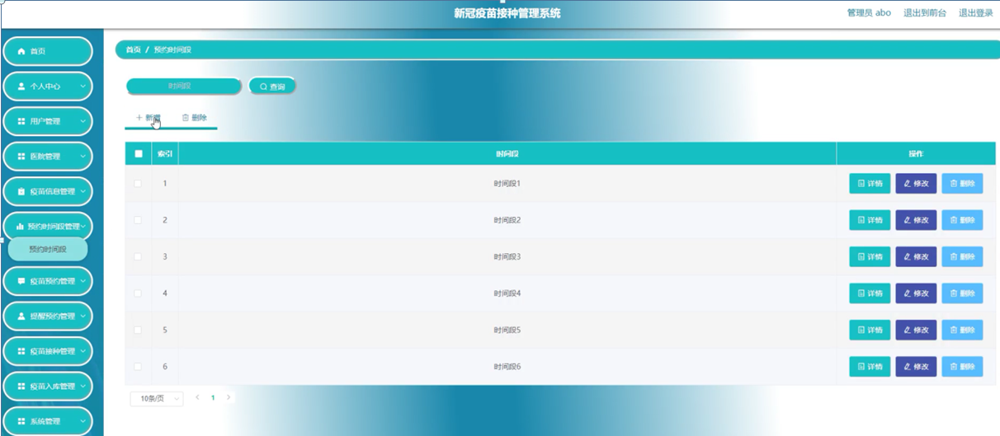

图5-10预约时段管理界面图

#### 5.2.3用户功能模块

用户登录进入系统可以查看首页，个人中心，疫苗预约管理，提醒预约管理，疫苗接种管理，我的收藏管理等功能，并根据需要进行详细操作，如图5-11所示。

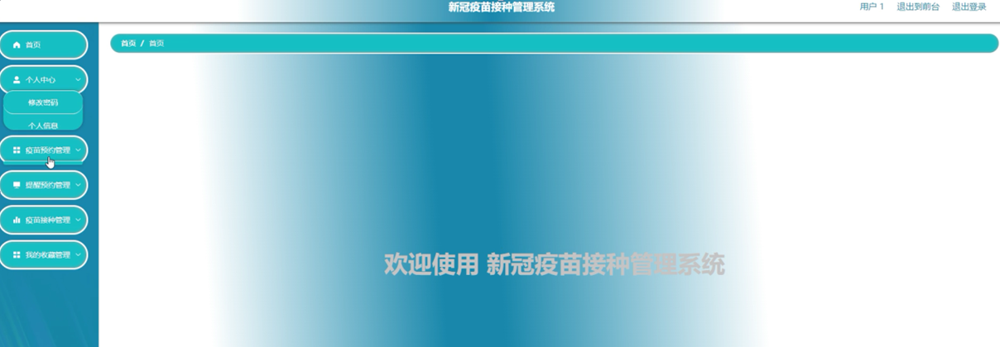

图5-11用户功能界面图

疫苗预约管理；在疫苗预约管理页面中可以查看索引,疫苗名称，产品规格，生产厂家，疫苗数量，预约日期，时间段，医院在账号，医院名称，用户名，手机，身份证，审核回复，审核状态等内容，并进行详情，删除操作；如图5-12所示。

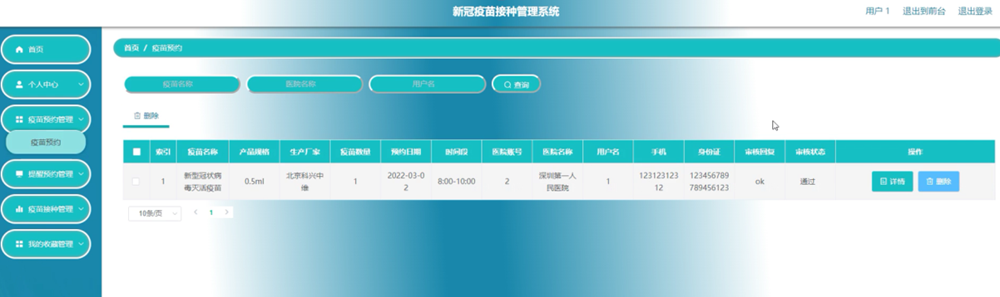

图5-12疫苗预约管理界面图

#### **JAVA** **毕设帮助，指导，源码分享，调试部署**

