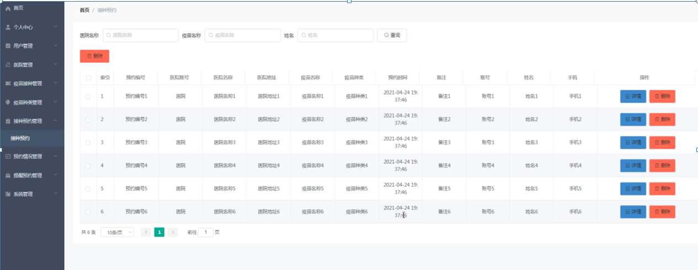

ssm+Vue计算机毕业设计新冠疫苗接种预约系统（程序+LW文档）

**项目运行**

**环境配置：**

**Jdk1.8 + Tomcat7.0 + Mysql + HBuilderX** **（Webstorm也行）+ Eclispe（IntelliJ
IDEA,Eclispe,MyEclispe,Sts都支持）。**

**项目技术：**

**SSM + mybatis + Maven + Vue** **等等组成，B/S模式 + Maven管理等等。**

**环境需要**

**1.** **运行环境：最好是java jdk 1.8，我们在这个平台上运行的。其他版本理论上也可以。**

**2.IDE** **环境：IDEA，Eclipse,Myeclipse都可以。推荐IDEA;**

**3.tomcat** **环境：Tomcat 7.x,8.x,9.x版本均可**

**4.** **硬件环境：windows 7/8/10 1G内存以上；或者 Mac OS；**

**5.** **是否Maven项目: 否；查看源码目录中是否包含pom.xml；若包含，则为maven项目，否则为非maven项目**

**6.** **数据库：MySql 5.7/8.0等版本均可；**

**毕设帮助，指导，本源码分享，调试部署** **(** **见文末** **)**

### 系统结构

本系统架构网站系统，本系统的具体功能如下：

图4-2系统功能结构图

管理员功能结构图，如图4-3所示：

图4-3 管理员功能结构图

医院功能结构图，如图4-4所示：

图4-4 医院功能结构图

用户功能结构图，如图4-5所示：

图4-5 用户功能结构图

### 系统功能模块

新冠疫苗接种预约系统，在系统首页可以查看首页、疫苗接种、疫苗资讯、个人中心、后台管理、在线客服等内容，如图5-1所示。

图5-1系统首页界面图

疫苗接种，在疫苗接种页面可以查看医院账号、医院名称、医院地址、疫苗名称、疫苗种类、可约时间、联系人、联系电话、注意事项、点击次数等详细内容，如图5-2所示。

图5-2疫苗接种界面图

个人中心，在个人中心页面通过填写账号、密码、姓名、年龄、性别、手机、身份证等信息进行更新信息，如图5-3所示。

图5-3个人中心界面图

### 5.2管理员功能模块

管理员登录，管理员通过输入用户名、密码，选择角色并点击登录进行系统登录操作，如图5-4所示。

图5-4管理员登录界图面

管理员登录系统后，可以对首页、个人中心、用户管理、医院管理、疫苗接种管理、疫苗种类管理、接种预约管理、预约情况管理、提醒预约管理、系统管理等功能模块进行相应操作，如图5-5所示。

图5-5管理员功能界图面

用户管理，在用户管理页面可以对索引、账号、姓名、年龄、性别、手机、身份证、照片等内容进行详情、删除等操作，如图5-6所示。

图5-6用户管理界面图

医院管理，在医院管理页面可以对索引、医院账号、医院名称、联系人、联系电话、邮箱、身份证、医院地址、图片等内容进行详情、删除等操作，如图5-7所示。

图5-7医院管理界面图

疫苗接种管理，在疫苗接种管理页面可以对索引、医院账号、医院名称、医院地址、疫苗名称、疫苗种类、可约时间、联系人、联系电话、图片等内容进行详情、删除等操作，如图5-8所示。

图5-8疫苗接种管理界面图

疫苗种类管理，在疫苗种类管理页面可以对索引、疫苗种类等内容进行删除等操作，如图5-9所示。

图5-9疫苗种类管理界面图

接种预约管理，在接种预约管理页面可以对首页、预约编号、医院账号、医院名称、医院地址、疫苗名称、疫苗种类、预约时间、备注、账号、姓名、手机等内容进行详情、删除等操作，如图5-10所示。

图5-10接种预约管理界面图

预约情况管理，在预约情况管理页面可以对首页、预约编号、医院账号、医院名称、医院地址、疫苗名称、疫苗种类、预约情况、预约凭证、账号、姓名、手机等内容进行详情、删除等操作，如图5-11所示。

图5-11预约情况管理界面图

提醒预约管理，在提醒预约管理页面可以对索引、提醒标题、医院账号、医院名称、疫苗名称、疫苗种类、账号、姓名、手机等内容进行详情、删除等操作，如图5-12所示。

图5-12提醒预约管理界面图

#### **JAVA** **毕设帮助，指导，源码分享，调试部署**

