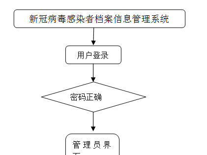
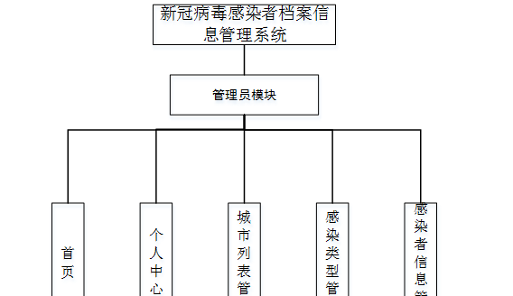
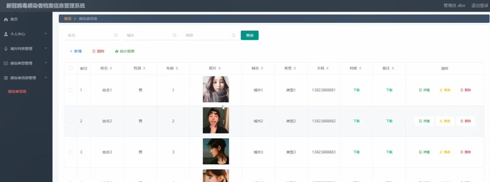

ssm+Vue计算机毕业设计新冠病毒感染者档案信息管理系统（程序+LW文档）

**项目运行**

**环境配置：**

**Jdk1.8 + Tomcat7.0 + Mysql + HBuilderX** **（Webstorm也行）+ Eclispe（IntelliJ
IDEA,Eclispe,MyEclispe,Sts都支持）。**

**项目技术：**

**SSM + mybatis + Maven + Vue** **等等组成，B/S模式 + Maven管理等等。**

**环境需要**

**1.** **运行环境：最好是java jdk 1.8，我们在这个平台上运行的。其他版本理论上也可以。**

**2.IDE** **环境：IDEA，Eclipse,Myeclipse都可以。推荐IDEA;**

**3.tomcat** **环境：Tomcat 7.x,8.x,9.x版本均可**

**4.** **硬件环境：windows 7/8/10 1G内存以上；或者 Mac OS；**

**5.** **是否Maven项目: 否；查看源码目录中是否包含pom.xml；若包含，则为maven项目，否则为非maven项目**

**6.** **数据库：MySql 5.7/8.0等版本均可；**

**毕设帮助，指导，本源码分享，调试部署** **(** **见文末** **)**

### 系统体系结构

新冠病毒感染者档案信息管理系统的结构图4-1所示：

图4-1 系统结构

登录系统结构图，如图4-2所示：

图4-2 登录结构图

系统结构图，如图4-3所示：

图4-3 系统结构图

###  数据库实体设计

数据库的功能就是对系统中所有的数据进行存储和管理。所有的数据可以在数据库中产时间的进行存储，方便用户的使用。而且所有的数据库中的数据也应该具有一定的共享性，任何的系统可以对一些数据进行使用，同时还应该保持一定的独立性，每一个数据库中的数据都有很强的安全性，可以被很好的存放到数据库，没有进行身份的验证是不能对这些数据进行查看和使用的。数据库的设计需要明确每一个实体之间的联系，系统的E-
R图如下图所示：：

管理员实体主要存储管理信息包括序号、用户名、密码属性。管理员信息属性图如图4-4所示。

图4-4 管理员信息实体属性图

感染者信息管理主要包括索引、姓名、性别、年龄、照片、城市、类型、手机、档案、备注等属性，感染者信息管理属性图如图4-5所示。

图4-5感染者信息管理实体属性图

### 管理员登录

管理员通过输入界面上显示的信息然后点击登录就能登录到系统进行系统的使用了，如图5-1所示。

图5-1管理员登录界面图

### 5.2管理员功能界面

管理员登录进入新冠病毒感染者档案信息管理系统之后，就可以对所有的信息进行查看，可以查看到首页、个人中心、城市列表管理、感染类型管理、感染者信息管理等，并且还可以对其进行相应的操作管理，如图5-2所示。

图5-2管理员功能界面图

### 5.3城市列表管理

在城市列表管理页面中可以对索引、城市等信息进行修改或删除等操作，如图5-3所示。

图5-3城市列表管理界面图

### 5.4感染类型管理

在感染类型管理页面中可以对索引、类型等信息进行修改或删除等操作，如图5-4所示。

图5-4感染类型管理界面图

### 5.5感染者信息管理

在感染者信息管理页面中可以对索引、姓名、性别、年龄、照片、城市、类型、手机、档案、备注等信息进行详情、修改或删除等操作，如图5-5所示。

图5-5感染者信息管理界面图

#### **JAVA** **毕设帮助，指导，源码分享，调试部署**

