ssm+Vue计算机毕业设计新文道考研机构在线教学辅导系统（程序+LW文档）

**项目运行**

**环境配置：**

**Jdk1.8 + Tomcat7.0 + Mysql + HBuilderX** **（Webstorm也行）+ Eclispe（IntelliJ
IDEA,Eclispe,MyEclispe,Sts都支持）。**

**项目技术：**

**SSM + mybatis + Maven + Vue** **等等组成，B/S模式 + Maven管理等等。**

**环境需要**

**1.** **运行环境：最好是java jdk 1.8，我们在这个平台上运行的。其他版本理论上也可以。**

**2.IDE** **环境：IDEA，Eclipse,Myeclipse都可以。推荐IDEA;**

**3.tomcat** **环境：Tomcat 7.x,8.x,9.x版本均可**

**4.** **硬件环境：windows 7/8/10 1G内存以上；或者 Mac OS；**

**5.** **是否Maven项目: 否；查看源码目录中是否包含pom.xml；若包含，则为maven项目，否则为非maven项目**

**6.** **数据库：MySql 5.7/8.0等版本均可；**

**毕设帮助，指导，本源码分享，调试部署** **(** **见文末** **)**

总体设计

根据新文道考研机构在线教学辅导系统的功能需求，进行系统设计。

前台功能：用户进入系统可以实现首页、教学资料、教学视频、学习论坛、课程测试卷、课程测试卷、课程资讯、个人中心、后台管理等进行操作；

后台主要是管理员，管理员功能包括首页、个人中心、学生管理、教师管理、课程名称管理、教学资料管理、教学视频管理、课程测试卷管理、课程试题管理、学习论坛、系统管理、练习管理等；

系统对这些功能进行整合，产生的功能结构图如下：

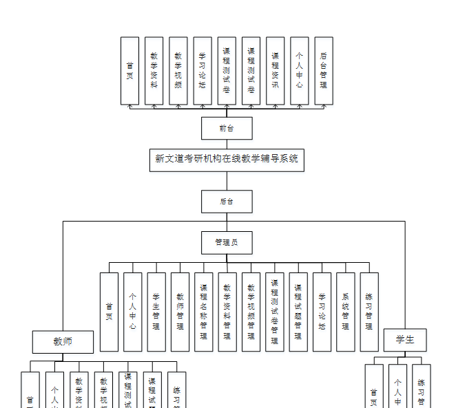

图3-1 系统总体结构图

3.4 数据库设计与实现

在每一个系统中数据库有着非常重要的作用，数据库的设计得好将会增加系统的效率以及系统各逻辑功能的实现。所以数据库的设计我们要从系统的实际需要出发，才能使其更为完美的符合系统功能的实现。

#### 3.4.1数据库概念结构设计

数据库的E-R图反映了实体、实体的属性和实体之间的联系。下面是各个实体以及实体的属性。

学生实体属性图如下所示：

图3-2学生实体属性图

课程资讯实体属性图如下所示：

图3-3课程资讯实体属性图

教学资料属性图如下所示：

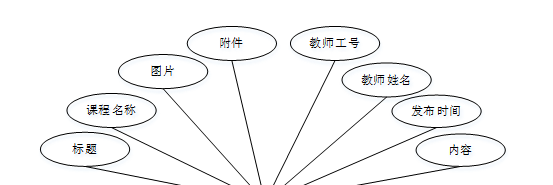

图3-4教学资料实体属性图

### 系统功能模块

新文道考研机构在线教学辅导系统，用户进入到系统首页，可以实现首页、教学资料、教学视频、学习论坛、课程测试卷、课程测试卷、课程资讯、个人中心、后台管理等内容进行操作，如图4-1所示。

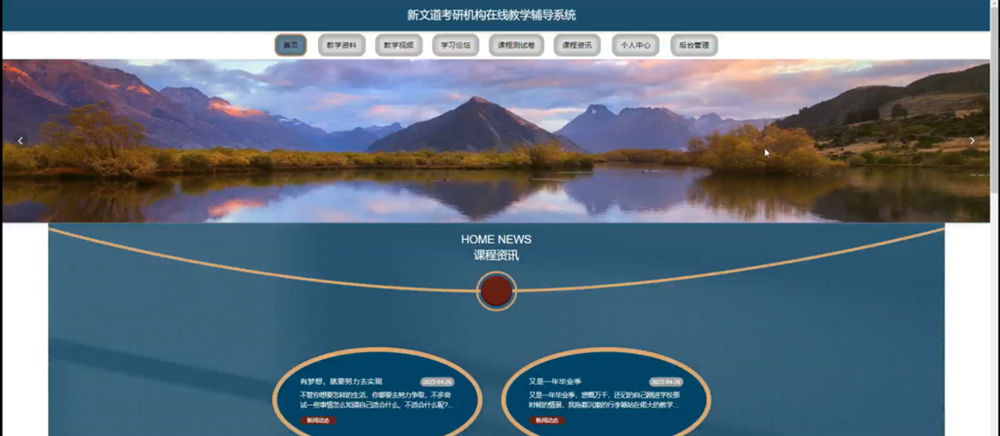 图4-1系统首页界面图

教学资料；在教学资料页面中可以查看教学名称、课程名称、教材工号、教师姓名、发布时间、附件、内容、图片等信息；并进行评论、收藏等操作；如图4-2所示。

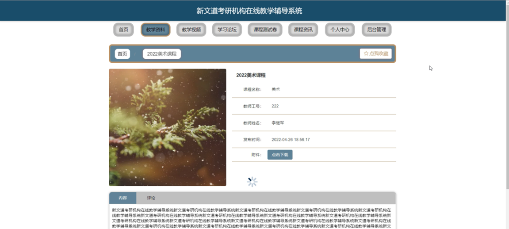

图4-2教学资料界面图

教学视频；在教学视频页面中可以查看课程名称、章节、教师工号、教师姓名、发布时间、图片等内容，并进行收藏等操作；如图4-3所示。

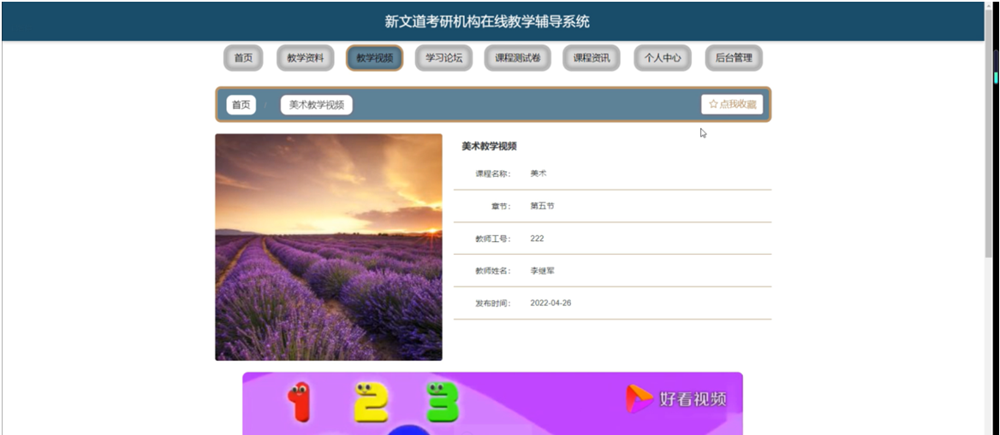

图4-3鲜花商城界面图

学习论坛；在学习论坛页面可以通过填写标题、类型、内容等内容进行发布帖子或重置等操作；如图4-4所示。

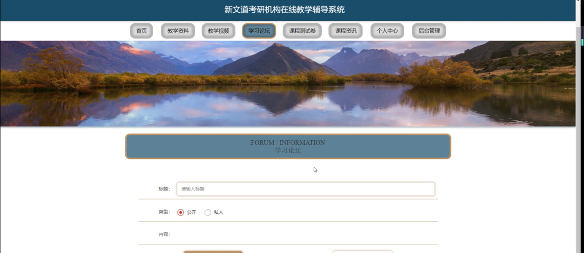

图4-4学习论坛界面图

课程测试卷；在课程测试卷页面可以查看课程测试卷名称、练习时长、创建时间等内容进行操作，如图4-5所示。

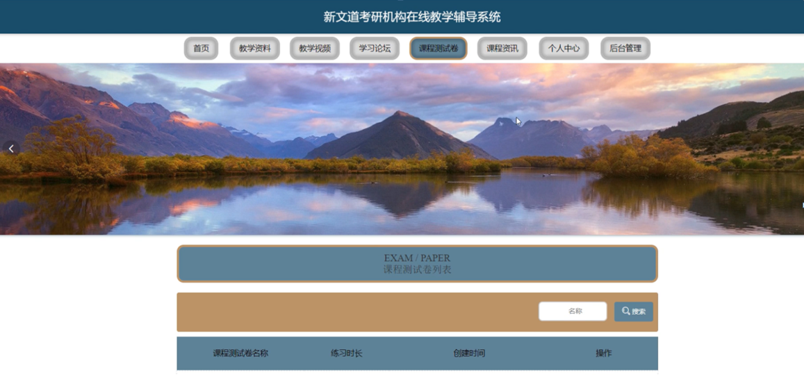

图4-5留言板界面图

学生注册；在学生注册页面中通过填写学生学号、学生姓名、密码、确认密码、联系电话、班级号等内容进行学生注册操作；如图4-6所示。

图4-6学生注册界面图

个人中心，在个人中心页面中通过填写学生学号、学生姓名、密码、性别、联系电话、班级号等内容进行更新信息，并可以根据需要对我的发布、练习记录、错题本、我的收藏进行相应的操作，如图4-7所示。

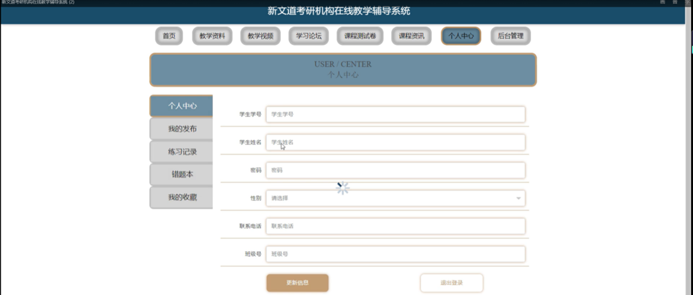

图4-7个人中心界面图

### 4.2后台功能模块

后台登录，用户通过填写注册时输入的用户名、密码、选择角色等信息进行登录操作，如图4-8所示。

图4-8后台登录界面图

#### 4.2.1管理员功能模块

管理员登录进入系统可以查看首页、个人中心、学生管理、教师管理、课程名称管理、教学资料管理、教学视频管理、课程测试卷管理、课程试题管理、学习论坛、系统管理、练习管理等功能，并进行详细操作，如图4-9所示。

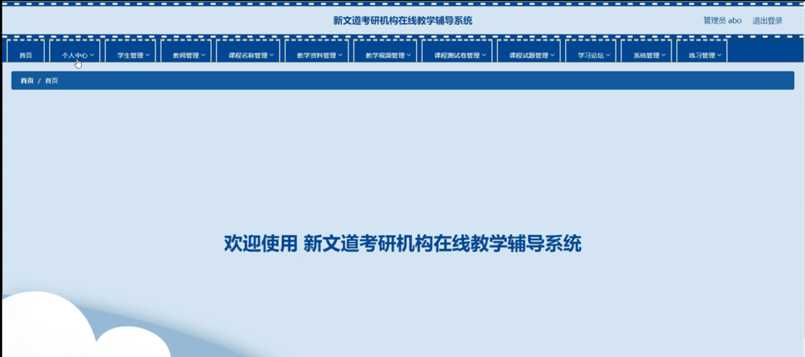

图4-9管理员功能界面图

教师管理；在教师管理页面中可以查看索引、教师工号、教师姓名、性别、职称、电话等内容，并进行详情，修改和删除等操作；如图4-10所示。

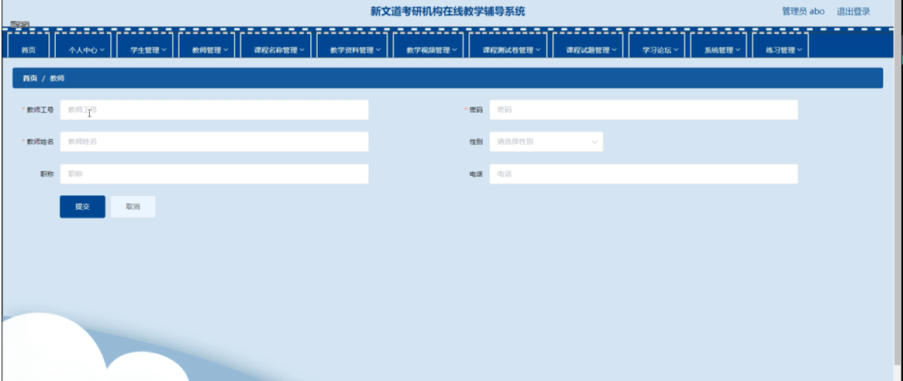

图4-10教师管理界面图

课程名称管理：在课程名称管理页面中可以查看索引、课程名称等内容，并进行详情，修改和删除等操作，如图4-11所示。

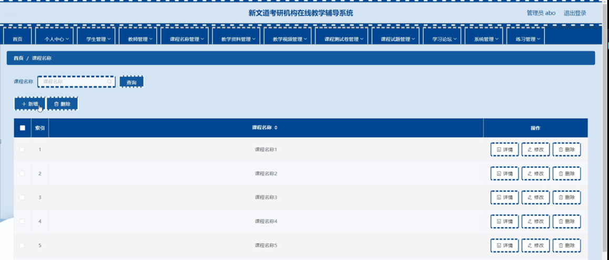

图4-11课程名称管理界面图

教学资料管理；在教学资料管理页面中可以查看索引、标题、课程名称、图片、附件、教师工号、教师姓名、发布时间等内容，并进行详情、修改、查看评论或删除等操作；如图4-12所示。

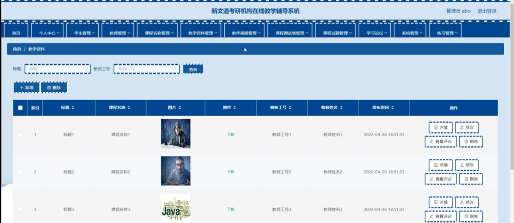

图4-12教学资料管理界面图

#### **JAVA** **毕设帮助，指导，源码分享，调试部署**

