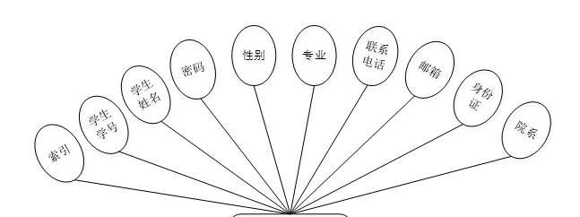
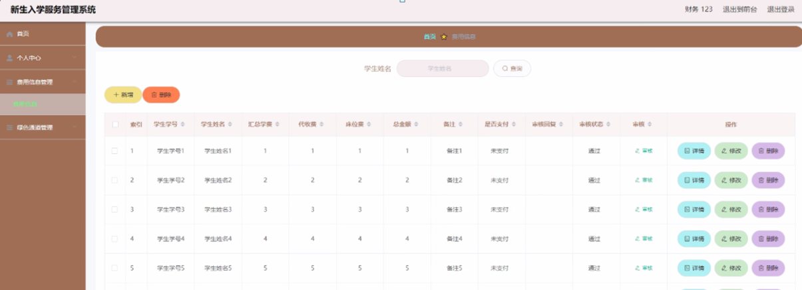

ssm+Vue计算机毕业设计新生入学服务管理系统（程序+LW文档）

**项目运行**

**环境配置：**

**Jdk1.8 + Tomcat7.0 + Mysql + HBuilderX** **（Webstorm也行）+ Eclispe（IntelliJ
IDEA,Eclispe,MyEclispe,Sts都支持）。**

**项目技术：**

**SSM + mybatis + Maven + Vue** **等等组成，B/S模式 + Maven管理等等。**

**环境需要**

**1.** **运行环境：最好是java jdk 1.8，我们在这个平台上运行的。其他版本理论上也可以。**

**2.IDE** **环境：IDEA，Eclipse,Myeclipse都可以。推荐IDEA;**

**3.tomcat** **环境：Tomcat 7.x,8.x,9.x版本均可**

**4.** **硬件环境：windows 7/8/10 1G内存以上；或者 Mac OS；**

**5.** **是否Maven项目: 否；查看源码目录中是否包含pom.xml；若包含，则为maven项目，否则为非maven项目**

**6.** **数据库：MySql 5.7/8.0等版本均可；**

**毕设帮助，指导，本源码分享，调试部署** **(** **见文末** **)**

### 系统结构设计

整个系统是由多个功能模块组合而成的，要将所有的功能模块都一一列举出来，然后进行逐个的功能设计，使得每一个模块都有相对应的功能设计，然后进行系统整体的设计。

本新生入学服务管理系统结构图如图3-2所示。

图3-2 新生入学服务管理系统结构图

### 3.3 数据库设计

数据库可以说是所有软件的根本，如果数据库存在缺陷，那么会导致系统开发的不顺利、维护困难、用户使用不顺畅等一系列问题，严重时将会直接损害企业的利益，同时在开发完成后，数据库缺陷也更加难以解决。所以必须要对数据库设计重点把握，做到认真细致。因此，数据库设计是这个在线新生入学服务购票系统的重点要素。

#### 3.3.1概念结构设计

(1) 学生管理实体属性图如下图3-3所示

图3-3学生管理实体属性图

(2) 财务管理实体属性如下图3-4所示

图3-4财务管理实体属性图

(3) 费用信息管理实体属性如下图3-5所示

图3-5费用信息管理实体属性图

### 系统功能模块

新生入学服务管理系统，在系统首页可以查看首页、网上报道、校园资讯、个人中心、后台管理等内容，如图4-1所示。

图4-1系统首页界面图

学生注册，在学生注册页面通过填写学生学号、学生姓名、密码、专业、联系电话、邮箱、身份证、院系等信息完成注册，如图4-2所示。在个人中心页面通过填写学生学号、学生姓名、密码、性别、专业、联系电话、邮箱、身份证、院系等信息进行修改操作，如图4-3所示。

图4-2学生注册界面图

图4-3个人中心界面图

网上报道，在网上报道页面可以查看标题、报道时间、封面、发布时间、新生须知等详细内容进行报到，如图4-4所示。

图4-4网上报道界面图

### 4.2学生后台功能模块

学生登录进入新生入学服务管理系统后台可以查看首页、个人中心、新生分班管理、费用信息管理、床位信息管理、学生报到管理、绿色通道管理等信息进行相应操作，如图4-5所示。

图4-5学生后台功能界面图

个人中心，在个人中心页面中可以填写学生学号、学生姓名、性别、专业、联系电话、邮箱、身份证、院系等信息进行修改操作，如图4-6所示。

图4-6个人中心界面图

费用信息管理，在费用信息管理页面中可以查看索引、学生学号、学生姓名、汇总学费、代收费、床位费、总金额、备注、是否支付、审核回复、审核状态等信息，并可根据需要进行修改或删除等详细操作，如图4-7所示。

图4-7费用信息管理界面图

### 4.3财务功能模块

财务登录进入新生入学服务管理系统可以查看首页、个人中心、费用信息管理、绿色通道管理等信息进行相应操作，如图4-8所示。

图4-8财务功能界面图

个人中心，在个人中心页面中可以填写财务账号、财务姓名、联系电话、邮箱等信息进行修改操作，如图4-9所示。

图4-9个人中心界面图

费用信息管理，在费用信息管理页面中可以查看索引、学生学号、学生姓名、汇总学费、代收费、床位费、总金额、备注、是否支付、审核回复、审核状态等信息，并可根据需要进行修改或删除等详细操作，如图4-10所示。

图4-10费用信息管理界面图

绿色通道管理，在绿色通道管理页面中可以查看索引、学生学号、学生姓名、专业、院系、联系电话、身份证、申请附件、贷款金额、申请时间、审核回复、审核状态、审核等信息，并可根据需要进行修改或删除等详细操作，如图4-11所示。

图4-11绿色通道管理界面图

### 4.4管理员功能模块

管理员登录，通过填写注册时输入的用户名、密码、角色进行登录，如图4-12所示。

图4-12管理员登录界面图

#### **JAVA** **毕设帮助，指导，源码分享，调试部署**

