ssm+Vue计算机毕业设计新生报到管理系统（程序+LW文档）

**项目运行**

**环境配置：**

**Jdk1.8 + Tomcat7.0 + Mysql + HBuilderX** **（Webstorm也行）+ Eclispe（IntelliJ
IDEA,Eclispe,MyEclispe,Sts都支持）。**

**项目技术：**

**SSM + mybatis + Maven + Vue** **等等组成，B/S模式 + Maven管理等等。**

**环境需要**

**1.** **运行环境：最好是java jdk 1.8，我们在这个平台上运行的。其他版本理论上也可以。**

**2.IDE** **环境：IDEA，Eclipse,Myeclipse都可以。推荐IDEA;**

**3.tomcat** **环境：Tomcat 7.x,8.x,9.x版本均可**

**4.** **硬件环境：windows 7/8/10 1G内存以上；或者 Mac OS；**

**5.** **是否Maven项目: 否；查看源码目录中是否包含pom.xml；若包含，则为maven项目，否则为非maven项目**

**6.** **数据库：MySql 5.7/8.0等版本均可；**

**毕设帮助，指导，本源码分享，调试部署** **(** **见文末** **)**

### 系统的功能结构图

经过系统需求分析，该新生报到管理系统的设计与实现功能结构图如图4-1所示：

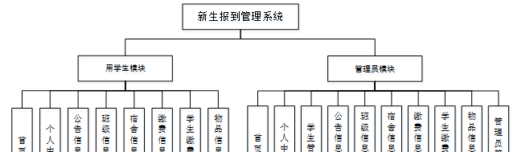

图4-1 系统功能结构图

### 4.2 数据库概念结构设计

####  4.2.1 数据库E-R图

概念设计主要是通过数据库的概念结构和模式进行建立数据库嗯逻辑结构，然后利用数据库的DBMS进行完成，它不需要计算机系统的支持。通过系统的整体来看，主要是对数据库进行管理、整理、更新等操作。数据库的功能是非常强大的，每个系统的开发肯定离不开数据库，通过数据库可以看得出整个系统的质量和效率，根据以上的系统分析，对系统中的主要实体进行规划。以下是几个关键实体的实体关系图：

(1) 公告信息管理实体E-R图如图4-2所示：

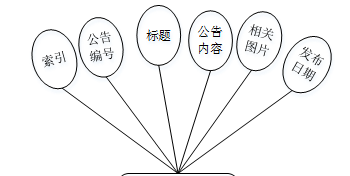

图4-2公告信息管理实体属性图

(2) 班级信息管理实体E-R图如图4-3所示：

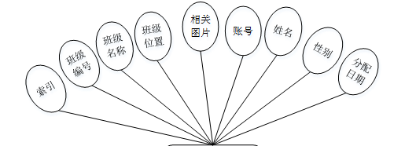

图4-3班级信息管理实体图

管理员功能模块

管理员登录，通过填写注册时输入的用户名、密码、选择角色进行登录，如图5-1所示。

图5-1管理员登录界面图

管理员登录进入系统可以查看首页、个人中心、学生管理、公告信息管理、班级信息管理、宿舍信息管理、缴费信息管理、学生缴费管理、物品信息管理、管理员管理等信息进行详细操作，如图5-2所示。

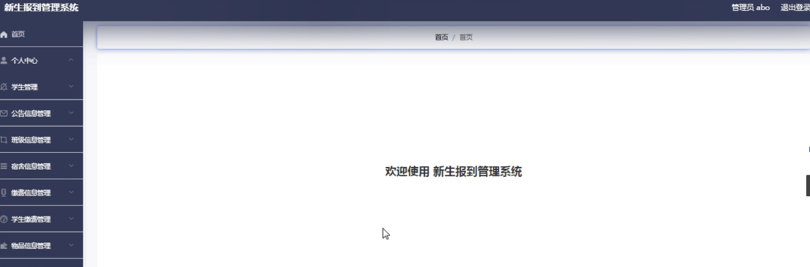

图5-2管理员功能界面图

学生管理，在学生管理页面中可以对索引、账号、密码、姓名、性别、身份证号码、手机号码、照片等信息进行详情、修改或删除等操作，如图5-3所示。

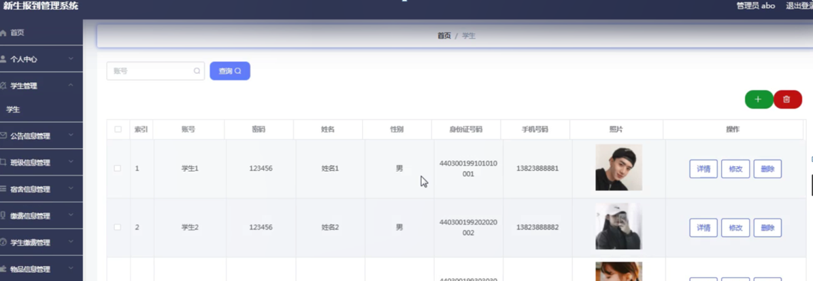

图5-3学生管理界面图

公告信息管理，在公告信息管理页面中可以对索引、公告编号、标题、公告内容、相关图片、发布日期等信息进行详情、修改或删除等操作，如图5-4所示。

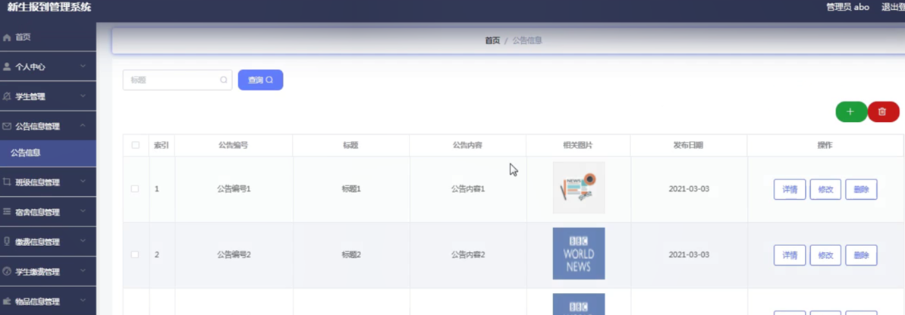

图5-4公告信息管理界面图

班级信息管理，在班级信息管理页面中可以对索引、班级编号、班级名称、班级位置、相关图片、账号、姓名、性别、分配日期等信息进行详情、修改或删除等操作，如图5-5所示。

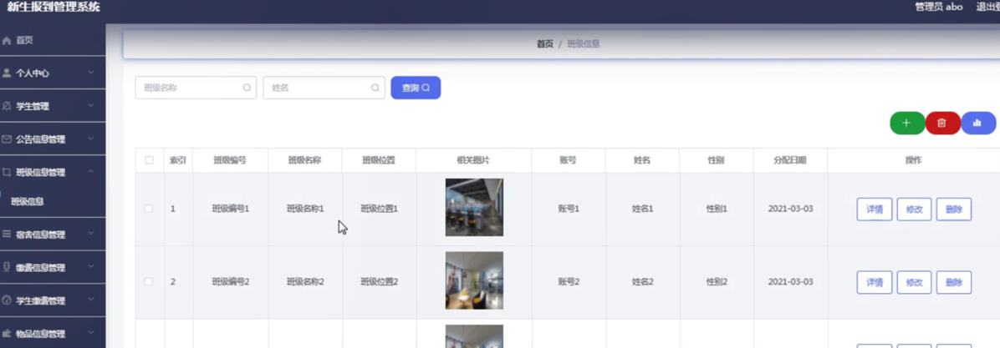

图5-5班级信息管理界面图

宿舍信息管理，在宿舍信息管理页面中可以对索引、宿舍编号、宿舍名称、宿舍位置、相关图片、账号、姓名、性别、分配日期等信息进行详情、修改或删除等操作，如图5-6所示。

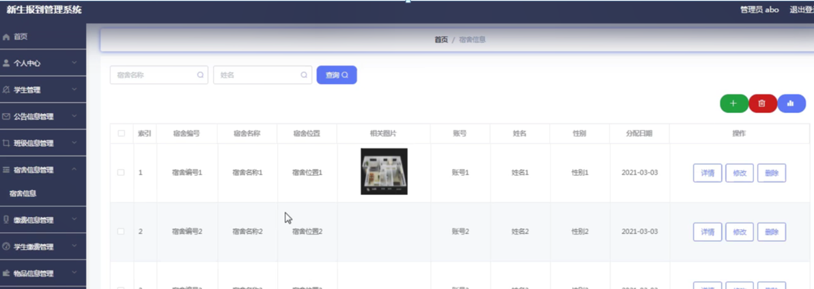

图5-6宿舍信息管理界面图

缴费信息管理，在缴费信息管理页面中可以对索引、缴费编号、缴费项目、缴费内容、费用、发表日期等信息进行详情、修改或删除等操作，如图5-7所示。

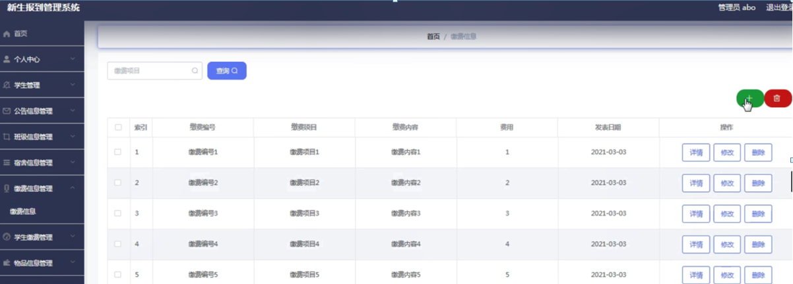

图5-7缴费信息管理界面图

学生缴费管理，在学生缴费管理页面中可以对索引、缴费编号、缴费项目、缴费内容、费用、账号、姓名、照片、缴费日期等信息进行删除操作，如图5-8所示。

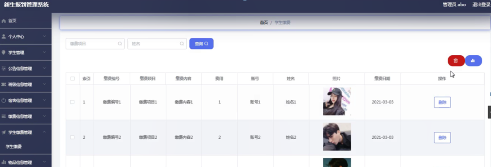

图5-8学生缴费管理界面图

物品信息管理，在物品信息管理页面中可以对索引、申请编号、物品名称、物品信息、账号、姓名、性别、手机号码、照片、状态、申请日期、审核回复、审核状态、审核等信息进行详情或删除等操作，如图5-9所示。

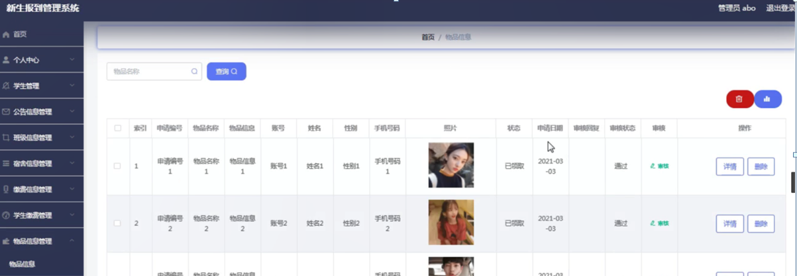

图5-9物品信息管理界面图

5.2学生功能模块

新生报到管理系统注册，在注册页面通过填写账号、密码、姓名、身份证号码、手机号码等信息进行注册操作，如图5-10所示。

图5-10新生报到管理系统注册界面图

学生登录进入系统可以查看首页、个人中心、公告信息管理、班级信息管理、宿舍信息管理、缴费信息管理、学生缴费管理、物品信息管理等内容进行详细操作，如图5-11所示。

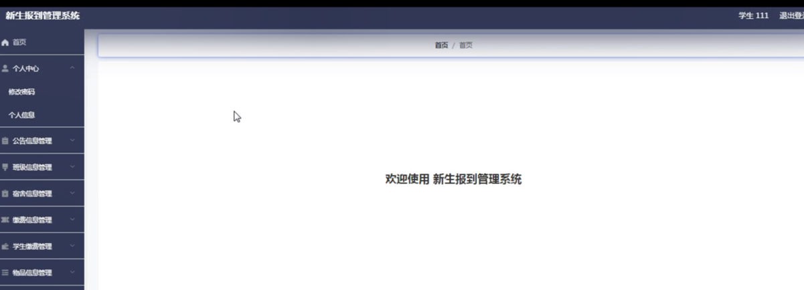

图5-11学生功能界面图

个人中心，在个人中心页面通过填写账号、姓名、性别、身份证号码、手机号码、照片等信息进行修改操作，如图5-12所示。

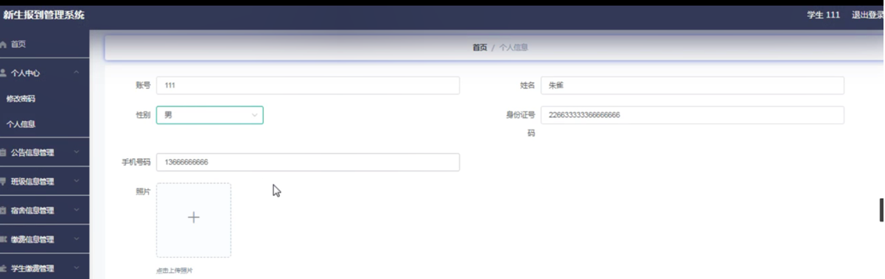

图5-12个人中心界面图

#### **JAVA** **毕设帮助，指导，源码分享，调试部署**

