ssm+Vue计算机毕业设计新能源汽车销售管理系统（程序+LW文档）

**项目运行**

**环境配置：**

**Jdk1.8 + Tomcat7.0 + Mysql + HBuilderX** **（Webstorm也行）+ Eclispe（IntelliJ
IDEA,Eclispe,MyEclispe,Sts都支持）。**

**项目技术：**

**SSM + mybatis + Maven + Vue** **等等组成，B/S模式 + Maven管理等等。**

**环境需要**

**1.** **运行环境：最好是java jdk 1.8，我们在这个平台上运行的。其他版本理论上也可以。**

**2.IDE** **环境：IDEA，Eclipse,Myeclipse都可以。推荐IDEA;**

**3.tomcat** **环境：Tomcat 7.x,8.x,9.x版本均可**

**4.** **硬件环境：windows 7/8/10 1G内存以上；或者 Mac OS；**

**5.** **是否Maven项目: 否；查看源码目录中是否包含pom.xml；若包含，则为maven项目，否则为非maven项目**

**6.** **数据库：MySql 5.7/8.0等版本均可；**

**毕设帮助，指导，本源码分享，调试部署** **(** **见文末** **)**

###  软件功能模块设计

网站整功能如下图所示：

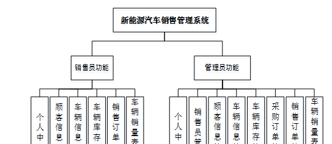

**图 4-1** **新能源汽车销售管理系统总体功能模块图**

### 4.2 数据库设计

#### 4.2.1 概念模型设计

概念模型是对现实中的问题出现的事物的进行描述，ER图是由实体及其关系构成的图，通过E-R图可以清楚地描述系统涉及到的实体之间的相互关系。

销售员信息实体图如图4-2所示：

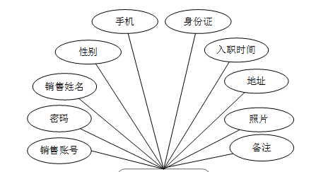

图4-2销售员信息实体图

车辆库存表实体图如图4-3所示：

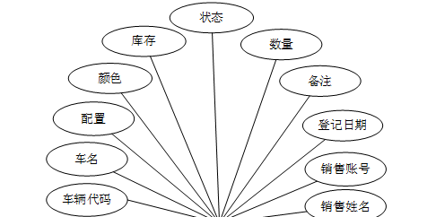

图4-3车辆库存表实体图

顾客信息实体图如图4-4所示：

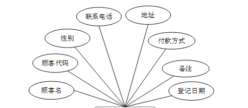

图4-4顾客信息实体图

### 销售员功能模块

本系统分为销售员和管理员进行登录操作，销售员如果要进入系统，需要通过输入销售账号、密码、确认密码、销售姓名、手机、身份证、地址、备注等信息进行销售员注册，如图5-1所示。

图5-1销售员注册界面图

点击登录，销售员通过输入账号、密码、选择登录角色进行登录，销售员登录如图5-2所示。

图5-2销售员登录界面图

销售员进入到系统后，可以对个人中心、顾客信息管理、车辆信息管理、车辆库存管理、销售订单管理、车辆销量表管理等功能进行操作，销售员功能页面如图5-3所示。

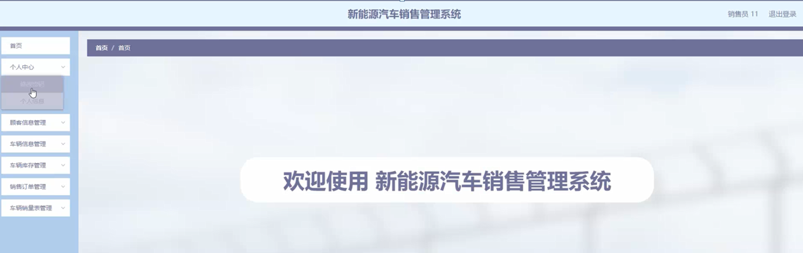

图5-3销售员功能界面图

点击个人中心，销售员可以修改密码和个人信息，个人信息包括销售账号、销售姓名、性别、手机、身份证、入职时间、地址、照片等信息，个人中心页面如图5-4所示。

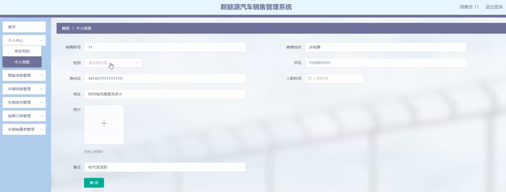

图5-4购物车界面图

点击顾客信息管理，销售员可以查看顾客名、顾客代码、性别、联系电话、地址、付款方式、登记日期等顾客信息，顾客信息管理页面如图5-5所示。

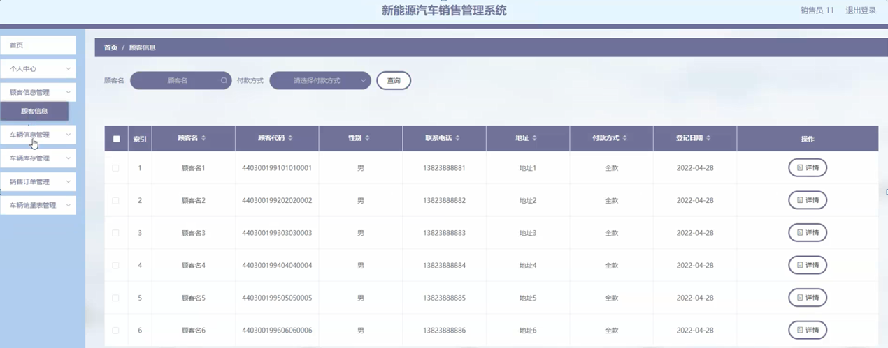

图5-5顾客信息管理界面图

点击车辆信息管理，销售员可以查看车辆代码、车名、配置、颜色、生产商、生产日期、供能类型、电池类型、电池编码、满电续航里程、登记日期等详情，车辆信息管理页面如图5-6所示。

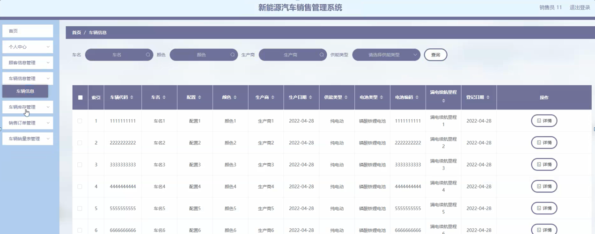

图5-6车辆信息管理界面图

点击车辆库存管理，销售员可以查看车辆代码、车名、配置、颜色、库存状态、数量、备注、登记日期等车辆库存详情，并进行销售出库的操作，车辆库存管理页面如图5-7所示。

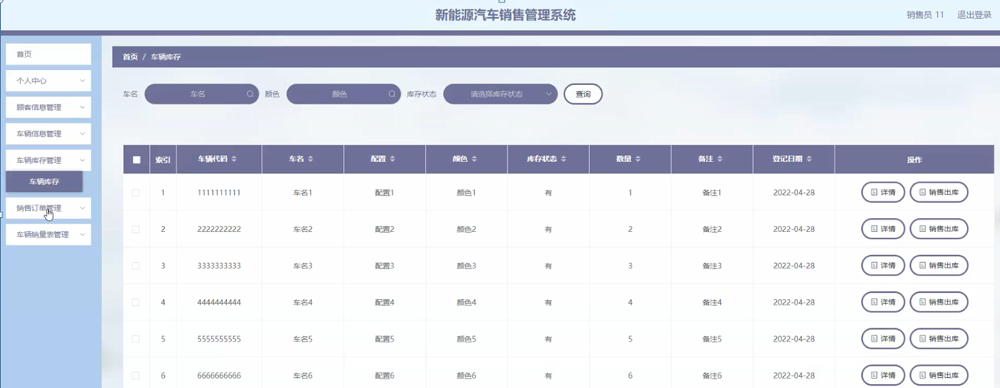

图5-7车辆库存管理界面图

###

### 5.2管理员功能模块

管理员进行登录，进入系统前在登录页面根据要求填写用户名和密码，选择角色等信息，点击登录进行登录操作，如图5-8所示。

图5-8管理员登录界面图

管理员登录系统后，可以对人中心、销售员管理、顾客信息管理、车辆信息管理、车辆库存管理、采购订单管理、销售订单管理、车辆销量表管理等进行相应的操作管理，如图5-9所示。

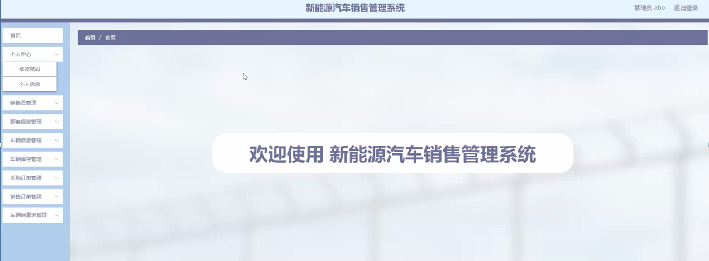

图5-9管理员功能界面图

在销售员管理页面，管理员可以对销售账号、销售姓名、性别、手机、身份证、入职时间、地址、照片、备注等销售员信息进行查看详情、修改、删除或新增等操作，如图5-10所示。

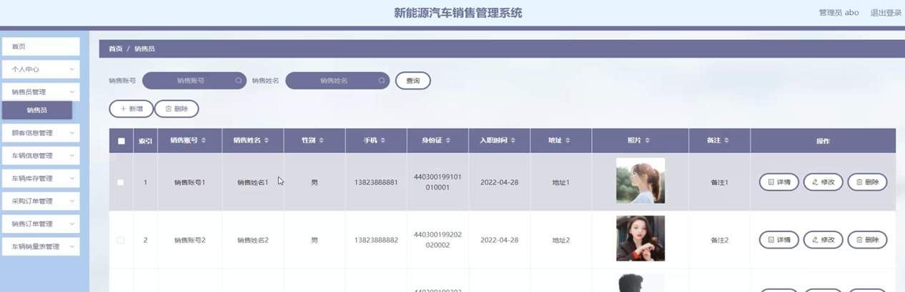

图5-10销售员管理界面图

顾客信息管理，在顾客信息管理页面可以对顾客名、顾客代码、性别、联系电话、地址、付款方式、登记日期等顾客信息进行详情、修改、删除、新增等操作，如图5-11所示。

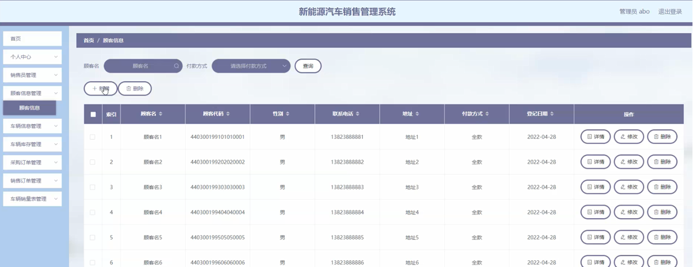

图5-11顾客信息管理界面图

点击车辆信息管理，管理员可以对车辆代码、车名、配置、颜色、生产商、生产日期、供能类型、电池类型、电池编码、满电续航里程、登记日期等车辆信息进行查看详情、修改、删除或新增等操作，如图5-12所示。

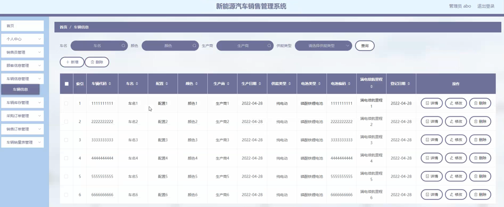

图5-12车辆信息管理界面图

#### **JAVA** **毕设帮助，指导，源码分享，调试部署**

