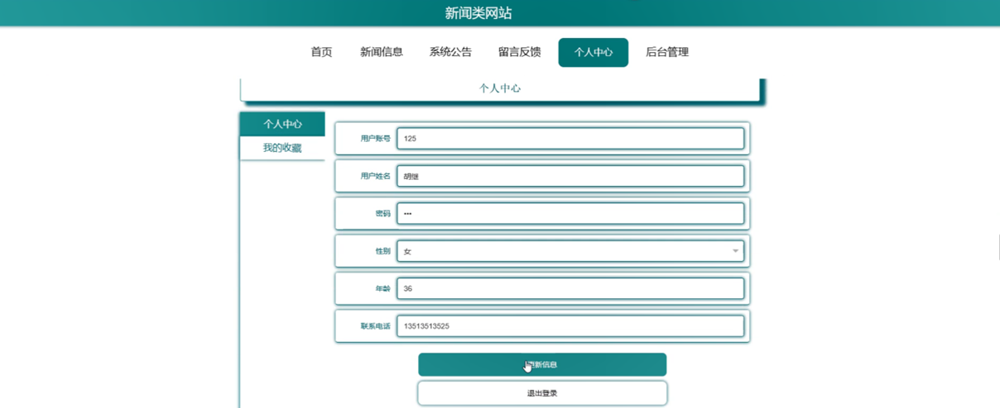

ssm+Vue计算机毕业设计新闻类网站（程序+LW文档）

**项目运行**

**环境配置：**

**Jdk1.8 + Tomcat7.0 + Mysql + HBuilderX** **（Webstorm也行）+ Eclispe（IntelliJ
IDEA,Eclispe,MyEclispe,Sts都支持）。**

**项目技术：**

**SSM + mybatis + Maven + Vue** **等等组成，B/S模式 + Maven管理等等。**

**环境需要**

**1.** **运行环境：最好是java jdk 1.8，我们在这个平台上运行的。其他版本理论上也可以。**

**2.IDE** **环境：IDEA，Eclipse,Myeclipse都可以。推荐IDEA;**

**3.tomcat** **环境：Tomcat 7.x,8.x,9.x版本均可**

**4.** **硬件环境：windows 7/8/10 1G内存以上；或者 Mac OS；**

**5.** **是否Maven项目: 否；查看源码目录中是否包含pom.xml；若包含，则为maven项目，否则为非maven项目**

**6.** **数据库：MySql 5.7/8.0等版本均可；**

**毕设帮助，指导，本源码分享，调试部署** **(** **见文末** **)**

### 系统结构设计

整个系统是由多个功能模块组合而成的，要将所有的功能模块都一一列举出来，然后进行逐个的功能设计，使得每一个模块都有相对应的功能设计，然后进行系统整体的设计。

本新闻类网站结构图如图3-2所示。

图3-2 新闻类网站结构图

### 3.3 数据库设计

数据库可以说是所有软件的根本，如果数据库存在缺陷，那么会导致系统开发的不顺利、维护困难、用户使用不顺畅等一系列问题，严重时将会直接损害企业的利益，同时在开发完成后，数据库缺陷也更加难以解决。所以必须要对数据库设计重点把握，做到认真细致。因此，数据库设计是这个在线新闻类网站的重点要素。

#### 3.3.1概念结构设计

(1)管理员实体属性图如下图3-3所示

图3-3管理员实体属性图

(2) 新闻分类管理实体属性如下图3-4所示

图3-4新闻分类管理实体属性图

(3) 新闻信息管理实体属性如下图3-5所示

图3-5新闻信息管理实体属性图

### 系统功能模块

新闻类网站，在网站首页可以查看首页、新闻信息、系统公告、留言反馈、个人中心、后台管理等内容进行详细操作，如图4-1所示。

图4-1网站首页界面图

新闻信息，在新闻信息页面可以查看新闻名称、新闻分类、新闻来源、图片、发布日期、点击次数、新闻内容等详细内容进行评论或收藏操作，如图4-2所示。

图4-2新闻信息界面图

用户注册，在用户注册页面通过填写用户账号、用户姓名、密码、年龄、联系电话等信息完成用户注册，如图4-3所示。在个人中心页面通过填写用户账号、用户姓名、密码、性别、年龄、联系电话等信息进行个人信息修改操作，还可以根据需要对我的收藏进行相应操作；如图4-4所示。

图4-3用户注册界面图

图4-4个人中心界面图

### 4.2管理员功能模块

管理员登录，通过填写注册时输入的用户名、密码、选择角色进行登录，如图4-5所示。

图4-5管理员登录界面图

管理员登录进入新闻类网站可以查看首页、个人中心、用户管理、新闻分类管理、新闻信息管理、留言板管理、系统管理等信息，还可以根据需要进行详细操作，如图4-6所示。

图4-6管理员功能界面图

用户管理，在用户管理页面中可以查看索引、用户账号、用户姓名、性别、年龄、联系电话等信息，并可根据需要进行详情，修改或删除等操作，如图4-7所示。

图4-7用户管理界面图

新闻分类管理，在新闻分类管理页面中可以查看索引、新闻分类等信息，并可根据需要进行详情，修改或删除等操作，如图4-8所示。

图4-8新闻分类管理界面图

新闻信息管理，在新闻信息管理页面中可以查看索引、新闻标题、新闻分类、新闻封面、新闻来源、发布日期等信息，并可根据需要进行详情、修改、查看评论或删除等操作，如图4-9所示。

图4-9新闻信息管理界面图

留言板管理，在留言板管理页面中可以查看索引、用户名、留言内容、回复内容等信息，并可根据需要进行详情、修改、回复或删除等操作，如图4-10所示。

图4-10留言板管理界面图

系统管理，在系统公告页面中可以查看标题、简介、图片等信息，并可根据需要进行详情，修改或删除等操作，还可以根据需要对轮播图管理进行详细操作；如图4-11所示。

图4-11系统管理界面图

### 4.3用户后台功能模块

用户登录进入新闻类网站可以查看首页、个人中心、新闻信息管理、我的收藏管理等内容进行详细操作，如图4-12所示。

图4-12新闻类网站界面图

#### **JAVA** **毕设帮助，指导，源码分享，调试部署**

