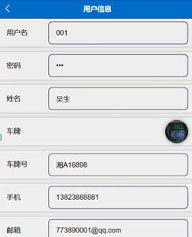

ssm+Vue计算机毕业设计智慧停车系统（程序+LW文档）

**项目运行**

**环境配置：**

**Jdk1.8 + Tomcat7.0 + Mysql + HBuilderX** **（Webstorm也行）+ Eclispe（IntelliJ
IDEA,Eclispe,MyEclispe,Sts都支持）。**

**项目技术：**

**SSM + mybatis + Maven + Vue** **等等组成，B/S模式 + Maven管理等等。**

**环境需要**

**1.** **运行环境：最好是java jdk 1.8，我们在这个平台上运行的。其他版本理论上也可以。**

**2.IDE** **环境：IDEA，Eclipse,Myeclipse都可以。推荐IDEA;**

**3.tomcat** **环境：Tomcat 7.x,8.x,9.x版本均可**

**4.** **硬件环境：windows 7/8/10 1G内存以上；或者 Mac OS；**

**5.** **是否Maven项目: 否；查看源码目录中是否包含pom.xml；若包含，则为maven项目，否则为非maven项目**

**6.** **数据库：MySql 5.7/8.0等版本均可；**

**毕设帮助，指导，本源码分享，调试部署** **(** **见文末** **)**

根据系统功能需求建立的模块关系图如下图：

图3-1 管理员结构图

用户功能实体属性图如图4-1所示。

图4-1用户功能实体属性图

管理员功能实体属性图如图4-2所示。

 图4-2管理员功能实体属性图

车位信息管理实体属性图如图4-3所示。

图4-3车位信息管理实体属性图

### 用户前台功能模块

登录，在登录界面通过输入注册时填写的账号、密码、用户类型进行系统登录，如图5-1所示。

图5-1登录界面图

用户登录进入系统首页可以查看首页、车位信息、停车信息、出场信息、我的等内容进行操作，如图5-2所示。

图5-2用户功能界面图

车位信息，在车位信息页面可以查看车位名称、车位编号、图片、类型、价格、车位状态、车位位置、备注、详情等详细信息进行入场停车，并可根据需要进行评论或收藏等操作，如图5-3所示。

图5-3车位信息界面图

停车信息，在停车信息页面可以查看车位编号、车位名称、车牌、类型、车位状态、价格、入场时间、备注、用户名、车牌号、手机、审核回复等内容进行出场，如图5-4所示。

图5-4停车信息界面图

出场信息，在出场信息页面可以查看车位名称、车位编号、车牌、类型、价格、入场时间、出场时间、停车时长、总价格、其它备注、用户名、手机、车牌号、审核回复等详细信息进行支付，如图5-5所示。

图5-5出场信息界面图

我的，在我的页面可以查看车位信息、停车信息、出场信息、消息提醒、我的收藏管理、客服中心等详细信息进行相应操作，如图5-6所示。

图5-6我的界面图

消息提醒，在消息提醒页面可以查看消息标题、类型、用户名、车牌、车牌号、手机、时间、备注、消息内容等详细信息进行操作，如图5-7所示。

图5-7消息提醒界面图

用户信息，在用户信息页面通过填写用户名、密码、姓名、车牌、车牌号、手机、邮箱等内容进行保存，如图5-8所示。

图5-8用户信息界面图

用户注册，在用户注册页面通过填写用户名、密码、姓名、车牌号、手机、邮箱等内容完成用户注册，如图5-9所示。

图5-9用户注册界面图

### 5.2管理员后台功能模块

管理员登录，管理员通过输入用户名和密码，选择角色并点击登录进行系统登录操作，如图5-10所示。

图5-10管理员登录界图面

管理员登陆系统后，可以对首页、个人中心、车位类型管理、车位信息管理、用户管理、停车信息管理、出场信息管理、消息提醒管理、管理员管理、系统管理等功能模块进行详情、修改、查看评论或删除等操作，如图5-11所示。

图5-11管理员功能界图面

车位类型管理，在车位类型管理页面可以查看索引、类型、价格等内容，并可根据需要进行详情、修改或删除等操作，如图5-12所示。

图5-12车位类型管理界面图

**JAVA** **毕设帮助，指导，源码分享，调试部署**

