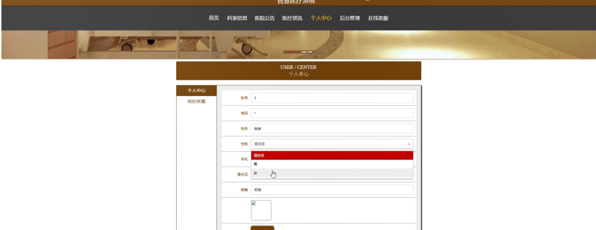

ssm+Vue计算机毕业设计智慧医疗系统（程序+LW文档）

**项目运行**

**环境配置：**

**Jdk1.8 + Tomcat7.0 + Mysql + HBuilderX** **（Webstorm也行）+ Eclispe（IntelliJ
IDEA,Eclispe,MyEclispe,Sts都支持）。**

**项目技术：**

**SSM + mybatis + Maven + Vue** **等等组成，B/S模式 + Maven管理等等。**

**环境需要**

**1.** **运行环境：最好是java jdk 1.8，我们在这个平台上运行的。其他版本理论上也可以。**

**2.IDE** **环境：IDEA，Eclipse,Myeclipse都可以。推荐IDEA;**

**3.tomcat** **环境：Tomcat 7.x,8.x,9.x版本均可**

**4.** **硬件环境：windows 7/8/10 1G内存以上；或者 Mac OS；**

**5.** **是否Maven项目: 否；查看源码目录中是否包含pom.xml；若包含，则为maven项目，否则为非maven项目**

**6.** **数据库：MySql 5.7/8.0等版本均可；**

**毕设帮助，指导，本源码分享，调试部署** **(** **见文末** **)**

### 系统结构

系统架构图属于系统设计阶段，系统架构图只是这个阶段一个产物，系统的总体架构决定了整个系统的模式，是系统的基础。智慧医疗系统的整体结构设计如图4-2所示。

图4-2 系统结构图

### 4.3. 数据库设计

系统里尤为关键的部分是在数据库方面，需要十分清晰的思路，所以从开始的设计时需要做到确立模块之间的联系，从而可以很明确的建立表间的联系和表中所需的内容。设计数据库还有一点是减少表的繁杂的创建，所以联系很关键，可以大大的减少，数据表中重复的事项。由此可以保证数据的完整和统一，不会造成数据的错误和重复，并且可以使数据得到数据库安全的保护，会使用户更加的放心。

#### 4.3.1 数据库实体

用户管理结构图，如图4-3所示：

图4-3用户管理结构图

科室信息管理实体属性图，如图4-4所示：

图4-4科室信息管理实体属性图

病历数据库管理实体属性图，如图4-5所示：

图4-5病历数据库管理实体属性图

### 系统功能模块

智慧医疗系统，在系统的首页可以查看首页、科室信息、医院公告、医疗资讯、个人中心、后台管理、在线客服等信息进行详细操作，如图5-1所示。

图5-1系统首页界面图

科室信息，在科室信息页面中可以查看科室、图片、科室介绍、科室位置等信息，并进行预约、评论或收藏等操作；如图5-2所示。

图5-2科室信息界面图

用户注册，在用户注册页面通过填写账号、密码、姓名、手机、身份证、邮箱等信息完成用户注册，如图5-3所示。，在个人中心页面通过填写账号、密码、姓名、性别、手机、身份证、邮箱、图片等内容进行信息更新操作，还可以对我的收藏进行详细操作；如图5-4所示。

图5-3用户注册界面图

图5-4个人中心界面图

### 5.2用户后台管理模块

用户登录进入智慧医疗系统后台可以查看首页、个人中心、科室信息管理、科室预约管理、医院公告管理、我的收藏管理等内容进行详细操作，如图5-5所示。

图5-5用户后台管理界面图

### 5.3管理员功能模块

管理员登录，管理员通过输入账号，密码，选择角色等信息即可进行系统登录，如图5-6所示。

图5-6管理员登录界面图

管理员登录进入智慧医疗系统可以查看首页、个人中心、用户管理、科室信息管理、科室预约管理、病情判断管理、病历数据库管理、医院公告管理、我的收藏管理、系统管理等内容进行详细操作，如图5-7所示。

图5-7管理员功能界面图

用户管理，在用户管理页面可以对索引、账号、姓名、性别、手机、身份证、邮箱、照片等信息进行详情，修改或删除等操作，如图5-8所示。

图5-8用户管理界面图

科室信息管理，在科室信息管理页面可以对索引、科室、图片、科室位置等信息进行详情、修改、查看评论或删除等操作，如图5-9所示。

图5-9科室信息管理界面图

科室预约管理，在科室预约管理页面可以对索引、科室、图片、科室介绍、科室位置、账号、姓名、预约时间等信息进行详情、病情判断、修改或删除等操作，如图5-10所示。

图5-10科室预约管理界面图

病情判断管理，在病情判断管理页面可以对索引、账号、姓名、病历名称、病情症状、科室、图片、病情描述、备注、诊断时间等信息进行详情，修改或删除等操作，如图5-11所示。

图5-11病情判断管理界面图

病历数据库管理，在病历数据库管理页面可以对索引、病历名称、病情症状、科室、图片等信息进行详情，修改或删除等操作，如图5-12所示。

图5-12病历数据库管理界面图

#### **JAVA** **毕设帮助，指导，源码分享，调试部署**

