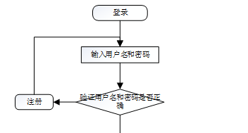

ssm+Vue计算机毕业设计智慧后勤app（程序+LW文档）

**项目运行**

**环境配置：**

**Jdk1.8 + Tomcat7.0 + Mysql + HBuilderX** **（Webstorm也行）+ Eclispe（IntelliJ
IDEA,Eclispe,MyEclispe,Sts都支持）。**

**项目技术：**

**SSM + mybatis + Maven + Vue** **等等组成，B/S模式 + Maven管理等等。**

**环境需要**

**1.** **运行环境：最好是java jdk 1.8，我们在这个平台上运行的。其他版本理论上也可以。**

**2.IDE** **环境：IDEA，Eclipse,Myeclipse都可以。推荐IDEA;**

**3.tomcat** **环境：Tomcat 7.x,8.x,9.x版本均可**

**4.** **硬件环境：windows 7/8/10 1G内存以上；或者 Mac OS；**

**5.** **是否Maven项目: 否；查看源码目录中是否包含pom.xml；若包含，则为maven项目，否则为非maven项目**

**6.** **数据库：MySql 5.7/8.0等版本均可；**

**毕设帮助，指导，本源码分享，调试部署** **(** **见文末** **)**

### 4.1系统总体设计

系统总体设计即对有关系统全局问题的设计，也就是设计系统总的处理方案，又称系统概要设计。它包括系统规划与系统功能设计等内容。

智慧后勤app主要有2类用户，可分为2个模块。分别是用户模块，管理员模块，详细规划如图4-1所示。

图4-1 智慧后勤app规划图

其中各子模块的主要功能如下：

1、用户登录：用户进入网页先输入用户名与密码，选择权限登录。

2、新用户注册：新用户填写用户名,密码,姓名,性别,手机,邮箱；完成注册。

3、查看智慧后勤app：用户登录成功后，能够按分类或者查找智慧后勤信息进行管理。

4、首页内容管理：管理员登录以后，可以对首页的公告信息,车辆信息,餐厅信息等进行管理。

### 4.2数据库设计

数据库是一个软件项目的根基，它决定了整个项目代码的走势，同时也决定了整个项目在后期的维护以及升级的难易程度。

#### 4.2.1 数据库概念设计

根据智慧后勤app的功能需求，对数据库进行分析，得到相应的数据，设计用户需要的各种实体，以及相互之间的关联，为逻辑结构设计铺好路。根据所实体内的各种具体信息得于实现。

1\. 用户注册信息实体

用户注册信息实体包括用户名,密码,姓名,性别,手机,邮箱。用户注册信息实体图如图4-2所示：

图4-2. 用户注册信息实体图

2\. 车辆信息实体

车辆信息实体包括车辆名称,车辆编号,车辆类别,车牌号码,图片,座位数量,车辆状态,驾驶员,联系电话,车辆详情；车辆信息实体图如图4-3所示：

图4-3车辆信息实体图

3\. 餐厅信息实体

餐厅信息实体包括餐厅名称,餐厅类别,餐厅位置,餐厅特色,图片,人均消费,联系人,联系电话,餐厅介绍等属性。餐厅信息实体图如图4-4所示：

图4-4餐厅信息实体图

### 5.1用户功能实现(app端)

按照不同功能模块，在此对系统所涉及的关键页面的实现细节进行阐述，包括页面功能描述，页面涉及功能分析，介绍以及界面展示。

系统登录：
运行系统，首先进入登录界面，按照登录界面的要求填写相应的“用户名”和“密码”以及用户类型，点击“登录”然后系统判断填写是否正确，若正确进入相应的界面，否则给出要求先注册信息。具体流程如图5-1所示。

图5-1 登录流程图

用户登录，通过输入用户名，密码，选择角色并点击登录进行系统登录操作，如图5-2所示。

图5-2用户登录界面图

智慧后勤app，在app首页可以查看首页,公告信息,车辆信息,餐厅信息,我的等内容进行详细操作，如图5-3所示。

图5-3 app首页界面图

用户注册，在用户注册页面通过填写用户名,密码,姓名,性别,手机,邮箱等信息完成用户注册操作，如图5-4所示。

图5-4用户注册界面图

公告信息，在公告信息页面可以查看公告标题,公告类型,发布日期,公告内容,图片等详细内容进行评论和收藏操作，如图5-5所示。

图5-5公告信息界面图

车辆信息，在车辆信息页面可以查看车辆名称,车辆编号,车辆类别,车牌号码,图片,座位数量,车辆状态,驾驶员,联系电话,车辆详情等详细内容进行车辆预订操作，如图5-6所示。

图5-6车辆信息界面图

餐厅信息，在餐厅信息页面可以查看餐厅名称,餐厅类别,餐厅位置,餐厅特色,图片,人均消费,联系人,联系电话,餐厅介绍等详细内容进行餐厅预订,评论和收藏操作，如图5-7所示。

图5-7餐厅信息界面图

我的，在我的页面可以对公告信息,车辆信息,公务用车,用车评价,餐厅信息,餐厅预订,用餐评价,会议室,会务订单,公务评价等功能进行详细操作，如图5-8所示。

图5-8我的界面图

用户信息，在用户信息页面通过填写用户名,密码,姓名,性别,头像,手机,邮箱等详细内容进行保存操作，如图5-9所示。

图5-9用户信息界面图

### 5.2管理员功能模块

管理员登录，通过输入用户名，密码，选择角色并点击登录进行系统登录操作，如图5-10所示。

图5-10管理员登录界面图

管理员登录app后，可以对首页,个人中心,用户管理,公告信息管理,车辆类别管理,车辆信息管理,公务用车管理,用户评价管理,餐厅类别管理,餐厅信息管理,餐厅预订管理,用餐评价管理,会议室管理,会务订单管理,会评价管理,维修类别管理,报修信息管理,系统管理等功能进行相应操作，如图5-11所示。

图5-11管理员功能界图面

用户管理，在用户管理页面可以查看索引,用户名,姓名,性别,头像,手机,邮箱,审核回复,审核状态,审核等内容，并根据需要进行详情，修改和删除等操作，如图5-12所示。

图5-12用户管理界面图

**JAVA** **毕设帮助，指导，源码分享，调试部署**

