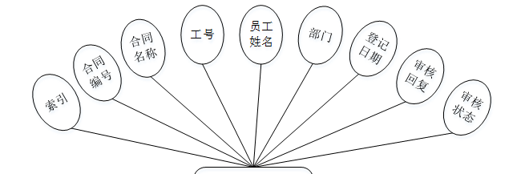
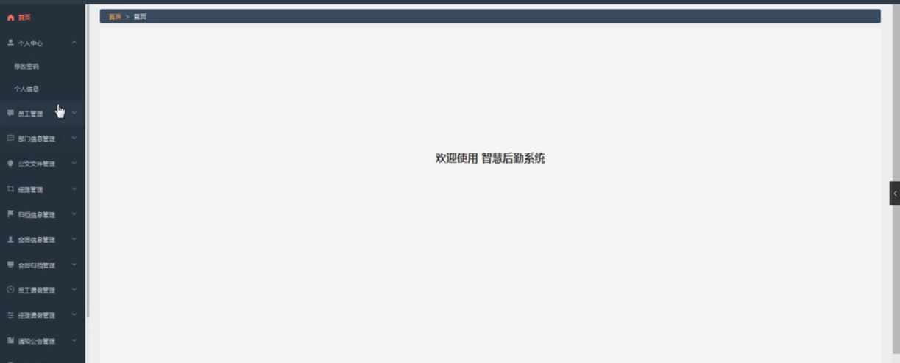

ssm+Vue计算机毕业设计智慧后勤系统（程序+LW文档）

**项目运行**

**环境配置：**

**Jdk1.8 + Tomcat7.0 + Mysql + HBuilderX** **（Webstorm也行）+ Eclispe（IntelliJ
IDEA,Eclispe,MyEclispe,Sts都支持）。**

**项目技术：**

**SSM + mybatis + Maven + Vue** **等等组成，B/S模式 + Maven管理等等。**

**环境需要**

**1.** **运行环境：最好是java jdk 1.8，我们在这个平台上运行的。其他版本理论上也可以。**

**2.IDE** **环境：IDEA，Eclipse,Myeclipse都可以。推荐IDEA;**

**3.tomcat** **环境：Tomcat 7.x,8.x,9.x版本均可**

**4.** **硬件环境：windows 7/8/10 1G内存以上；或者 Mac OS；**

**5.** **是否Maven项目: 否；查看源码目录中是否包含pom.xml；若包含，则为maven项目，否则为非maven项目**

**6.** **数据库：MySql 5.7/8.0等版本均可；**

**毕设帮助，指导，本源码分享，调试部署** **(** **见文末** **)**

### 系统结构设计

系统设计主要是管理员登录后对整个系统相关操作进行处理，可进行管理员的添加和删除，部门信息管理、公文文件管理、经理管理、归档信息管理、合同信息管理、合同归档管理、员工请假管理、经理请假管理、通知公告管理、会议室管理、预约信息管理、通知信息管理、员工通讯录管理、物业报修管理、报修进度管理等操作管理。

系统的功能结构图如下图所示。

图4-1系统功能结构图

### 4.2功能模块设计

  1. 系统登录：系统登录是管理员访问系统的路口，设计了系统登录界面，包括管理员名、密码和验证码，然后对登录进来的管理员判断身份信息，判断是管理员管理员还是普通用户。
  2. 管理员管理：管理员可以管理系统的其他普通用户的账号，包括录入新管理员，删除现有的普通用户，修改现有的普通用户的信息，并可以通过管理员名和姓名等关键字搜索普通用户，打印管理员列表页面，导出管理员列表至excel中。
  3. 修改密码：系统所有管理员（管理员和普通用户）应该都要能修改自己的登录密码，修改后需要重新登录。
  4. 个人资料管理：由普通用户使用，普通用户登录系统后，可以修改个人原始信息，如修改电话号码、邮箱等，管理员的管理员名是无法修改的。
  5. 登录情况管理：系统每个管理员应该都能查看个人的历史登录情况，如登录IP、登录时间、登录地址等，防止管理员账号被盗，加强管理员账号安全。
  6. 操作日志管理：系统每个管理员应该都能查看个人的历史操作日志，如管理员添加了某条数据，历史操作日志需要展示操作人，操作描述，操作时间等信息。防止系统被黑客攻击，加强系统的安全性。

### 4.3数据库设计

系统里尤为关键的部分是在数据库方面，需要十分清晰的思路，所以从开始的设计时需要做到确立模块之间的联系，从而可以很明确的建立表间的联系和表中所需的内容。设计数据库还有一点是减少表的繁杂的创建，所以联系很关键，可以大大的减少，数据表中重复的事项。由此可以保证数据的完整和统一，不会造成数据的错误和重复，并且可以使数据得到数据库安全的保护，会使用户更加的放心。

4.3.1 E-R图设计

概念设计是整个数据库设计的关键，在概念设计阶段，由需求分析得到了E-
R模型。E-R图是识别功能模型与数据模型间关联关系的，在主题数据库的抽取和规范化的过程中，采用的是简化的E-R图表示方法，从而避免过繁过细的E-
R图表示影响规划的直观和可用性。是对现实世界的抽象和概括，是数据库设计人员进行数据可设计的有力工具，能够方便直接地表达应用中的各种语义知识，令一方面它简单、清晰、易于用户理解。

管理员实体包括用户名、密码、角色三个属性。

管理员体ER图如下图所示。

图4-2管理员ER图

合同信息管理ER图如下图所示。

图4-3合同信息管理ER图

物业报修管理ER图如下图所示。

图4-4物业报修管理ER图

通知信息管理ER图如下图所示。

图4-5通知信息管理ER图

### 登录模块

系统登录模块，为确保系统安全性，系统操作员只有在登录界面输入正确的管理员名、密码、权限以及验证码，单击“登录”按钮后才能够进入本系统的主界面。

管理员登录流程图如下所示。

图5-1管理员登录流程图

登录界面如下图所示。

图5-2登录界面图

### 5.2管理员功能模块

管理员登录成功后进入到系统操作界面，可以对首页、个人中心、员工管理、部门信息管理、公文文件管理、经理管理、归档信息管理、合同信息管理、合同归档管理、员工请假管理、经理请假管理、通知公告管理、会议室管理、预约信息管理、通知信息管理、员工通讯录管理、物业报修管理、报修进度管理等功能模块进行相对应操作。如图5-3所示。

图5-3管理员功能界面图

员工管理：在员工管理页面可以获取索引、工号、员工姓名、性别、年龄、身份证号码、手机号码、相片、部门等信息，根据需要进行登记、修改或删除等操作，如图5-4所示。

图5-4员工管理界面图

部门信息管理：在部门信息管理页面可以获取索引、部门名称、部门经理、联系方式、地址等信息，根据需要进行修改或删除等操作，如图5-5所示。

图5-5部门信息管理界面图

归档信息管理：在归档信息管理页面可以获取索引、文件编号、文件名称、文件类型、登记日期、工号、员工姓名、部门、经理工号、经理姓名、状态、日期、审核回复、审核状态、审核等信息，根据需要进行删除等操作，如图5-6所示。

图5-6归档信息管理界面图

合同信息管理：在合同信息管理页面可以获取索引、合同编号、合同名称、工号、员工姓名、部门、登记日期、审核回复、审核状态等信息，根据需要进行删除等操作，如图5-7所示。

图5-7合同信息管理界面图

合同归档管理：在合同归档管理页面可以获取索引、合同编号、合同名称、工号、员工姓名、部门、登记日期、经理工号、经理姓名、状态、日期、审核回复、审核状态、审核等信息，根据需要进行删除等操作，如图5-8所示。

图5-8合同归档管理界面图

经理请假管理：在经理请假管理页面可以获取索引、请假编号、请假名称、经理工号、经理姓名、申请日期、审核回复、审核状态、审核等信息，根据需要进行删除等操作，如图5-9所示。

图5-9经理请假管理界面图

通知公告管理：在通知公告管理页面可以获取索引、公告编号、公告标题、相关图片等信息，根据需要进行修改或删除等操作，如图5-10所示。

图5-10通知公告管理界面图

预约信息管理：在预约信息管理页面可以获取索引、会议室名称、地址、会议室类型、容纳人数、辅助设施、状态、工号、员工姓名、部门、备注、预约日期、审核回复、审核状态、审核等信息，根据需要进行删除等操作，如图5-11所示。

图5-11预约信息管理界面图

通知信息管理：在通知信息管理页面可以获取索引、信息编号、信息类型、名称、工号、员工姓名、部门、发布日期、审核回复、审核状态、审核等信息，根据需要进行删除等操作，如图5-12所示。

图5-12通知信息管理界面图

**JAVA** **毕设帮助，指导，源码分享，调试部署**

