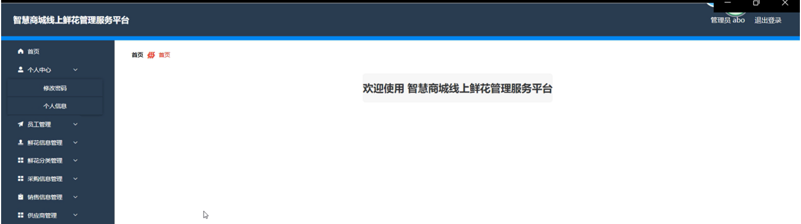

ssm+Vue计算机毕业设计智慧商城线上鲜花管理服务平台（程序+LW文档）

**项目运行**

**环境配置：**

**Jdk1.8 + Tomcat7.0 + Mysql + HBuilderX** **（Webstorm也行）+ Eclispe（IntelliJ
IDEA,Eclispe,MyEclispe,Sts都支持）。**

**项目技术：**

**SSM + mybatis + Maven + Vue** **等等组成，B/S模式 + Maven管理等等。**

**环境需要**

**1.** **运行环境：最好是java jdk 1.8，我们在这个平台上运行的。其他版本理论上也可以。**

**2.IDE** **环境：IDEA，Eclipse,Myeclipse都可以。推荐IDEA;**

**3.tomcat** **环境：Tomcat 7.x,8.x,9.x版本均可**

**4.** **硬件环境：windows 7/8/10 1G内存以上；或者 Mac OS；**

**5.** **是否Maven项目: 否；查看源码目录中是否包含pom.xml；若包含，则为maven项目，否则为非maven项目**

**6.** **数据库：MySql 5.7/8.0等版本均可；**

**毕设帮助，指导，本源码分享，调试部署** **(** **见文末** **)**

### 功能结构

为了更好的去理清本系统整体思路，对该系统以结构图的形式表达出来，设计实现该智慧商城线上鲜花管理服务平台的功能结构图如下所示：

图4-1 系统总体结构图

### 4.2 数据库设计

#### 4.2.1 数据库E/R图

ER图是由实体及其关系构成的图，通过E/R图可以清楚地描述系统涉及到的实体之间的相互关系。在系统中对一些主要的几个关键实体如下图：

(1)员工注册E/R图如下所示：

图4-2员工注册E/R图

(2)员工管理E/R图如下所示：

图4-3员工管理E/R图

(3)鲜花信息管理E/R图如下所示：

图4-4鲜花信息管理E/R图

系统登录，用户进入系统前在登录页面根据要求填写用户名和密码，选择角色等信息，点击登录进行登录操作，如图5-1所示。

图5-1系统登录界面图

### 5.1 管理员功能模块

管理员登录系统后，可以对首页、个人中心、员工管理、鲜花信息管理、鲜花分类管理、采购信息管理、销售信息管理、供应商管理，客户信息管理等功能进行相应的操作管理，如图5-2所示。

图5-2管理员功能界面图

员工管理，在员工管理页面可以对索引、工号、姓名、性别、手机、头像等内容进行详情、修改或删除等操作，如图5-3所示。

图5-3员工管理界面图

鲜花信息管理，在鲜花信息管理页面可以对索引、鲜花名称，鲜花类型，产地，数量，售价，采摘日期，保质期，鲜花图片等内容进行详情、修改和删除等操作，如图5-4所示。

图5-4鲜花信息管理界面图

鲜花分类管理，在鲜花分类管理页面可以对索引、类型等内容进行修改和删除等操作，如图5-5所示。

图5-5鲜花分类管理界面图

采购信息管理，在采购信息管理页面可以对索引、鲜花名称，鲜花类型，数量，采购价格，总价，采购时间，供应商，工号，姓名，审核回复，审核状态，审核等内容进行详情和删除等操作；如图5-6所示。

图5-6采购信息管理界面图

销售信息管理，在销售信息管理页面可以对索引、鲜花名称，鲜花类型，数量，售价，合计，销售时间，客户姓名，工号，姓名，审核回复，审核状态，审核等内容进行详情和删除等操作，如图5-7所示。

图5-7销售信息管理界面图

供应商管理，在供应商管理页面中可以对索引，供应编号，供应名称，供应商品，负责人，联系电话等内容进行详情，修改和删除等操作，如图5-8所示。

图5-8供应商管理界面图

客户信息管理，在客户信息管理页面中可以对索引、客户编号，客户姓名，性别，年龄，手机，地址，备注等内容进行详情、修改和删除等操作，如图5-9所示。

图5-9客户信息管理界面图

### 5.2 员工功能模块

员工进入系统可以查看首页、个人中心、鲜花信息管理、采购信息管理、销售信息管理等内容进行相应的操作；如图5-10所示。

图5-10员工功能界面图

鲜花信息管理，在鲜花信息管理页面可以对索引、鲜花名称，鲜花类型，产地，数量，售价，采摘日期，保质期，鲜花图片等内容进行详情、采购和销售等操作，如图5-11所示。

图5-11鲜花信息管理界面图

采购信息管理，在采购信息管理页面可以对索引、鲜花名称，鲜花类型，数量，采购价格，总价，采购时间，供应商，工号，姓名，审核回复，审核状态等内容进行详情，修改和删除等操作；如图5-12所示。

图5-12采购信息管理界面图

#### **JAVA** **毕设帮助，指导，源码分享，调试部署**

