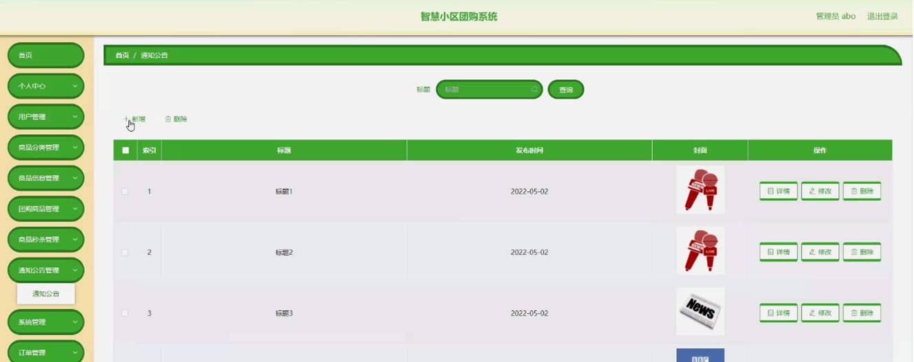

ssm+Vue计算机毕业设计智慧小区团购系统（程序+LW文档）

**项目运行**

**环境配置：**

**Jdk1.8 + Tomcat7.0 + Mysql + HBuilderX** **（Webstorm也行）+ Eclispe（IntelliJ
IDEA,Eclispe,MyEclispe,Sts都支持）。**

**项目技术：**

**SSM + mybatis + Maven + Vue** **等等组成，B/S模式 + Maven管理等等。**

**环境需要**

**1.** **运行环境：最好是java jdk 1.8，我们在这个平台上运行的。其他版本理论上也可以。**

**2.IDE** **环境：IDEA，Eclipse,Myeclipse都可以。推荐IDEA;**

**3.tomcat** **环境：Tomcat 7.x,8.x,9.x版本均可**

**4.** **硬件环境：windows 7/8/10 1G内存以上；或者 Mac OS；**

**5.** **是否Maven项目: 否；查看源码目录中是否包含pom.xml；若包含，则为maven项目，否则为非maven项目**

**6.** **数据库：MySql 5.7/8.0等版本均可；**

**毕设帮助，指导，本源码分享，调试部署** **(** **见文末** **)**

### 系统结构设计

系统设计主要是管理员登录后对整个系统相关操作进行处理，可进行系统管理。系

统的功能结构图如下图所示。

图3-1 系统总体结构图

3.4 数据库设计与实现

数据可设计要遵循职责分离原则，即在设计时应该要考虑系统独立性，即每个系统之间互不干预不能混乱数据表和系统关系。

数据库命名也要遵循一定规范，否则容易混淆，数据库字段名要尽量做到与表名类似，多使用小写英文字母和下划线来命名并尽量使用简单单词。

#### 3.4.1 数据库概念结构设计

数据库的E-R图反映了实体、实体的属性和实体之间的联系。下面是各个实体以及实体的属性。

用户信息实体属性图如下所示：

图3-2 用户信息实体属性图

商品秒杀实体属性图如下所示：

图3-3商品秒杀实体属性图

订单信息实体属性图如下所示：

图3-4 订单信息实体属性图

### 管理员功能模块

管理员登录，管理员通过输入用户名、密码进行登录进入系统，如图4-1所示。

图4-1管理员登录界面图

管理员通过登录进入智慧小区团购系统可查看个人中心、用户管理、商品分类管理、商品信息管理、团购商品管理、商品秒杀管理、通知公告管理、系统管理、订单管理等内容，如图4-2所示。

图4-2管理员功能界面图

商品分类管理，管理员可在商品分类管理页面进行查询、新增、修改或删除等操作，如图4-3所示。

图4-3商品分类管理界面图

用户管理，管理员可在用户管理页面查看账号、姓名、年龄、性别、手机、照片等内容，还可进行新增、修改或删除等操作，如图4-4所示。

图4-4用户管理界面图

商品信息管理，管理员可在商品信息管理页面查看商品编号、商品名称、商品分类、品牌、规格、图片、上架日期、价格、单限、库存等内容，还可进行新增、修改、查看评论或删除等操作，如图4-5所示。

图4-5商品信息管理界面图

团购商品管理，管理员可在团购商品管理页面查看商品编号、商品名称、商品分类、品牌、规格、图片、上架日期、价格、团购价、团购人数、当前人数等内容，还可进行新增、修改、查看评论或删除等操作，如图4-6所示。

图4-6团购商品管理界面图

商品秒杀管理，管理员可在商品秒杀管理页面查看商品编号、商品名称、商品分类、品牌、规格、图片、上架日期、价格、单限、库存等内容，还可进行新增、修改、查看评论或删除等操作，如图4-7所示。

图4-7商品秒杀管理界面图

通知公告管理，管理员可在通知公告管理页面查看标题、发布时间、封面等内容，还可进行新增、修改或删除等操作，如图4-8所示。

图4-8通知公告管理界面图

轮播图管理，管理员可在轮播图管理页面进行修改等操作，如图4-9所示。

图4-9轮播图管理界面图

订单管理，管理员可在订单管理页面查看订单编号、商品名称、商品图片、购买数量、价格、折扣价格、总价格、折扣总价格、支付类型、状态、地址、电话、收货人、团购编号、下单时间等内容，还可进行删除等操作，如图4-10所示。

图4-10订单管理界面图

4.3系统功能模块

智慧小区团购系统，在系统首页可查看首页、商品信息、团购商品、商品秒杀、通知公告、个人中心、购物车等内容，如图4-11所示。

图4-11系统首页界面图

用户注册，用户通过输入账号、密码、姓名、年龄、手机进行注册，如图4-12所示。

图4-12用户注册界面图

#### **JAVA** **毕设帮助，指导，源码分享，调试部署**

