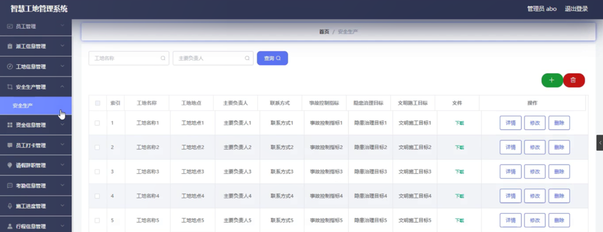
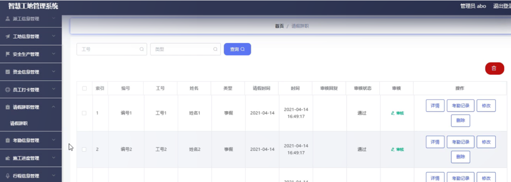

ssm+Vue计算机毕业设计智慧工地管理系统（程序+LW文档）

**项目运行**

**环境配置：**

**Jdk1.8 + Tomcat7.0 + Mysql + HBuilderX** **（Webstorm也行）+ Eclispe（IntelliJ
IDEA,Eclispe,MyEclispe,Sts都支持）。**

**项目技术：**

**SSM + mybatis + Maven + Vue** **等等组成，B/S模式 + Maven管理等等。**

**环境需要**

**1.** **运行环境：最好是java jdk 1.8，我们在这个平台上运行的。其他版本理论上也可以。**

**2.IDE** **环境：IDEA，Eclipse,Myeclipse都可以。推荐IDEA;**

**3.tomcat** **环境：Tomcat 7.x,8.x,9.x版本均可**

**4.** **硬件环境：windows 7/8/10 1G内存以上；或者 Mac OS；**

**5.** **是否Maven项目: 否；查看源码目录中是否包含pom.xml；若包含，则为maven项目，否则为非maven项目**

**6.** **数据库：MySql 5.7/8.0等版本均可；**

**毕设帮助，指导，本源码分享，调试部署** **(** **见文末** **)**

### 系统体系结构

智慧工地管理系统的结构图4-1所示：

图4-1 系统结构

登录系统结构图，如图4-2所示：

图4-2 登录结构图

系统结构图，如图4-3所示：

图4-3 系统结构图

### 管理员功能模块

管理员登录，管理员通过输入界面上显示的信息然后点击登录就能登录到系统进行系统的使用了，如图5-1所示。

图5-1管理员登录界面图

管理员登录进入智慧工地管理系统之后，就可以对所有的信息进行查看，可以查看到首页、个人中心、员工管理、派工信息管理、工地信息管理、安全生产管理、资金信息管理、员工打卡管理、请假辞职管理、考勤信息管理、施工进度管理、行程信息管理、健康码管理、视频监控管理、人员出入管理、车辆出入管理、模拟报警管理等，并且还可以对其进行相应的操作管理，如图5-2所示。

图5-2管理员功能界面图

员工管理，在员工管理页面中可以对索引、工号、姓名、性别、手机、邮箱、身份证、照片等信息进行详情，修改或删除等操作，如图5-3所示。

图5-3员工管理界面图

派工信息管理，在派工信息管理页面中可以对索引、派工编号、工号、姓名、派出时间、派出地点等信息进行详情，修改或删除等操作，如图5-4所示。

图5-4派工信息管理界面图

工地信息管理，在工地信息管理页面中可以对索引、工地名称、工地地点、主要负责人、联系方式、试工目标等信息进行详情，修改或删除等操作，如图5-5所示。

图5-5工地信息管理界面图

安全生产管理，在安全生产管理页面中可以对索引、工地名称、工地地点、主要负责人、联系方式、事故控制指标、隐患治理目标、文明施工目标、文件等信息进行详情，修改或删除等操作，如图5-6所示。

图5-6安全生产管理界面图

资金信息管理，在资金信息管理页面中可以对索引、资金编号、类型、金额、工号、姓名、记录时间等信息进行详情，修改或删除等操作，如图5-7所示。

图5-7资金信息管理界面图

员工打卡管理，在员工打卡管理页面中可以对索引、编号、工号、姓名、类型、时间等信息进行考勤记录、修改或删除等操作，如图5-8所示。

图5-8员工打卡管理界面图

请假辞职管理，在请假辞职管理页面中可以对索引、编号、工号、姓名、类型、请假时间、时间、审核回复、审核状态、审核等信息进行详情、考勤记录、修改或删除等操作，如图5-9所示。

图5-9请假辞职管理界面图

施工进度管理，在施工进度管理页面中可以对索引、编号、工号、姓名、工地名称、工地地点、主要负责人、联系方式、记录时间、进度等信息进行详情，修改或删除等操作，如图5-10所示。

图5-10施工进度管理界面图

### 5.2 员工功能模块

员工注册，在员工注册页面通过填写工号、密码、姓名、手机、邮箱、身份证等信息进行注册操作，如图5-11所示。

图5-11员工注册界面图

员工登录进入系统可以查看首页、个人中心、派工信息管理、工地信息管理、资金信息管理、员工打卡管理、请假辞职管理、考勤信息管理、施工进度管理、行程信息管理、健康码管理等内容，并且还可以对其进行相应的操作管理，如图5-12所示。

图5-12员工功能界面图

#### **JAVA** **毕设帮助，指导，源码分享，调试部署**

