ssm+Vue计算机毕业设计智慧景区一体化售票系统（程序+LW文档）

**项目运行**

**环境配置：**

**Jdk1.8 + Tomcat7.0 + Mysql + HBuilderX** **（Webstorm也行）+ Eclispe（IntelliJ
IDEA,Eclispe,MyEclispe,Sts都支持）。**

**项目技术：**

**SSM + mybatis + Maven + Vue** **等等组成，B/S模式 + Maven管理等等。**

**环境需要**

**1.** **运行环境：最好是java jdk 1.8，我们在这个平台上运行的。其他版本理论上也可以。**

**2.IDE** **环境：IDEA，Eclipse,Myeclipse都可以。推荐IDEA;**

**3.tomcat** **环境：Tomcat 7.x,8.x,9.x版本均可**

**4.** **硬件环境：windows 7/8/10 1G内存以上；或者 Mac OS；**

**5.** **是否Maven项目: 否；查看源码目录中是否包含pom.xml；若包含，则为maven项目，否则为非maven项目**

**6.** **数据库：MySql 5.7/8.0等版本均可；**

**毕设帮助，指导，本源码分享，调试部署** **(** **见文末** **)**

系统体系结构

智慧景区一体化售票系统的结构图4-1所示：

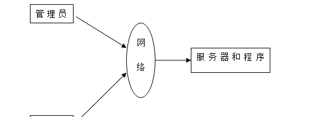

图4-1 系统结构

登录系统结构图，如图4-2所示：

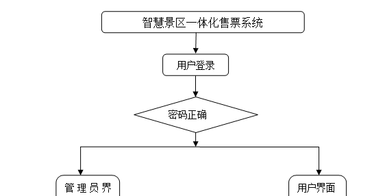

图4-2 登录结构图

系统结构图，如图4-3所示：

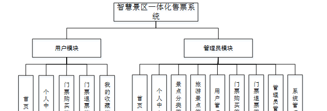

图4-3 系统结构图

4.2 数据库实体设计

数据库的功能就是对系统中所有的数据进行存储和管理。所有的数据可以在数据库中产时间的进行存储，方便用户的使用。而且所有的数据库中的数据也应该具有一定的共享性，任何的系统可以对一些数据进行使用，同时还应该保持一定的独立性，每一个数据库中的数据都有很强的安全性，可以被很好的存放到数据库，没有进行身份的验证是不能对这些数据进行查看和使用的。数据库的设计需要明确每一个实体之间的联系，系统的E-
R图如下图所示：：

管理员实体主要存储管理信息包括用户名、密码、角色等属性。管理员信息属性图如图4-4所示。

图4-4 管理员信息实体属性图

旅游景点管理主要包括活动索引、景点名称、分类、景点图片、景点星级、景点地址、营业时间、门票类型、门票价格、是否折扣、门票包含、注意事项等属性，旅游景点管理属性图如图4-5所示。

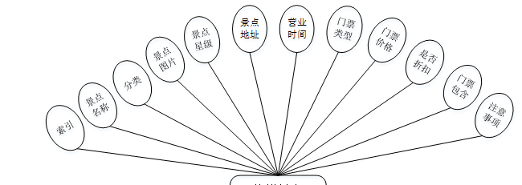

图4-5旅游景点管理实体属性图

用户实体属性主要包括索引、用户名、密码、姓名、性别、头像、手机、邮箱、身份证等属性。用户实体属性图如图4-6所示。

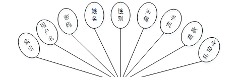

图4-6用户实体属性图

系统功能模块

智慧景区一体化售票系统，在系统的首页可以查看首页、旅游景点、公告信息、个人中心、后台管理等信息，如图5-1所示。

图5-1系统首页界面图

个人中心，在个人中心页面输入用户名、密码、姓名、性别、图片、手机、邮箱、身份证等信息进行更新，还可以根据需要对我的收藏进行相应操作，具体操作如图5-2所示。

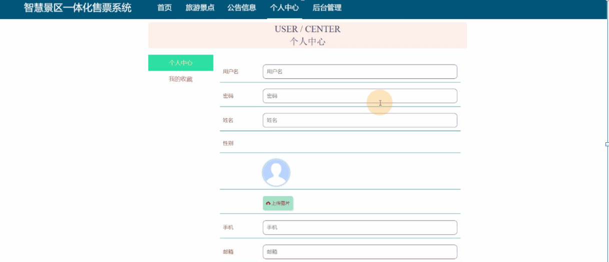

图5-2个人中心界面图

用户注册，新用户可以进行用户注册的操作，可以根据界面上的提示输入用户名、密码、姓名、手机、邮箱、身份证等信息，然后点击提交，所有的信息就被系统保存了下来，具体操作如图5-3所示。

图5-3用户注册界面图

旅游景点，在旅游景点页面中可以查看景点名称、分类、图片、景点星级、景点地址、营业时间、门票类型、门票价格、是否折扣、门票包含、注意事项、点击次数、景点介绍等信息并进行在线购票、评论或收藏等操作，如图5-4所示。

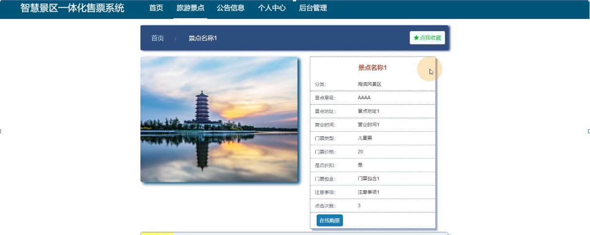

图5-4旅游景点界面图

### 5.2 后台功能模块

进入智慧景区一体化售票系统后台可以对首页、个人中心、门票购买管理、门票退票管理、我的收藏管理等信息进行查看，并且还可以对其进行相应的操作管理，如图5-5所示。

图5-5后台功能界面图

个人中心，在个人中心页面中可以填写用户名、姓名、性别、头像、手机、邮箱、身份证等信息进行修改，如图5-6所示。

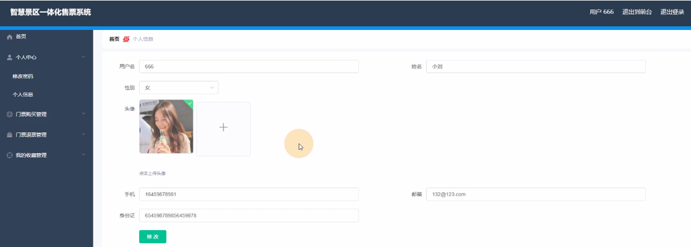

图5-6个人中心界面图

门票购买管理，在门票购买管理页面中通过查看索引、门票票码、景点名称、分类、景点图片、景点地址、门票类型、门票价格、购买数量、总价格、预定日期、备注、用户名、姓名、手机、身份证、是否支付等信息进行详情、门票退票等操作，如图5-7所示。

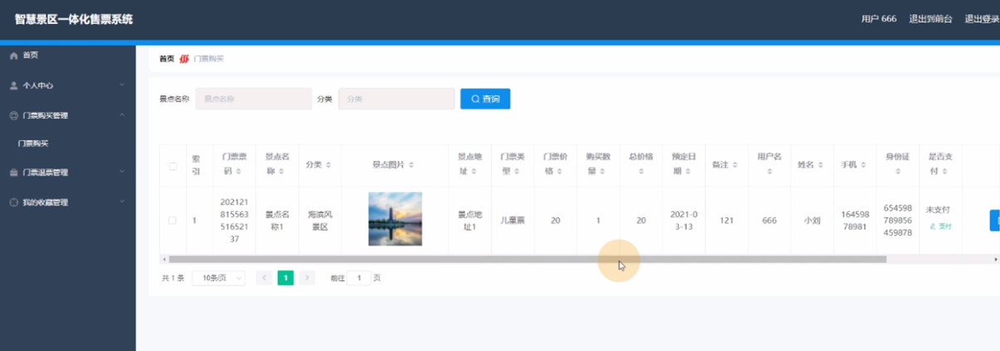

图5-7门票购买管理界面图

门票退票管理，在门票退票管理页面中可以查看索引、景点名称、分类、景点图片、景点地址、门票价格、购买数量、总价格、预定日期、备注、用户名、姓名、手机、取消时间、取消原因、是否支付、审核回复、审核状态等信息进行详情查看等操作，如下图5-8所示。

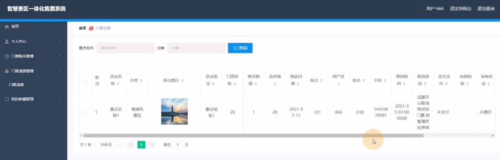

图5-8门票退票管理界面图

### 5.3 管理员功能模块

管理员登录，管理员通过输入界面上显示的信息然后点击登录就能登录到系统进行系统的使用了，如图5-9所示。

图5-9管理员登录界面图

管理员登录进入智慧景区一体化售票系统之后，就可以对所有的信息进行查看，可以查看到首页、个人中心、景点分类管理、旅游景点管理、用户管理、门票购买管理、门票退票管理、管理员管理、系统管理等信息，并且还可以对其进行相应的操作管理，如图5-10所示。

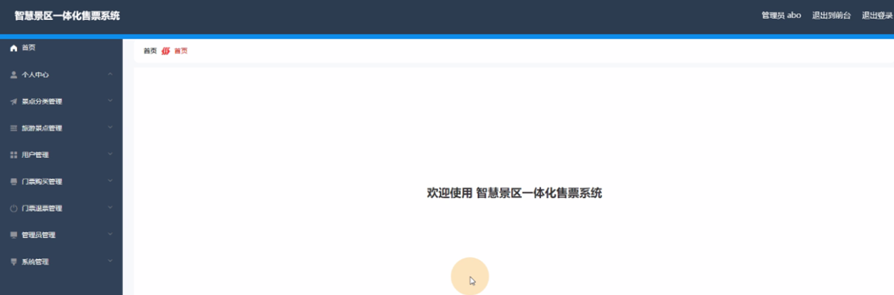

图5-10管理员功能界面图

景点分类管理，在景点分类管理页面中可以查看索引、分类等信息，还可以根据需要进行修改或删除等操作，如图5-11所示。

图5-11景点分类管理界面图

旅游景点管理，在旅游景点管理页面中可以查看索引、景点名称、分类、景点图片、景点星级、景点地址、营业时间、门票类型、门票价格、是否折扣、门票包含、注意事项等信息，还可以根据需要进行详情查看、修改、查看评论或删除等操作，如图5-12所示。

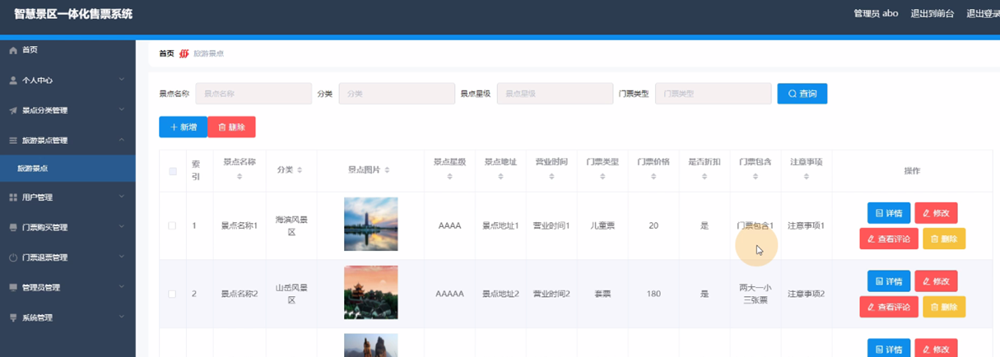

图5-12旅游景点管理界面图

#### **JAVA** **毕设帮助，指导，源码分享，调试部署**

