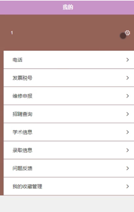

ssm+Vue计算机毕业设计智慧校园系统（程序+LW文档）

**项目运行**

**环境配置：**

**Jdk1.8 + Tomcat7.0 + Mysql + HBuilderX** **（Webstorm也行）+ Eclispe（IntelliJ
IDEA,Eclispe,MyEclispe,Sts都支持）。**

**项目技术：**

**SSM + mybatis + Maven + Vue** **等等组成，B/S模式 + Maven管理等等。**

**环境需要**

**1.** **运行环境：最好是java jdk 1.8，我们在这个平台上运行的。其他版本理论上也可以。**

**2.IDE** **环境：IDEA，Eclipse,Myeclipse都可以。推荐IDEA;**

**3.tomcat** **环境：Tomcat 7.x,8.x,9.x版本均可**

**4.** **硬件环境：windows 7/8/10 1G内存以上；或者 Mac OS；**

**5.** **是否Maven项目: 否；查看源码目录中是否包含pom.xml；若包含，则为maven项目，否则为非maven项目**

**6.** **数据库：MySql 5.7/8.0等版本均可；**

**毕设帮助，指导，本源码分享，调试部署** **(** **见文末** **)**

### 系统结构

本系统架构网站，本系统的具体功能如下：

图4-2系统功能结构图

系统结构图，如图4-3所示：

图4-3 系统结构图

### 4.3. 数据库设计

#### 4.3.1 数据库实体

管理员信息属性图如图4-4所示。

图4-4 管理员信息实体属性图

学术信息管理实体属性图如图4-5所示。

图4-5学术信息管理实体属性图

录取信息管理实体属性图如图4-6所示。

图4-6录取信息管理实体属性图

### 用户前端功能模块

用户登录，用户通过输入用户名和密码，选择角色并点击登录进行系统登录操作，如图5-1所示。

图5-1用户登录界面图

用户注册，在用户注册页面通过填写个人账号、密码、姓名、性别、年龄、身份证号码、手机号码等信息进行注册操作；如图5-2所示。

图5-2用户注册界面图

用户登陆系统后，可以对首页、成绩、课表、校车、我的等功能模块进行操作，如图5-3所示。

图5-3系统首页界面图

成绩，在成绩页面可以查看科目名称、图片、信息编号、成绩、个人账号、姓名、发布日期等信息进行评论或收藏，如图5-4所示。

图5-4成绩界面图

课表，在课表页面可以查看课表名称、图片、课表编号、发布日期、简介等信息进行评论或收藏，如图5-5所示。

图5-5课表界面图

校车，在校车页面可以查看校车名称、信息编号、校车车牌、途径地点、座位、最早班次、最晚班次、发布日期等信息进行评论或收藏，如图5-6所示。

图5-6校车界面图

我的，在我的页面可以对电话、发票税号、维修申报、招聘查询、学术信息、录取信息、问题反馈、我的收藏管理等详细信息进行操作，如图5-7所示。

图5-7我的界面图

### 5.2管理员功能模块（后端）

管理员登录，管理员通过输入账号、密码，选择角色并点击登录进行系统登录操作，如图5-8所示。

图5-8管理员登录界图面

管理员登陆系统后，可以对首页、个人中心、用户管理、成绩管理、课表管理、校车管理、电话管理、发票税号管理、维修申报管理、招聘查询管理、学术信息管理、录取信息管理、问题反馈管理等功能模块进行相应操作，如图5-9所示。

图5-9管理员功能界图面

用户管理，在用户管理页面可以对索引、个人账号、姓名、性别、年龄、身份证号码、手机号码、相片等内容进行详情、修改或删除等操作，如图5-10所示。

图5-10用户管理界面图

成绩管理，在成绩管理页面可以对索引、信息编号、科目名称、相关图片、成绩、个人账号、姓名、发布日期等内容进行详情、修改、查看评论或删除等操作，如图5-11所示。

图5-11成绩管理界面图

课表管理，在课表管理页面可以对索引、课表编号、课表名称、相关图片、简介、发布日期等内容进行详情、修改、查看评论或删除等操作，如图5-12所示。

图5-12课表管理界面图

**JAVA** **毕设帮助，指导，源码分享，调试部署**

